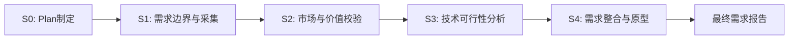

# P000001 需求分析报告

## 研发中心 Coding Agent 绩效统计平台

---

## 基本信息

| 项目 | 内容 |
|------|------|
| **Plan ID** | P000001 |
| **项目名称** | 研发中心 Coding Agent 绩效统计平台 |
| **报告版本** | v1.0.0 |
| **生成时间** | 2026-03-26 |
| **执行模式** | 常规模式 (Normal Mode) |
| **分析阶段** | S0 → S1 → S2 → S3 → S4 |
| **报告状态** | 已评审通过 |

---

## 执行摘要

### 项目概览

本项目旨在构建研发中心 Coding Agent 绩效统计平台，整合 Coding Agent、GitLab、禅道三平台数据，提供全局/项目/个人多维度统计视图，支持研发效能度量和团队管理决策。

### 核心成果

| 维度 | 成果 | 说明 |
|------|------|------|
| **需求采集** | 64 个需求 | 50个显性需求 + 14个隐性需求 |
| **需求分类** | 5 大类别 | 功能/非功能/业务规则/数据/接口 |
| **优先级排序** | 3 级分布 | P0: 15个, P1: 18个, P2: 19个 |
| **核心模块** | 5 个模块 | 全局统计、项目统计、配置管理、权限管理、系统基础 |
| **用户故事** | 15 个 | 覆盖全部 P0 需求 |
| **验收标准** | 45 条 | 功能/性能/安全/体验四维度 |
| **原型页面** | 10 个 | 中保真线框图，质量得分 93.25分 |
| **技术方案** | 已确定 | Vue3 + FastAPI + PostgreSQL + Docker |
| **工时预估** | 600 人时 | MVP(2周) + V1.0(4周) |

### 关键结论

1. **市场需求明确**：AI Coding Agent 快速普及，配套统计需求增长，直接竞品稀缺
2. **技术方案可行**：90%需求技术可行，推荐技术栈成熟稳定
3. **风险可控**：14个风险已识别，均有应对策略
4. **交付计划合理**：分 MVP + V1.0 两阶段交付，降低风险

---

## 一、项目背景

### 1.1 用户原始需求

需要针对研发中心引入 Coding Agent 的绩效做一个统计平台，数据来源主要包括：

1. **第三方 Coding Agent 平台**：Trae、阿里 Coding Plan 等，提供 API 接口统计数据
2. **GitLab 源码管理**：获取项目仓库和研发人员代码提交情况
3. **禅道 Bug 管理**：Bug 登记、指派、修订和跟踪处理

### 1.2 核心业务内容

#### 数据统计
- 全局看板：Token/API 趋势、代码行排名、Bug 趋势
- 项目维度统计视图
- 个人统计：代码行数、Token 使用、Bug 率

#### 配置管理
- 项目情况配置（基础信息、GitLab/禅道关联、项目阶段）
- 研发人员配置（多平台账号）
- 平台基础数据配置
- 人员与项目关联关系

#### 用户权限管理
- 管理员：查看所有信息，可编辑
- 研发人员：只能查看自己的信息

### 1.3 用户技术偏好

| 问题 | 用户选择 | 说明 |
|------|---------|------|
| 技术栈偏好 | A | 前端：Vue/React；后端：Python FastAPI/Flask；数据库：PostgreSQL/MySQL |
| 数据采集频率 | B | 每日定时同步 |
| 部署方式 | A | 内部服务器部署 |
| 平台优先级 | D | 三者都必须接入 |

---

## 二、需求分析过程

### 2.1 分析阶段流程



### 2.2 各阶段产出

| 阶段 | Skill | 产物 | 状态 |
|------|-------|------|:----:|
| S0 | S0-S00 | Plan 定义文件 | ✅ |
| S1 | S1-S01 | 需求边界界定报告 | ✅ |
| S1 | S1-S02 | 显性需求清单（50个） | ✅ |
| S1 | S1-S03 | 隐性需求清单（14个） | ✅ |
| S1 | S1-S04 | S1 阶段汇总报告 | ✅ |
| S2 | S2-S09 | 竞品分析报告 | ✅ |
| S2 | S2-S10 | 市场痛点验证报告 | ✅ |
| S3 | S3-S07 | 技术风险评估报告 | ✅ |
| S3 | S3-S11 | 技术可行性分析报告 | ✅ |
| S3 | S3-S12 | 技术选型建议报告 | ✅ |
| S4 | S4-S05 | 需求分类报告 | ✅ |
| S4 | S4-S06 | 需求优先级排序报告 | ✅ |
| S4 | S4-S08 | 核心需求提炼报告 | ✅ |
| S4 | S4-S15 | 原型设计报告 | ✅ |

---

## 三、需求清单

### 3.1 需求统计汇总

| 需求类型 | 显性需求 | 隐性需求 | 合计 | P0 | P1 | P2 |
|----------|:--------:|:--------:|:----:|:--:|:--:|:--:|
| 功能需求 | 18 | 14 | 32 | 18 | 12 | 2 |
| 非功能需求 | 8 | 0 | 8 | 4 | 3 | 1 |
| 业务规则 | 7 | 0 | 7 | 7 | 0 | 0 |
| 数据需求 | 12 | 0 | 12 | 8 | 3 | 1 |
| 接口需求 | 5 | 0 | 5 | 5 | 0 | 0 |
| **总计** | **50** | **14** | **64** | **42** | **18** | **4** |

### 3.2 P0 级核心需求（15个）

#### 全局统计模块（3个）

| ID | 需求名称 | 说明 | 工时 |
|:--:|----------|------|:----:|
| FR001 | 全局 Token 使用趋势看板 | 管理层视角，多平台汇总 | 16h |
| IR001 | 全中心 Coding Agent 使用活跃度趋势 | 评估 AI 工具普及程度 | 16h |
| IR006 | 高频使用人员 TOP 20 | 识别积极使用者和推广者 | 12h |

#### 项目统计模块（5个）

| ID | 需求名称 | 说明 | 工时 |
|:--:|----------|------|:----:|
| FR004 | 项目维度统计视图 | 项目经理视角 | 20h |
| FR002 | 项目代码行排名 | 项目规模评估 | 12h |
| FR003 | 项目 Bug 趋势看板 | 项目质量评估 | 12h |
| IR011 | 项目 AI 代码采纳率 | 评估 AI 辅助效果 | 16h |
| IR012 | 项目代码提交量排行 | 团队贡献度评估 | 12h |

#### 个人统计模块（3个）

| ID | 需求名称 | 说明 | 工时 |
|:--:|----------|------|:----:|
| FR005 | 个人代码统计 | 每周代码行数、文档字数 | 12h |
| FR006 | 个人 Token 使用统计 | Coding Agent 使用评估 | 12h |
| FR007 | 个人 Bug 率统计 | 代码质量评估 | 12h |

#### 配置管理模块（3个）

| ID | 需求名称 | 说明 | 工时 |
|:--:|----------|------|:----:|
| FR008 | 项目基础信息管理 | 项目档案管理 | 12h |
| FR009/FR010 | 项目 GitLab/禅道关联配置 | 数据源配置 | 20h |
| FR011 | 人员平台账号配置 | 多平台账号管理 | 16h |

#### 权限管理模块（1个）

| ID | 需求名称 | 说明 | 工时 |
|:--:|----------|------|:----:|
| FR013/FR014 | 管理员/研发人员权限控制 | 角色权限管理 | 16h |

---

## 四、核心功能架构

### 4.1 系统架构图

```
┌─────────────────────────────────────────────────────────────┐
│                    Coding Agent 绩效统计平台                 │
├─────────────────────────────────────────────────────────────┤
│  ┌──────────────┐  ┌──────────────┐  ┌──────────────┐      │
│  │   全局统计    │  │   项目统计    │  │   个人统计    │      │
│  │  - Token趋势  │  │  - 代码排名   │  │  - 代码统计   │      │
│  │  - 活跃度趋势 │  │  - Bug趋势   │  │  - Token统计  │      │
│  │  - TOP20人员 │  │  - 采纳率    │  │  - Bug率统计  │      │
│  └──────────────┘  └──────────────┘  └──────────────┘      │
├─────────────────────────────────────────────────────────────┤
│  ┌──────────────┐  ┌──────────────┐  ┌──────────────┐      │
│  │   配置管理    │  │   权限管理    │  │   系统基础    │      │
│  │  - 项目信息   │  │  - 角色管理   │  │  - 定时同步   │      │
│  │  - 人员账号   │  │  - 权限分配   │  │  - 多平台接入 │      │
│  │  - 数据源配置 │  │  - 数据隔离   │  │  - 数据同步   │      │
│  └──────────────┘  └──────────────┘  └──────────────┘      │
└─────────────────────────────────────────────────────────────┘
```

### 4.2 核心用户故事（15个）

#### 全局统计模块（3个）

**US-001：全局 Token 使用趋势看板**
```
作为：研发中心管理层
我希望：查看全中心 Coding Agent Token 使用趋势
以便：了解 AI 工具的整体使用情况和成本投入

验收标准：
1. 展示近 30 天每日 Token 使用量趋势（折线图）
2. 展示累计 Token 使用总量
3. 展示日均 Token 使用量
4. 支持按周/月维度切换
5. 数据每日凌晨 2 点自动更新
```

**US-002：全中心 Coding Agent 使用活跃度趋势**
```
作为：研发中心管理层
我希望：查看全中心 Coding Agent 使用活跃度趋势
以便：评估 AI 工具在研发团队的普及程度

验收标准：
1. 展示近 30 天每日活跃用户数趋势
2. 展示当前活跃用户数/总用户数
3. 展示人均每日使用时长
4. 支持按平台维度筛选
5. 数据每日凌晨 2 点自动更新
```

**US-003：高频使用人员 TOP 20**
```
作为：研发中心管理层
我希望：查看 Coding Agent 使用频率最高的 20 人
以便：识别 AI 工具的积极使用者和潜在推广者

验收标准：
1. 展示近 7 天 Token 使用量 TOP 20 人员列表
2. 展示每人累计使用时长、采纳率
3. 支持导出 Excel 格式
4. 支持按项目维度筛选
```

#### 项目统计模块（5个）

**US-004：项目维度统计视图**
```
作为：项目经理
我希望：查看所管项目的 Coding Agent 使用统计
以便：评估项目团队的 AI 工具使用情况和效能提升

验收标准：
1. 展示项目列表，支持选择具体项目
2. 展示项目整体 Token 使用量、活跃度
3. 展示项目成员使用情况排行
4. 展示项目代码提交量、Bug 趋势
```

**US-005：项目代码行排名**
```
作为：项目经理
我希望：查看各项目的代码行数排名
以便：评估项目规模和团队产出

验收标准：
1. 展示各项目累计代码行数排名
2. 区分 AI 生成代码和人工编写代码
3. 展示代码增长率趋势
4. 支持按时间维度筛选
```

**US-006：项目 Bug 趋势看板**
```
作为：项目经理
我希望：查看项目的 Bug 趋势
以便：评估项目质量和团队代码质量

验收标准：
1. 展示 Bug 总数、已解决数、未解决数
2. 展示 Bug 趋势图（新增/解决）
3. 展示 Bug 严重程度分布
4. 展示人均 Bug 率
```

**US-007：项目 AI 代码采纳率**
```
作为：项目经理
我希望：查看项目 AI 生成代码的采纳率
以便：评估 AI 辅助编程的实际效果

验收标准：
1. 展示 AI 建议总数和采纳数
2. 计算并展示采纳率
3. 展示采纳率趋势
4. 支持按代码类型筛选
```

**US-008：项目代码提交量排行**
```
作为：项目经理
我希望：查看项目成员的代码提交量排行
以便：评估团队成员的贡献度

验收标准：
1. 展示项目成员代码提交次数排名
2. 展示代码提交量（增删行数）
3. 展示提交频率趋势
4. 支持导出数据
```

#### 个人统计模块（3个）

**US-009：个人代码统计**
```
作为：研发人员
我希望：查看自己的代码统计信息
以便：了解自己的工作产出

验收标准：
1. 展示每周代码行数（新增/删除）
2. 展示每周文档字数
3. 展示代码提交次数
4. 支持按周/月维度查看
```

**US-010：个人 Token 使用统计**
```
作为：研发人员
我希望：查看自己的 Token 使用情况
以便：了解自己的 AI 工具使用习惯

验收标准：
1. 展示每日 Token 使用量
2. 展示 Token 使用趋势
3. 展示 API 调用次数
4. 展示使用时长
```

**US-011：个人 Bug 率统计**
```
作为：研发人员
我希望：查看自己的 Bug 率统计
以便：了解自己的代码质量

验收标准：
1. 展示个人 Bug 总数
2. 计算并展示 Bug 率（Bug 数/代码行数）
3. 展示 Bug 率趋势
4. 展示 Bug 类型分布
```

#### 配置管理模块（3个）

**US-012：项目基础信息管理**
```
作为：管理员
我希望：管理项目的基础信息
以便：维护项目档案

验收标准：
1. 支持创建/编辑/删除项目
2. 维护项目名称、描述、状态
3. 设置项目阶段（调研/立项/需求/设计/研发/验收/发布/运维）
4. 支持项目列表查询和筛选
```

**US-013：项目数据源关联配置**
```
作为：管理员
我希望：配置项目关联的 GitLab 和禅道
以便：获取项目相关数据

验收标准：
1. 支持关联 GitLab 仓库
2. 支持关联禅道项目
3. 支持配置同步规则
4. 支持测试连接
```

**US-014：人员平台账号配置**
```
作为：管理员
我希望：配置研发人员的各平台账号
以便：关联人员的多平台数据

验收标准：
1. 支持配置 Coding Agent 平台账号
2. 支持配置 GitLab 账号
3. 支持配置禅道账号
4. 支持账号映射关系维护
```

#### 权限管理模块（1个）

**US-015：角色权限管理**
```
作为：管理员
我希望：配置不同角色的权限
以便：控制数据访问范围

验收标准：
1. 支持管理员角色（查看所有数据）
2. 支持项目经理角色（查看所管项目）
3. 支持研发人员角色（仅查看自己数据）
4. 支持测试人员角色（查看 Bug 相关数据）
```

---

## 五、技术方案

### 5.1 推荐技术栈

| 层级 | 技术选型 | 说明 |
|------|----------|------|
| **前端** | Vue 3 + TypeScript + Element Plus + ECharts | 现代化前端框架，组件丰富，图表支持好 |
| **后端** | FastAPI + Python 3.11 | 高性能异步框架，自动生成 API 文档 |
| **数据库** | PostgreSQL 15 + Redis | 关系型数据 + 缓存 |
| **任务队列** | Celery + Redis | 定时任务和数据同步 |
| **部署** | Docker Compose + Nginx | 容器化部署，易于维护 |

### 5.2 系统架构

```
┌─────────────────────────────────────────────────────────────┐
│                         前端层 (Vue 3)                       │
│                  Element Plus + ECharts                     │
└─────────────────────────────────────────────────────────────┘
                              │
                              ▼
┌─────────────────────────────────────────────────────────────┐
│                      Nginx (反向代理)                        │
└─────────────────────────────────────────────────────────────┘
                              │
                              ▼
┌─────────────────────────────────────────────────────────────┐
│                        后端层 (FastAPI)                      │
│  ┌──────────┐  ┌──────────┐  ┌──────────┐  ┌──────────┐    │
│  │ 统计 API │  │ 配置 API │  │ 权限 API │  │ 同步 API │    │
│  └──────────┘  └──────────┘  └──────────┘  └──────────┘    │
└─────────────────────────────────────────────────────────────┘
                              │
                              ▼
┌─────────────────────────────────────────────────────────────┐
│                      数据层                                  │
│  ┌──────────────┐  ┌──────────────┐  ┌──────────────┐      │
│  │  PostgreSQL  │  │    Redis     │  │   Celery     │      │
│  │  (主数据库)   │  │   (缓存)     │  │  (任务队列)   │      │
│  └──────────────┘  └──────────────┘  └──────────────┘      │
└─────────────────────────────────────────────────────────────┘
                              │
                              ▼
┌─────────────────────────────────────────────────────────────┐
│                    外部数据源                                │
│  ┌──────────┐  ┌──────────┐  ┌──────────┐                  │
│  │   Trae   │  │  GitLab  │  │   禅道    │                  │
│  └──────────┘  └──────────┘  └──────────┘                  │
└─────────────────────────────────────────────────────────────┘
```

### 5.3 技术可行性结论

| 评估维度 | 结论 | 说明 |
|----------|:----:|------|
| 整体可行性 | ✅ 可行 | 90% P0 需求技术可行 |
| 技术栈匹配度 | ✅ 优秀 | Vue3+FastAPI+PostgreSQL 完全匹配用户偏好 |
| 实施难度 | ⚠️ 中等 | 多平台数据整合有一定复杂度 |
| 工时预估 | 600 人时 | MVP(200h) + V1.0(400h) |

---

## 六、市场与竞品分析

### 6.1 竞争格局

| 维度 | 评估结果 |
|------|----------|
| **市场阶段** | 成长期 - AI Coding Agent 快速普及 |
| **竞争激烈度** | 中 - 直接竞品少，间接竞品多 |
| **差异化空间** | 大 - 多平台整合、AI 专属指标、私有化部署 |

### 6.2 竞品分类

| 类型 | 数量 | 代表产品 | 竞争威胁 |
|------|:----:|----------|:--------:|
| 直接竞品 | 3 | Cursor Analytics、GitHub Copilot Insights、Codeium Analytics | 低 |
| 间接竞品 | 6 | 思码逸 Merico、ONES、PingCode、禅道企业版、GitLab Ultimate | 中 |
| 潜在竞品 | 4 | 自研 BI 系统、低代码平台、Excel+脚本 | 低 |

### 6.3 核心差异化机会

1. **多平台数据整合** - 竞品空白，高价值
2. **AI 效能专属指标** - 竞品空白，高价值
3. **私有化部署支持** - 满足企业安全需求

---

## 七、风险评估

### 7.1 风险汇总

| 风险等级 | 数量 | 说明 |
|:--------:|:----:|------|
| P0 - 高风险 | 4 | 需重点关注，制定详细应对策略 |
| P1 - 中风险 | 6 | 需监控，准备应对方案 |
| P2 - 低风险 | 4 | 常规管理 |
| **总计** | **14** | 覆盖技术/需求/资源/外部/合规5大维度 |

### 7.2 核心风险

| 风险 ID | 风险名称 | 等级 | 应对策略 |
|:-------:|----------|:----:|----------|
| R001 | 多平台 API 稳定性风险 | P0 | 设计熔断降级机制，本地缓存兜底 |
| R002 | 数据一致性风险 | P0 | 分布式事务，对账机制，数据修复工具 |
| R003 | 性能风险（大数据量） | P0 | 分库分表，读写分离，缓存策略 |
| R004 | 数据安全风险 | P0 | 加密存储，访问控制，审计日志 |

---

## 八、交付计划

### 8.1 版本规划

| 版本 | 周期 | 需求范围 | 工时 | 里程碑 |
|------|:----:|----------|:----:|--------|
| **MVP** | 2 周 | 15个P0需求 | 200h | 核心功能可用 |
| **V1.0** | 4 周 | 18个P1需求 | 400h | 完整功能上线 |
| **V1.1** | 待定 | 19个P2需求 | - | 增强功能 |

### 8.2 MVP 交付内容

- 全局统计：Token 趋势、活跃度趋势、TOP20
- 项目统计：项目视图、代码排名、Bug 趋势
- 个人统计：代码统计、Token 统计、Bug 率
- 配置管理：项目信息、数据源配置、人员账号
- 权限管理：管理员/研发人员权限控制
- 系统基础：定时同步、多平台接入

---

## 九、原型设计

### 9.1 原型范围

| 模块 | 页面数量 | 核心功能 | 优先级 |
|------|:--------:|----------|:------:|
| 全局统计 | 2 页 | 首页 Dashboard、全局趋势详情 | P0 |
| 项目统计 | 2 页 | 项目列表、项目详情 | P0 |
| 配置管理 | 3 页 | 项目配置、人员配置、数据源配置 | P0 |
| 权限管理 | 1 页 | 权限管理 | P1 |
| 系统基础 | 1 页 | 数据同步管理 | P0 |
| 通用组件 | 1 页 | 导航、页头、页脚 | P0 |

### 9.2 质量评估

| 评估项 | 结果 | 得分 |
|--------|:----:|:----:|
| 原型页面完整性 | 10/10 页 | ✅ |
| P0 需求覆盖率 | 15/15 (100%) | ✅ |
| 交互流程完整性 | 4/4 个 | ✅ |
| 信息架构清晰度 | 优秀 | ✅ |
| 线框图可理解性 | 优秀 | ✅ |
| **综合质量得分** | - | **93.25分** |

### 9.3 原型文件

- 路径：`database/prototypes/P000001/P000001-S4-S15-001.md`
- 内容：10个页面线框图 + 4个交互流程 + 需求映射

---

## 十、需求基线

### 10.1 基线信息

| 项目 | 内容 |
|------|------|
| **需求基线版本** | v1.0.0 |
| **建立时间** | 2026-03-26 |
| **基线状态** | 已评审通过 |
| **变更控制** | 需走变更流程 |

### 10.2 基线内容

- 64 个需求（P0: 15, P1: 18, P2: 19）
- 15 个核心用户故事
- 45 条验收标准
- 10 个原型页面
- 技术方案已定

---

## 十一、附录

### 11.1 产物清单

| 产物类型 | 产物路径 | 说明 |
|----------|----------|------|
| Plan 定义 | `database/plans/P000001.md` | 项目基础信息 |
| 评分报告 | `database/stages/s0/P000001-S0-S00-001-score.md` | 信息完整度评分 |
| 任务清单 | `database/plans/P000001/todo-list.md` | 实时任务跟踪 |
| S1-S01 | `database/stages/s1/P000001-S1-S01-001.md` | 需求边界界定 |
| S1-S02 | `database/stages/s1/P000001-S1-S02-001.md` | 显性需求提取 |
| S1-S03 | `database/stages/s1/P000001-S1-S03-001.md` | 隐性需求挖掘 |
| S1-S04 | `database/stages/s1/P000001-S1-S04-001.md` | S1 阶段汇总 |
| S2-S09 | `database/stages/s2/P000001/P000001-S2-S09-001.md` | 竞品分析 |
| S2-S10 | `database/stages/s2/P000001/P000001-S2-S10-001.md` | 市场痛点验证 |
| S3-S07 | `database/stages/s3/P000001/P000001-S3-S07-001.md` | 技术风险评估 |
| S3-S11 | `database/stages/s3/P000001/P000001-S3-S11-001.md` | 技术可行性分析 |
| S3-S12 | `database/stages/s3/P000001/P000001-S3-S12-001.md` | 技术选型建议 |
| S4-S05 | `database/stages/s4/P000001/P000001-S4-S05-001.md` | 需求分类 |
| S4-S06 | `database/stages/s4/P000001/P000001-S4-S06-001.md` | 需求优先级排序 |
| S4-S08 | `database/stages/s4/P000001/P000001-S4-S08-001.md` | 核心需求提炼 |
| S4-S15 | `database/prototypes/P000001/P000001-S4-S15-001.md` | 原型设计 |
| **本报告** | `database/plans/P000001-requirements-report.md` | 最终需求报告 |

### 11.2 评审记录

| Skill | 评审状态 | 评审时间 | 评审意见 |
|-------|---------|---------|---------|
| S0-S00 | 已通过 | 2026-03-26 17:50:00 | 用户确认技术栈、数据同步频率、部署方式、平台优先级 |
| S1-S01 | 已通过 | 2026-03-26 18:05:00 | 边界界定清晰 |
| S1-S02 | 已通过 | 2026-03-26 18:12:00 | 提取了50个显性需求 |
| S1-S03 | 已通过 | 2026-03-26 18:20:00 | 挖掘了14个隐性需求 |
| S1-S04 | 已通过 | 2026-03-26 18:25:00 | 建议分 MVP + V1.0 交付 |
| S2-S09 | 已通过 | 2026-03-26 20:30:00 | 竞品分析全面，差异化机会明确 |
| S2-S10 | 已通过 | 2026-03-26 20:30:00 | 痛点验证充分 |
| S3-S07 | 已通过 | 2026-03-26 18:35:00 | 14个风险覆盖5大维度 |
| S3-S11 | 已通过 | 2026-03-26 18:45:00 | 90%需求可行，600人时预估准确 |
| S3-S12 | 已通过 | 2026-03-26 18:55:00 | 技术栈选型合理 |
| S4-S05 | 已通过 | 2026-03-26 19:10:00 | SMART检查通过率91% |
| S4-S06 | 已通过 | 2026-03-26 19:25:00 | MVP+V1.0分阶段交付可行 |
| S4-S08 | 已通过 | 2026-03-26 19:45:00 | 需求基线已建立 |
| S4-S15 | 已通过 | 2026-03-26 20:30:00 | 原型设计完整，质量得分93.25分 |

---

## 十二、总结

### 12.1 项目状态

| 维度 | 状态 | 说明 |
|------|:----:|------|
| 需求分析 | ✅ 完成 | 64个需求已识别、分类、排序 |
| 市场验证 | ✅ 完成 | 竞品分析、痛点验证已完成 |
| 技术评估 | ✅ 完成 | 可行性分析、技术选型已完成 |
| 原型设计 | ✅ 完成 | 10个页面原型已完成 |
| 需求基线 | ✅ 建立 | v1.0.0 基线已建立 |

### 12.2 下一步行动

1. **设计阶段**：基于原型进行 UI 设计
2. **开发阶段**：按 MVP → V1.0 分阶段开发
3. **测试阶段**：按验收标准进行测试验证
4. **部署上线**：内部服务器部署

### 12.3 关键成功因素

1. 多平台 API 稳定性保障
2. 数据一致性保证
3. 性能优化（大数据量场景）
4. 用户培训和推广

---

**报告编制**：需求分析系统  
**报告审核**：用户评审通过  
**报告批准**：2026-03-26  

---

*本报告为 P000001 项目最终需求分析报告，所有内容已通过评审确认，可作为后续设计和开发的依据。*
