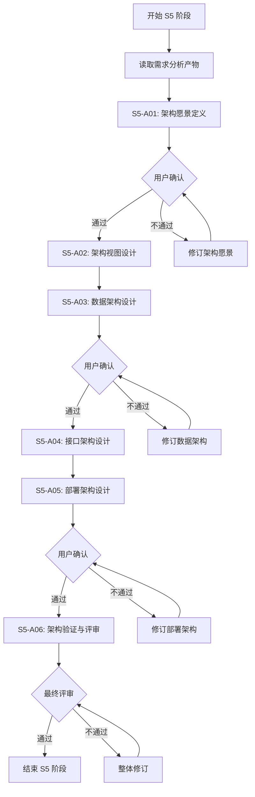

# P000001 S5 架构设计阶段工作计划

---

## 基本信息

| 项目 | 内容 |
|------|------|
| **Plan ID** | P000001 |
| **阶段编号** | S5 |
| **阶段名称** | 软件架构设计阶段 |
| **计划版本** | v1.0.0 |
| **制定时间** | 2026-03-27 |
| **执行模式** | 自动分析 + 用户交互 |
| **计划状态** | 待评审 |

---

## 一、阶段目标

基于 S1-S4 阶段的需求分析产物，按照 S5 通用软件架构设计阶段规范，完成以下目标：

1. **架构愿景定义**：分析需求特征，推导架构方向，确认关键决策
2. **架构视图设计**：基于 4+1 视图模型生成系统架构设计
3. **数据架构设计**：分析数据需求，设计数据存储方案
4. **接口架构设计**：识别集成点，设计接口规范
5. **部署架构设计**：分析部署约束，设计部署方案
6. **架构验证与评审**：检查设计完整性，识别架构风险

---

## 二、输入产物

### 2.1 需求分析产物

| 产物编号 | 产物名称 | 路径 | 状态 |
|----------|----------|------|:----:|
| S0-S00 | Plan 定义文件 | `database/plans/P000001.md` | ✅ |
| S1-S01 | 需求边界界定报告 | `database/stages/s1/P000001-S1-S01-001.md` | ✅ |
| S1-S02 | 显性需求清单 | `database/stages/s1/P000001-S1-S02-001.md` | ✅ |
| S1-S03 | 隐性需求清单 | `database/stages/s1/P000001-S1-S03-001.md` | ✅ |
| S1-S04 | S1 阶段汇总报告 | `database/stages/s1/P000001-S1-S04-001.md` | ✅ |
| S2-S09 | 竞品分析报告 | `database/stages/s2/P000001/P000001-S2-S09-001.md` | ✅ |
| S2-S10 | 市场痛点验证报告 | `database/stages/s2/P000001/P000001-S2-S10-001.md` | ✅ |
| S3-S07 | 技术风险评估报告 | `database/stages/s3/P000001/P000001-S3-S07-001.md` | ✅ |
| S3-S11 | 技术可行性分析报告 | `database/stages/s3/P000001/P000001-S3-S11-001.md` | ✅ |
| S3-S12 | 技术选型建议报告 | `database/stages/s3/P000001/P000001-S3-S12-001.md` | ✅ |
| S4-S05 | 需求分类报告 | `database/stages/s4/P000001/P000001-S4-S05-001.md` | ✅ |
| S4-S06 | 需求优先级排序报告 | `database/stages/s4/P000001/P000001-S4-S06-001.md` | ✅ |
| S4-S08 | 核心需求提炼报告 | `database/stages/s4/P000001/P000001-S4-S08-001.md` | ✅ |
| S4-S15 | 原型设计报告 | `database/prototypes/P000001/P000001-S4-S15-001.md` | ✅ |
| 最终报告 | 需求分析报告 | `database/plans/P000001-requirements-report.md` | ✅ |

### 2.2 关键需求特征

| 维度 | 特征描述 |
|------|----------|
| **系统类型** | 企业级 Web 应用（内部部署） |
| **用户规模** | 部门级（约 500 用户，200 并发） |
| **数据特征** | 关系型数据为主，含时序数据（趋势类） |
| **性能要求** | 中等并发，数据每日同步 |
| **集成需求** | 复杂（Trae/GitLab/禅道三平台） |
| **安全等级** | 内部敏感（研发效能数据） |

---

## 三、工作任务分解

### 3.1 S5-A01：架构愿景定义

**目标**：分析需求特征，推导架构方向，确认关键决策

**工作内容**：
1. 自动分析需求特征（系统类型、用户规模、数据特征、性能要求、集成需求、安全等级）
2. 基于自动推导规则推荐架构风格
3. 识别关键决策点，准备用户交互问题
4. 生成架构愿景文档

**关键决策点**（需用户确认）：
- 架构风格选择：分层架构 vs 微服务架构
- 可用性等级要求：99.9% vs 99.99%
- 数据同步策略：定时全量 vs 增量实时

**预计工时**：8 小时

**产出物**：
- `database/stages/s5/P000001/P000001-S5-A01-001.md`（架构愿景文档）

---

### 3.2 S5-A02：架构视图设计

**目标**：基于 4+1 视图模型生成系统架构设计

**工作内容**：
1. **场景视图**：基于 15 个核心用户故事，设计关键场景流程
2. **逻辑视图**：设计 5 大模块（全局统计/项目统计/个人统计/配置管理/权限管理）的模块划分
3. **开发视图**：基于 Vue3 + FastAPI 技术栈，设计代码组织结构
4. **物理视图**：设计服务器部署节点和网络拓扑
5. **数据视图**：设计数据流和存储分布

**视图选择**（推荐）：
- 核心视图：逻辑视图 + 场景视图 + 数据视图
- 简化视图：开发视图（基于技术栈自动推导）

**预计工时**：12 小时

**产出物**：
- `database/stages/s5/P000001/P000001-S5-A02-001.md`（架构视图设计文档）

---

### 3.3 S5-A03：数据架构设计

**目标**：分析数据需求，设计数据存储方案

**工作内容**：
1. 分析 12 个数据需求，识别数据实体
2. 设计核心数据模型：
   - 项目信息模型
   - 人员账号模型
   - Token 使用记录模型
   - 代码提交记录模型
   - Bug 记录模型
   - 统计数据聚合模型
3. 推荐存储方案：
   - PostgreSQL：业务数据、配置数据、聚合统计数据
   - Redis：缓存、会话管理、任务队列
   - 时序数据：PostgreSQL（分区表）或 TimescaleDB
4. 设计数据同步策略（每日凌晨 2 点）

**关键决策点**（需用户确认）：
- 时序数据存储：PostgreSQL 分区表 vs TimescaleDB
- 历史数据保留策略：永久保存 vs 定期归档

**预计工时**：10 小时

**产出物**：
- `database/stages/s5/P000001/P000001-S5-A03-001.md`（数据架构设计文档）

---

### 3.4 S5-A04：接口架构设计

**目标**：识别集成点，设计接口规范

**工作内容**：
1. **外部接口**（3 个）：
   - Trae API：Token 使用、API 调用、代码建议数据
   - GitLab API：仓库、提交、代码行数数据
   - 禅道 API：Bug 登记、指派、状态跟踪数据
2. **内部 API**（4 大模块）：
   - 统计 API：Token 趋势、活跃度、排名等
   - 配置 API：项目、人员、数据源配置
   - 权限 API：角色、权限、认证
   - 同步 API：数据同步任务管理
3. 接口规范设计：
   - RESTful API 风格
   - JWT 认证
   - 统一响应格式
   - 错误码规范
   - API 版本管理

**关键决策点**（需用户确认）：
- API 认证方式：JWT vs Session
- 外部 API 同步策略：串行 vs 并行

**预计工时**：10 小时

**产出物**：
- `database/stages/s5/P000001/P000001-S5-A04-001.md`（接口架构设计文档）

---

### 3.5 S5-A05：部署架构设计

**目标**：分析部署约束，设计部署方案

**工作内容**：
1. 分析部署约束：
   - 内部服务器部署
   - 容器化部署（Docker Compose）
   - Nginx 反向代理
2. 设计部署架构：
   - 前端：Nginx 静态文件服务
   - 后端：FastAPI 应用（Gunicorn + Uvicorn）
   - 数据库：PostgreSQL + Redis
   - 任务队列：Celery Worker
3. 资源配置建议：
   - 开发环境：单节点部署
   - 生产环境：应用集群 + 数据库主从
4. 设计监控方案：
   - 应用监控：Prometheus + Grafana
   - 日志管理：ELK Stack

**关键决策点**（需用户确认）：
- 生产环境节点数量：单节点 vs 多节点集群
- 监控方案：基础监控 vs 完整 ELK

**预计工时**：8 小时

**产出物**：
- `database/stages/s5/P000001/P000001-S5-A05-001.md`（部署架构设计文档）

---

### 3.6 S5-A06：架构验证与评审

**目标**：检查设计完整性，识别架构风险

**工作内容**：
1. **完整性检查**：
   - 64 个需求覆盖度检查
   - 15 个 P0 需求重点验证
   - 45 条验收标准对齐
2. **架构风险评估**：
   - 技术风险：多平台 API 稳定性、数据一致性
   - 性能风险：大数据量查询、定时同步性能
   - 安全风险：数据加密、访问控制
   - 运维风险：监控告警、故障恢复
3. **架构质量评估**：
   - 可维护性
   - 可扩展性
   - 可靠性
   - 安全性
4. 生成交互确认问题，请求用户评审

**预计工时**：8 小时

**产出物**：
- `database/stages/s5/P000001/P000001-S5-A06-001.md`（架构评审报告）

---

## 四、执行计划

### 4.1 里程碑计划

| 里程碑 | 时间节点 | 交付内容 | 状态 |
|--------|----------|----------|:----:|
| M1：架构愿景确认 | Day 1 | 架构愿景文档 | ⏳ |
| M2：架构视图完成 | Day 2-3 | 架构视图设计文档 | ⏳ |
| M3：数据架构完成 | Day 4 | 数据架构设计文档 | ⏳ |
| M4：接口架构完成 | Day 5 | 接口架构设计文档 | ⏳ |
| M5：部署架构完成 | Day 6 | 部署架构设计文档 | ⏳ |
| M6：架构评审通过 | Day 7 | 架构评审报告 | ⏳ |

### 4.2 工时汇总

| 任务编号 | 任务名称 | 工时（小时） |
|----------|----------|:------------:|
| S5-A01 | 架构愿景定义 | 8 |
| S5-A02 | 架构视图设计 | 12 |
| S5-A03 | 数据架构设计 | 10 |
| S5-A04 | 接口架构设计 | 10 |
| S5-A05 | 部署架构设计 | 8 |
| S5-A06 | 架构验证与评审 | 8 |
| **合计** | - | **56 小时** |

### 4.3 资源需求

| 资源类型 | 需求描述 |
|----------|----------|
| **人员** | 架构师 1 名（全程参与） |
| **工具** | 架构设计工具（Draw.io/Mermaid）、文档编辑工具 |
| **环境** | 需求分析产物已就绪，无需额外环境 |

---

## 五、用户交互点

### 5.1 关键决策确认（S5-A01）

**交互时机**：架构愿景定义完成后

**交互内容**：
1. 架构风格选择
2. 可用性等级确认
3. 数据同步策略确认

**预计交互时间**：30 分钟

---

### 5.2 存储选型确认（S5-A03）

**交互时机**：数据架构设计完成后

**交互内容**：
1. 时序数据存储方案选择
2. 历史数据保留策略确认

**预计交互时间**：20 分钟

---

### 5.3 接口规范确认（S5-A04）

**交互时机**：接口架构设计完成后

**交互内容**：
1. API 认证方式选择
2. 外部 API 同步策略确认

**预计交互时间**：20 分钟

---

### 5.4 部署方案确认（S5-A05）

**交互时机**：部署架构设计完成后

**交互内容**：
1. 生产环境部署规模确认
2. 监控方案选择

**预计交互时间**：20 分钟

---

### 5.5 架构评审确认（S5-A06）

**交互时机**：架构评审报告生成后

**交互内容**：
1. 架构风险评估确认
2. 风险应对策略确认
3. 整体架构方案评审通过

**预计交互时间**：60 分钟

---

## 六、风险管理

### 6.1 技术风险

| 风险编号 | 风险描述 | 影响程度 | 应对策略 |
|----------|----------|:--------:|----------|
| S5-R01 | 多平台 API 接口文档不完整 | 中 | 提前调研，准备 Mock 方案 |
| S5-R02 | 时序数据量预估不足 | 中 | 设计分库分表方案，预留扩展性 |
| S5-R03 | 数据一致性设计复杂度高 | 高 | 引入分布式事务，设计对账机制 |

### 6.2 进度风险

| 风险编号 | 风险描述 | 影响程度 | 应对策略 |
|----------|----------|:--------:|----------|
| S5-R04 | 用户交互确认延迟 | 中 | 提前预约评审时间，准备异步确认机制 |
| S5-R05 | 架构设计返工 | 中 | 每个子阶段完成后立即评审确认 |

---

## 七、质量标准

### 7.1 产物质量要求

| 检查项 | 标准要求 | 验证方式 |
|--------|----------|----------|
| **需求覆盖率** | 100% 覆盖 64 个需求 | 需求追踪矩阵 |
| **P0 需求覆盖** | 100% 覆盖 15 个 P0 需求 | 用户故事映射 |
| **架构一致性** | 符合 Vue3+FastAPI+PostgreSQL 技术栈 | 技术评审 |
| **文档完整性** | 6 个产物文档齐全 | 产物清单检查 |
| **图表规范性** | 使用 Mermaid 绘制流程图 | 文档检查 |

### 7.2 架构质量属性

| 质量属性 | 目标值 | 评估方法 |
|----------|--------|----------|
| **可维护性** | 模块耦合度低，职责清晰 | 架构评审 |
| **可扩展性** | 支持水平扩展，易于新增功能 | 设计检查 |
| **可靠性** | 99.9% 可用性 | 架构设计 |
| **安全性** | 数据加密存储，访问控制完善 | 安全评审 |

---

## 八、交付清单

| 产物编号 | 产物名称 | 存储路径 | 状态 |
|----------|----------|----------|:----:|
| S5-A01-001 | 架构愿景文档 | `database/stages/s5/P000001/P000001-S5-A01-001.md` | ⏳ |
| S5-A02-001 | 架构视图设计文档 | `database/stages/s5/P000001/P000001-S5-A02-001.md` | ⏳ |
| S5-A03-001 | 数据架构设计文档 | `database/stages/s5/P000001/P000001-S5-A03-001.md` | ⏳ |
| S5-A04-001 | 接口架构设计文档 | `database/stages/s5/P000001/P000001-S5-A04-001.md` | ⏳ |
| S5-A05-001 | 部署架构设计文档 | `database/stages/s5/P000001/P000001-S5-A05-001.md` | ⏳ |
| S5-A06-001 | 架构评审报告 | `database/stages/s5/P000001/P000001-S5-A06-001.md` | ⏳ |
| **本计划** | 架构设计工作计划 | `database/plans/P000001/P000001-S5-architecture-plan.md` | ⏳ |

---

## 九、执行流程

---

## 十、审批记录

| 角色 | 姓名 | 评审意见 | 评审时间 | 状态 |
|------|------|----------|----------|:----:|
| **架构师** | - | - | - | ⏳ |
| **技术负责人** | - | - | - | ⏳ |
| **用户代表** | - | - | - | ⏳ |

---

## 十一、附录

### 11.1 参考资料

1. S5 通用软件架构设计阶段规范：`skills/s5-architecture-generic/SKILL.md`
2. P000001 需求分析报告：`database/plans/P000001-requirements-report.md`
3. ISO/IEC/IEEE 42010:2011 系统与软件工程架构描述标准
4. IEEE 1016 软件架构设计文档标准

### 11.2 术语表

| 术语 | 定义 |
|------|------|
| **4+1 视图模型** | 场景视图、逻辑视图、开发视图、物理视图、数据视图 |
| **架构愿景** | 架构设计的高层目标和方向 |
| **数据架构** | 数据存储、数据流、数据管理的整体设计 |

---

**计划编制**：架构设计系统  
**编制时间**：2026-03-27  
**计划版本**：v1.0.0  
**计划状态**：待评审

---

*本计划为 P000001 项目 S5 架构设计阶段的工作指导文件，评审通过后将作为架构设计的执行依据。*
