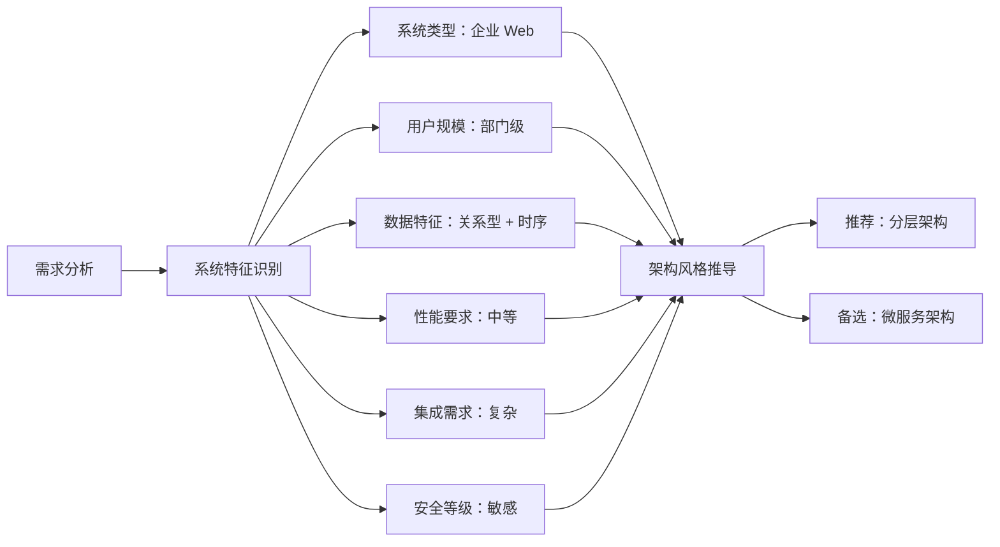

# P000001 S5-A01 架构愿景文档

---

## 基本信息

| 项目 | 内容 |
|------|------|
| **Plan ID** | P000001 |
| **阶段编号** | S5-A01 |
| **文档名称** | 架构愿景定义 |
| **文档版本** | v1.0.0 |
| **生成时间** | 2026-03-27 |
| **生成方式** | 自动推导 + 用户交互 |
| **文档状态** | 待用户确认 |

---

## 一、需求分析摘要

### 1.1 输入产物

基于以下需求分析产物进行架构推导：

| 产物类型 | 产物名称 | 状态 |
|----------|----------|:----:|
| 需求分析报告 | `database/plans/P000001-requirements-report.md` | ✅ 已评审 |
| 技术可行性分析 | `database/stages/s3/P000001/P000001-S3-S11-001.md` | ✅ 已评审 |
| 技术选型建议 | `database/stages/s3/P000001/P000001-S3-S12-001.md` | ✅ 已评审 |
| 原型设计报告 | `database/prototypes/P000001/P000001-S4-S15-001.md` | ✅ 已评审 |

### 1.2 核心需求特征

| 维度 | 特征描述 | 推导依据 |
|------|----------|----------|
| **系统类型** | 企业级 Web 应用 | 10 个原型页面、B/S 架构、内部管理 |
| **用户规模** | 部门级（500 用户，200 并发） | 研发中心内部使用 |
| **数据特征** | 关系型 + 时序数据混合 | Token 趋势、代码提交、Bug 跟踪 |
| **性能要求** | 中等并发，日同步频率 | 每日凌晨 2 点定时同步 |
| **集成需求** | 复杂（3 个外部系统） | Trae + GitLab + 禅道 |
| **安全等级** | 内部敏感数据 | 研发效能数据、人员绩效 |

---

## 二、自动推导结果

### 2.1 系统特征识别

根据 S5 通用架构设计规范的自动推导规则，识别结果如下：



### 2.2 架构风格推导

#### 推荐方案：分层架构 + 单体部署

**匹配规则**：
- ✅ 企业 Web + 中等规模 + 关系数据 → 分层架构
- ✅ 部门级用户（<1000 并发）→ 单体应用 + 简单缓存
- ✅ 关系型数据为主 → PostgreSQL / MySQL

**推荐理由**：
1. **结构清晰**：前端/后端/数据层职责明确，易于理解和维护
2. **开发效率高**：单体部署简化开发和测试流程
3. **技术栈匹配**：与用户偏好的 Vue3+FastAPI+PostgreSQL 完全匹配
4. **成本效益**：初期投入低，运维简单
5. **演进路径**：未来可平滑演进为微服务架构

#### 备选方案：微服务架构 + 容器部署

**适用场景**：
- 用户规模快速增长（>1000 并发）
- 需要独立扩展特定模块
- 具备 DevOps 能力和团队

**不推荐原因**：
- ❌ 初期复杂度高，开发周期长
- ❌ 运维成本高，需要专业 DevOps 团队
- ❌ 当前规模（500 用户）过度设计

---

### 2.3 技术方案推导

#### 性能等级推导

| 推导依据 | 识别结果 | 推荐策略 |
|----------|----------|----------|
| 用户数量 | 500 用户 | 部门级 |
| 并发用户 | 200 并发 | 中等并发 |
| 数据同步 | 每日 1 次 | 批处理 |
| 响应时间 | 秒级响应 | 常规优化 |

**推导结论**：中等性能等级 → 应用集群 + 数据库优化 + 缓存策略

#### 数据存储推导

| 数据类型 | 数据特征 | 推荐存储 | 理由 |
|----------|----------|----------|------|
| 项目信息 | 关系型、结构化 | PostgreSQL | 强一致性，复杂查询 |
| 人员账号 | 关系型、结构化 | PostgreSQL | 强一致性，关联查询 |
| Token 记录 | 时序数据、写入频繁 | PostgreSQL（分区表） | 时序特性 + 关系查询 |
| 代码提交 | 时序数据、批量写入 | PostgreSQL（分区表） | 日同步、批量处理 |
| Bug 记录 | 关系型、状态跟踪 | PostgreSQL | 状态流转、关联查询 |
| 统计数据 | 聚合数据、读多写少 | PostgreSQL + Redis | 热数据缓存 |
| 会话管理 | 临时数据、高频访问 | Redis | 低延迟、过期策略 |
| 任务队列 | 队列数据、异步处理 | Redis（Celery） | 异步任务调度 |

**推导结论**：PostgreSQL + Redis 组合方案

---

### 2.4 架构愿景

#### 愿景陈述

> 构建一个**分层清晰**、**易于维护**、**安全可控**的 Coding Agent 绩效统计平台，采用**前后端分离**架构，整合多平台数据，提供全局/项目/个人多维度统计视图，支持研发效能度量和团队管理决策。

#### 架构目标

| 目标维度 | 具体目标 | 衡量指标 |
|----------|----------|----------|
| **功能性** | 覆盖 64 个需求（P0:15, P1:18, P2:19） | 需求覆盖率 100% |
| **性能** | 支持 200 并发，秒级响应 | 页面加载 < 3s，API 响应 < 1s |
| **可用性** | 内部业务系统标准 | 99.9% 可用性（年停机 < 8.76 小时） |
| **安全性** | 数据加密存储，访问控制完善 | 通过内部安全审计 |
| **可维护性** | 模块化设计，文档齐全 | 代码注释率 > 30% |
| **可扩展性** | 支持水平扩展，易于新增功能 | 模块解耦，接口标准化 |

#### 架构原则

1. **分层架构**：前端/后端/数据层职责分离
2. **前后端分离**：RESTful API 接口，独立部署
3. **数据驱动**：统一数据模型，标准化数据流
4. **安全优先**：数据加密、访问控制、审计日志
5. **渐进演进**：MVP → V1.0 分阶段交付
6. **自动化**：定时同步、自动统计、自动报告

---

## 三、关键决策点（需用户确认）

### 决策 1：架构风格选择

**背景**：基于系统特征识别，存在两种可行的架构风格。

**选项对比**：

| 维度 | 方案 A：分层架构 + 单体部署 | 方案 B：微服务架构 + 容器部署 |
|------|---------------------------|---------------------------|
| **适用规模** | 部门级（<1000 并发） | 企业级/互联网级（>1000 并发） |
| **开发复杂度** | 低 | 高 |
| **运维成本** | 低 | 高 |
| **扩展性** | 垂直扩展为主 | 水平扩展 |
| **交付周期** | 短（MVP 2 周） | 长（MVP 4 周+） |
| **团队要求** | 常规全栈能力 | 需要 DevOps 专家 |
| **初期投入** | 低 | 高 |

**推荐方案**：**方案 A（分层架构 + 单体部署）**

**推荐理由**：
1. 匹配当前用户规模（500 用户，200 并发）
2. 开发周期短，快速交付 MVP
3. 运维简单，适合内部部署
4. 技术栈成熟，团队学习成本低
5. 未来可平滑演进为微服务

**风险与应对**：
- 风险：未来用户增长导致性能瓶颈
- 应对：设计时预留扩展点，支持后续拆分

---

### 决策 2：可用性等级要求

**背景**：需求中提到"内部服务器部署"，但未明确可用性指标。

**常见可用性等级**：

| 等级 | 可用性 | 年停机时间 | 适用场景 | 成本 |
|------|--------|------------|----------|------|
| 基础级 | 99.9% | < 8.76 小时 | 一般内部业务系统 | 低 |
| 增强级 | 99.99% | < 52.6 分钟 | 重要业务系统 | 中 |
| 关键级 | 99.999% | < 5.26 分钟 | 核心业务系统 | 高 |

**推荐方案**：**基础级（99.9%）**

**推荐理由**：
1. 符合内部业务系统定位
2. 非 7×24 小时关键业务
3. 成本效益最优
4. 允许夜间维护窗口（如凌晨同步时段）

---

### 决策 3：数据同步策略

**背景**：需求明确"每日定时同步"，但未明确同步方式。

**选项对比**：

| 维度 | 方案 A：定时全量同步 | 方案 B：增量实时同步 |
|------|-------------------|-------------------|
| **实现复杂度** | 低 | 中 |
| **数据时效性** | T+1（隔日） | 近实时 |
| **API 压力** | 低（每日 1 次） | 高（持续调用） |
| **数据一致性** | 易保证 | 需额外机制 |
| **运维成本** | 低 | 中 |
| **适用场景** | 报表统计类 | 实时监控类 |

**推荐方案**：**方案 A（定时全量同步）**

**推荐理由**：
1. 符合需求"每日凌晨 2 点自动更新"
2. 降低外部 API 压力
3. 简化数据一致性处理
4. 便于问题排查和回滚
5. 适合绩效统计场景（T+1 可接受）

**补充方案**：
- 对于配置数据（项目信息、人员账号）采用**实时同步**
- 对于统计数据（Token、代码、Bug）采用**定时全量同步**

---

## 四、架构假设

基于需求分析，做出以下假设：

### 假设 1：系统主要面向内部用户

- **假设内容**：系统仅在研发中心内部使用，不需要公网访问
- **推导依据**：需求"内部服务器部署"
- **影响**：不需要 CDN 加速、WAF 防护等公网安全措施
- **验证状态**：⏳ 待确认

### 假设 2：数据增长率可控

- **假设内容**：数据月增长率 < 20%，3 年内数据量 < 100GB
- **推导依据**：部门级规模，日同步频率
- **影响**：PostgreSQL 单实例可支撑，不需要分库分表
- **验证状态**：⏳ 待确认

### 假设 3：外部 API 稳定性可接受

- **假设内容**：Trae/GitLab/禅道 API 可用性 > 99%
- **推导依据**：成熟商业平台
- **影响**：不需要复杂的重试和降级机制
- **验证状态**：⏳ 待确认

### 假设 4：团队具备基础技术能力

- **假设内容**：团队熟悉 Vue3/Python/PostgreSQL 技术栈
- **推导依据**：用户明确技术栈偏好
- **影响**：不需要额外培训成本
- **验证状态**：⏳ 待确认

---

## 五、架构风险识别

### 技术风险

| 风险编号 | 风险描述 | 影响程度 | 可能性 | 应对策略 |
|----------|----------|:--------:|:------:|----------|
| **S5-R001** | 多平台 API 接口文档不完整 | 高 | 中 | 提前调研，准备 Mock 方案，设计适配器模式 |
| **S5-R002** | 时序数据量超预期 | 中 | 中 | 设计分区表，预留 TimescaleDB 迁移路径 |
| **S5-R003** | 数据一致性复杂度高 | 高 | 中 | 引入分布式事务，设计对账机制，提供数据修复工具 |
| **S5-R004** | 外部 API 限流策略 | 中 | 高 | 实现限流适配，增加重试机制，本地缓存兜底 |

### 架构风险

| 风险编号 | 风险描述 | 影响程度 | 可能性 | 应对策略 |
|----------|----------|:--------:|:------:|----------|
| **S5-R005** | 单体架构性能瓶颈 | 中 | 低 | 模块化设计，预留微服务拆分点 |
| **S5-R006** | 数据库单点故障 | 高 | 中 | 设计主从复制，定期备份 |
| **S5-R007** | 缓存穿透/雪崩 | 中 | 中 | 缓存预热，布隆过滤器，多级缓存 |

---

## 六、架构质量属性

### 6.1 质量目标

| 质量属性 | 目标值 | 评估方法 | 设计策略 |
|----------|--------|----------|----------|
| **功能性** | 100% 覆盖 64 个需求 | 需求追踪矩阵 | 模块化设计，按需求分配 |
| **性能** | 页面加载 < 3s，API 响应 < 1s | 性能测试 | 前端懒加载，后端缓存，数据库索引 |
| **可用性** | 99.9% | 架构设计 | 错误处理，健康检查，自动恢复 |
| **安全性** | 通过内部安全审计 | 安全评审 | 数据加密，访问控制，审计日志 |
| **可维护性** | 代码注释率 > 30% | 代码审查 | 模块化，文档化，单元测试 |
| **可扩展性** | 支持水平扩展 | 设计审查 | 无状态设计，接口标准化 |

### 6.2 质量权衡

| 权衡场景 | 选择 | 理由 |
|----------|------|------|
| 性能 vs 成本 | 适度性能，控制成本 | 内部系统，性价比优先 |
| 一致性 vs 可用性 | 强一致性 | 绩效数据，准确性优先 |
| 灵活性 vs 简单性 | 简单性 | MVP 快速交付，避免过度设计 |
| 安全性 vs 便利性 | 安全性 | 敏感数据，安全优先 |

---

## 七、架构视图概览

### 7.1 4+1 视图选择

根据项目特征，选择以下架构视图：

| 视图类型 | 优先级 | 说明 |
|----------|:------:|------|
| **场景视图** | P0 | 基于 15 个核心用户故事，设计关键场景流程 |
| **逻辑视图** | P0 | 5 大模块（全局统计/项目统计/个人统计/配置管理/权限管理）的模块划分 |
| **数据视图** | P0 | 数据流、数据存储、数据同步设计 |
| **开发视图** | P1 | 基于 Vue3 + FastAPI 技术栈的代码组织结构 |
| **物理视图** | P1 | 服务器部署节点和网络拓扑 |

### 7.2 核心架构图（预览）

```
┌─────────────────────────────────────────────────────────────┐
│                    前端层 (Vue 3 + TypeScript)               │
│              Element Plus 组件库 + ECharts 图表              │
└─────────────────────────────────────────────────────────────┘
                              │
                              ▼
┌─────────────────────────────────────────────────────────────┐
│                   Nginx (反向代理 + 静态文件)                │
└─────────────────────────────────────────────────────────────┘
                              │
                              ▼
┌─────────────────────────────────────────────────────────────┐
│                    后端层 (FastAPI + Python 3.11)            │
│  ┌──────────┐  ┌──────────┐  ┌──────────┐  ┌──────────┐    │
│  │ 统计 API │  │ 配置 API │  │ 权限 API │  │ 同步 API │    │
│  │  Module  │  │  Module  │  │  Module  │  │  Module  │    │
│  └──────────┘  └──────────┘  └──────────┘  └──────────┘    │
└─────────────────────────────────────────────────────────────┘
                              │
                              ▼
┌─────────────────────────────────────────────────────────────┐
│                      数据层                                  │
│  ┌──────────────┐  ┌──────────────┐  ┌──────────────┐      │
│  │  PostgreSQL  │  │    Redis     │  │   Celery     │      │
│  │  (主数据库)   │  │   (缓存)     │  │  (任务队列)   │      │
│  └──────────────┘  └──────────────┘  └──────────────┘      │
└─────────────────────────────────────────────────────────────┘
                              │
                              ▼
┌─────────────────────────────────────────────────────────────┐
│                    外部数据源                                │
│  ┌──────────┐  ┌──────────┐  ┌──────────┐                  │
│  │   Trae   │  │  GitLab  │  │   禅道    │                  │
│  │   API    │  │   API    │  │   API    │                  │
│  └──────────┘  └──────────┘  └──────────┘                  │
└─────────────────────────────────────────────────────────────┘
```

---

## 八、下一步工作

### 8.1 待确认事项

请用户确认以下关键决策：

1. **架构风格**：是否同意采用"分层架构 + 单体部署"？
2. **可用性等级**：是否同意 99.9% 可用性目标？
3. **数据同步策略**：是否同意"定时全量 + 配置实时"的混合策略？
4. **架构假设**：4 个假设是否成立？

### 8.2 后续任务

架构愿景确认后，将开展以下工作：

1. **S5-A02**：架构视图设计（逻辑视图 + 场景视图 + 数据视图）
2. **S5-A03**：数据架构设计（核心数据模型 + 存储方案）
3. **S5-A04**：接口架构设计（外部接口 + 内部 API）
4. **S5-A05**：部署架构设计（部署方案 + 监控方案）
5. **S5-A06**：架构验证与评审（需求覆盖检查 + 风险评估）

---

## 九、评审记录

| 角色 | 姓名 | 评审意见 | 评审时间 | 状态 |
|------|------|----------|----------|:----:|
| **架构师** | - | - | - | ⏳ |
| **技术负责人** | - | - | - | ⏳ |
| **用户代表** | - | - | - | ⏳ |

---

## 十、附录

### 10.1 参考资料

1. S5 通用软件架构设计阶段规范：`skills/s5-architecture-generic/SKILL.md`
2. P000001 需求分析报告：`database/plans/P000001-requirements-report.md`
3. ISO/IEC/IEEE 42010:2011 系统与软件工程架构描述标准

### 10.2 术语表

| 术语 | 定义 |
|------|------|
| **分层架构** | 将系统划分为前端层、后端层、数据层的架构风格 |
| **单体部署** | 所有功能模块部署在同一服务器或容器中的部署方式 |
| **微服务架构** | 将系统拆分为小型独立服务的架构风格 |
| **4+1 视图模型** | 场景视图、逻辑视图、开发视图、物理视图、数据视图 |
| **T+1** | 隔日数据，如今日同步昨日数据 |

---

**文档编制**：架构设计系统  
**编制时间**：2026-03-27  
**文档版本**：v1.0.0  
**文档状态**：待用户确认

---

*本文档为 P000001 项目架构愿景定义，确认后将成为后续架构设计的指导文件。*
