# P000001 S5-A02 架构视图设计文档

---

## 基本信息

| 项目 | 内容 |
|------|------|
| **Plan ID** | P000001 |
| **阶段编号** | S5-A02 |
| **文档名称** | 架构视图设计 |
| **文档版本** | v1.0.0 |
| **生成时间** | 2026-03-27 |
| **生成方式** | 基于架构愿景自动生成 |
| **文档状态** | 待评审 |

---

## 一、设计输入

### 1.1 前置文档

| 文档名称 | 文档路径 | 状态 |
|----------|----------|:----:|
| 架构愿景定义 | `database/stages/s5/P000001/P000001-S5-A01-001.md` | ✅ 已确认 |
| 需求分析报告 | `database/plans/P000001-requirements-report.md` | ✅ 已评审 |

### 1.2 确认的架构决策

| 决策项 | 确认方案 | 确认时间 |
|--------|----------|----------|
| **架构风格** | 分层架构 + 单体部署 | 2026-03-27 |
| **可用性等级** | 99.9%（基础级） | 2026-03-27 |
| **数据同步策略** | 定时全量 + 配置实时（混合） | 2026-03-27 |
| **架构假设** | 4 个假设均成立 | 2026-03-27 |

### 1.3 视图选择

根据项目特征和架构愿景，设计以下视图：

| 视图类型 | 优先级 | 设计内容 |
|----------|:------:|----------|
| **逻辑视图** | P0 | 5 大模块划分、模块职责、模块关系 |
| **场景视图** | P0 | 15 个核心用户故事的场景流程 |
| **数据视图** | P0 | 数据流、数据存储、数据同步 |
| **开发视图** | P1 | 代码组织结构、技术栈映射 |
| **物理视图** | P1 | 部署节点、网络拓扑 |

---

## 二、逻辑视图（Logical View）

### 2.1 系统分层

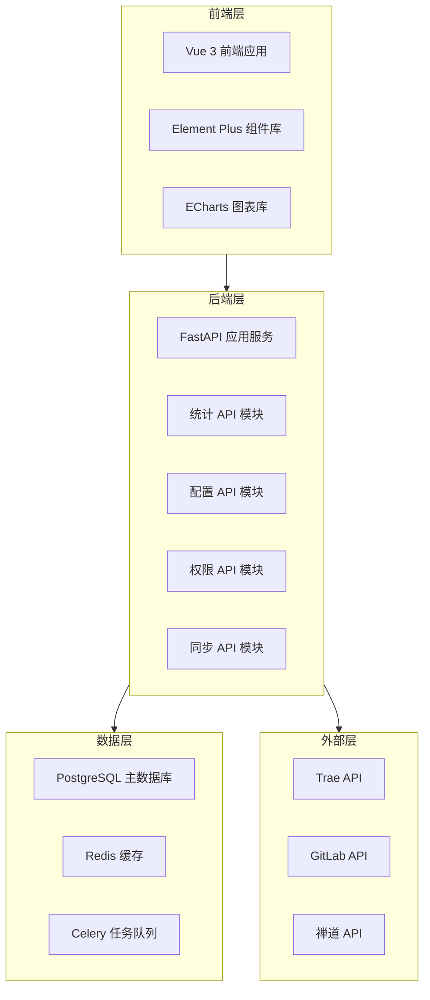

### 2.2 模块划分

系统划分为 5 大核心模块：

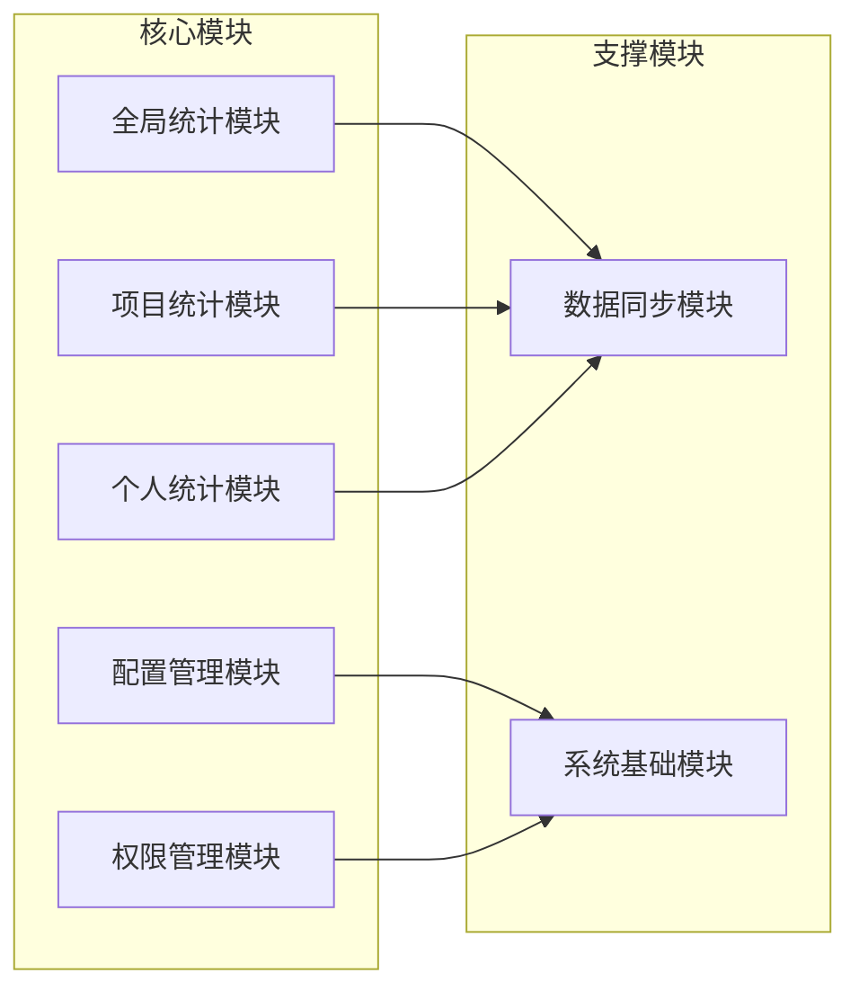

### 2.3 模块职责

#### 全局统计模块

| 属性 | 内容 |
|------|------|
| **模块编号** | MOD-001 |
| **模块名称** | 全局统计模块 |
| **核心职责** | 提供全中心维度的 Coding Agent 使用统计 |
| **包含功能** | 1. 全局 Token 使用趋势看板<br>2. 全中心活跃度趋势<br>3. 高频使用人员 TOP 20 |
| **接口** | GET /api/stats/global/token-trend<br>GET /api/stats/global/activity-trend<br>GET /api/stats/global/top-users |
| **数据依赖** | Token 使用记录表、API 调用记录表、用户表 |

#### 项目统计模块

| 属性 | 内容 |
|------|------|
| **模块编号** | MOD-002 |
| **模块名称** | 项目统计模块 |
| **核心职责** | 提供项目维度的统计视图 |
| **包含功能** | 1. 项目维度统计视图<br>2. 项目代码行排名<br>3. 项目 Bug 趋势看板<br>4. 项目 AI 代码采纳率<br>5. 项目代码提交量排行 |
| **接口** | GET /api/stats/projects<br>GET /api/stats/projects/{id}/code-rank<br>GET /api/stats/projects/{id}/bug-trend<br>GET /api/stats/projects/{id}/ai-adoption<br>GET /api/stats/projects/{id}/commit-rank |
| **数据依赖** | 项目表、代码提交记录表、Bug 记录表、AI 建议记录表 |

#### 个人统计模块

| 属性 | 内容 |
|------|------|
| **模块编号** | MOD-003 |
| **模块名称** | 个人统计模块 |
| **核心职责** | 提供个人维度的统计视图 |
| **包含功能** | 1. 个人代码统计<br>2. 个人 Token 使用统计<br>3. 个人 Bug 率统计 |
| **接口** | GET /api/stats/personal/code<br>GET /api/stats/personal/token<br>GET /api/stats/personal/bug-rate |
| **数据依赖** | 用户表、代码提交记录表、Token 使用记录表、Bug 记录表 |

#### 配置管理模块

| 属性 | 内容 |
|------|------|
| **模块编号** | MOD-004 |
| **模块名称** | 配置管理模块 |
| **核心职责** | 管理系统基础配置信息 |
| **包含功能** | 1. 项目基础信息管理<br>2. 项目数据源关联配置<br>3. 人员平台账号配置 |
| **接口** | CRUD /api/config/projects<br>CRUD /api/config/data-sources<br>CRUD /api/config/user-accounts |
| **数据依赖** | 项目表、数据源配置表、用户账号表 |

#### 权限管理模块

| 属性 | 内容 |
|------|------|
| **模块编号** | MOD-005 |
| **模块名称** | 权限管理模块 |
| **核心职责** | 管理用户角色和权限 |
| **包含功能** | 1. 角色权限管理<br>2. 用户认证<br>3. 数据访问控制 |
| **接口** | CRUD /api/auth/roles<br>POST /api/auth/login<br>GET /api/auth/permissions |
| **数据依赖** | 用户表、角色表、权限表 |

#### 数据同步模块

| 属性 | 内容 |
|------|------|
| **模块编号** | MOD-006 |
| **模块名称** | 数据同步模块 |
| **核心职责** | 负责外部平台数据同步 |
| **包含功能** | 1. Trae 数据同步<br>2. GitLab 数据同步<br>3. 禅道数据同步<br>4. 定时任务调度 |
| **接口** | POST /api/sync/trigger<br>GET /api/sync/status<br>GET /api/sync/logs |
| **数据依赖** | 同步任务表、同步日志表 |

#### 系统基础模块

| 属性 | 内容 |
|------|------|
| **模块编号** | MOD-007 |
| **模块名称** | 系统基础模块 |
| **核心职责** | 提供系统基础服务 |
| **包含功能** | 1. 日志管理<br>2. 健康检查<br>3. 系统监控 |
| **接口** | GET /api/health<br>GET /api/metrics<br>GET /api/logs |
| **数据依赖** | 日志表、监控指标表 |

### 2.4 模块关系

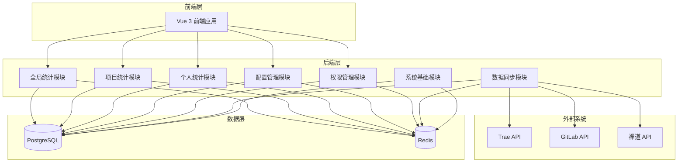

---

## 三、场景视图（Scenario View）

### 3.1 核心场景列表

基于 15 个核心用户故事，识别以下关键场景：

| 场景编号 | 场景名称 | 对应用户故事 | 优先级 |
|----------|----------|--------------|:------:|
| SC-001 | 查看全局 Token 趋势 | US-001 | P0 |
| SC-002 | 查看活跃度趋势 | US-002 | P0 |
| SC-003 | 查看高频使用人员 | US-003 | P0 |
| SC-004 | 查看项目统计视图 | US-004 | P0 |
| SC-005 | 配置项目信息 | US-012 | P0 |
| SC-006 | 配置数据源 | US-013 | P0 |
| SC-007 | 触发数据同步 | - | P0 |

### 3.2 场景流程

#### SC-001：查看全局 Token 趋势

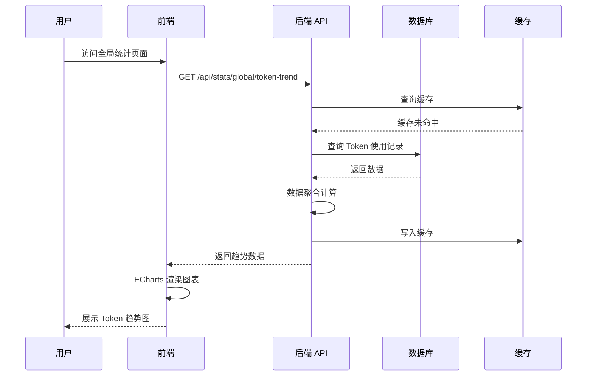

**场景说明**：
1. 用户访问全局统计页面
2. 前端调用后端 API 获取 Token 趋势数据
3. 后端优先查询缓存，未命中则查询数据库
4. 数据库返回原始数据，后端进行聚合计算
5. 结果写入缓存（TTL: 1 小时）
6. 前端使用 ECharts 渲染折线图

**涉及模块**：全局统计模块、数据层

---

#### SC-002：配置项目信息

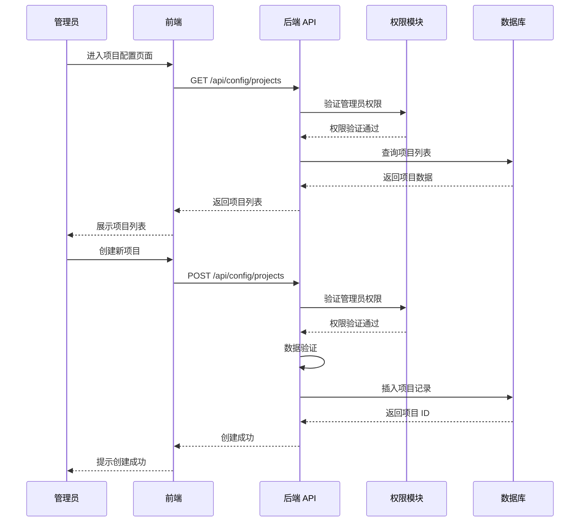

**场景说明**：
1. 管理员进入项目配置页面
2. 后端验证管理员权限
3. 查询并展示项目列表
4. 创建新项目时进行数据验证
5. 权限验证贯穿整个流程

**涉及模块**：配置管理模块、权限管理模块

---

#### SC-003：触发数据同步

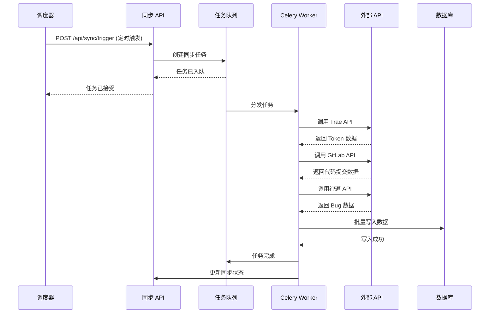

**场景说明**：
1. 定时调度器（每日凌晨 2 点）触发同步任务
2. 同步任务入队，由 Celery Worker 异步处理
3. Worker 依次调用三个外部 API
4. 批量写入数据库
5. 更新同步状态和日志

**涉及模块**：数据同步模块、任务队列

---

#### SC-004：查看个人统计

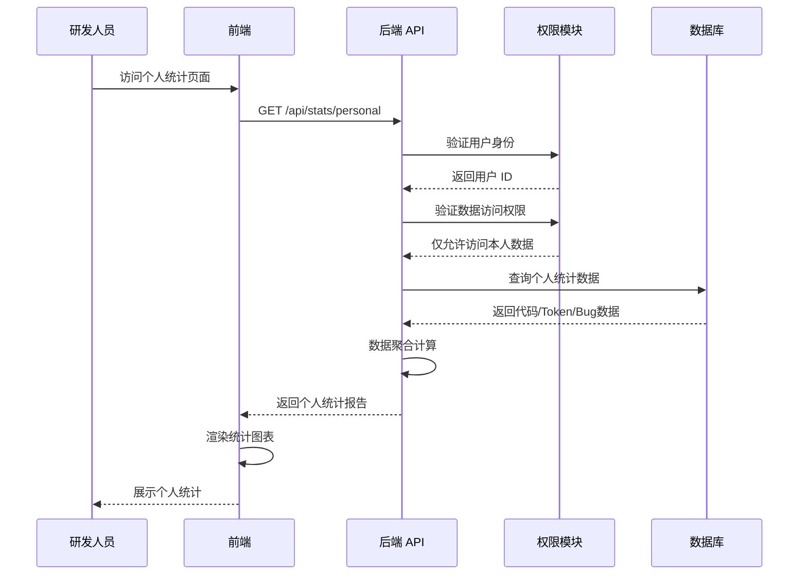

**场景说明**：
1. 研发人员访问个人统计页面
2. 后端验证用户身份
3. 权限控制确保只能查看本人数据
4. 聚合代码、Token、Bug 多维度数据
5. 前端展示个人统计报告

**涉及模块**：个人统计模块、权限管理模块

---

### 3.3 场景 - 模块映射

| 场景编号 | 场景名称 | 涉及模块 | 优先级 |
|----------|----------|----------|:------:|
| SC-001 | 查看全局 Token 趋势 | 全局统计模块、数据层 | P0 |
| SC-002 | 查看活跃度趋势 | 全局统计模块、数据层 | P0 |
| SC-003 | 查看高频使用人员 | 全局统计模块、数据层 | P0 |
| SC-004 | 查看项目统计视图 | 项目统计模块、数据层 | P0 |
| SC-005 | 配置项目信息 | 配置管理模块、权限管理模块 | P0 |
| SC-006 | 配置数据源 | 配置管理模块、权限管理模块 | P0 |
| SC-007 | 触发数据同步 | 数据同步模块、任务队列 | P0 |
| SC-008 | 查看个人统计 | 个人统计模块、权限管理模块 | P0 |

---

## 四、数据视图（Data View）

### 4.1 数据流图

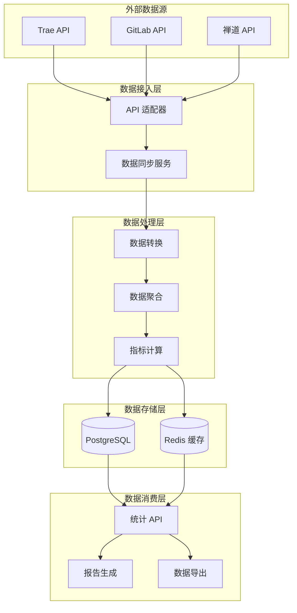

**数据流说明**：
1. **数据采集**：通过 API 适配器从三个外部平台采集数据
2. **数据同步**：定时全量同步（统计数据）+ 实时同步（配置数据）
3. **数据处理**：转换 → 聚合 → 计算
4. **数据存储**：PostgreSQL（持久化）+ Redis（缓存）
5. **数据消费**：统计 API、报告生成、数据导出

---

### 4.2 数据实体关系

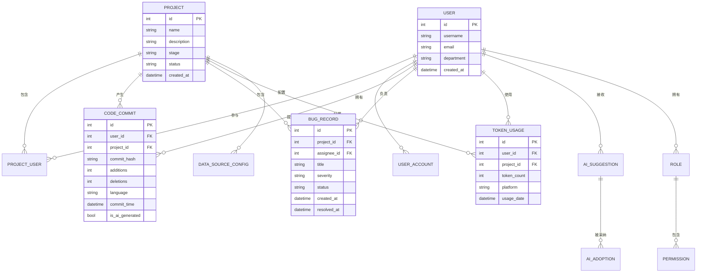

### 4.3 核心数据表

#### 用户表（users）

| 字段名 | 类型 | 约束 | 说明 |
|--------|------|------|------|
| id | INTEGER | PK, AUTO | 用户 ID |
| username | VARCHAR(50) | NOT NULL, UNIQUE | 用户名 |
| email | VARCHAR(100) | NOT NULL, UNIQUE | 邮箱 |
| department | VARCHAR(50) | NOT NULL | 部门 |
| password_hash | VARCHAR(255) | NOT NULL | 密码哈希 |
| role_id | INTEGER | FK | 角色 ID |
| created_at | TIMESTAMP | NOT NULL | 创建时间 |
| updated_at | TIMESTAMP | NOT NULL | 更新时间 |

#### 项目表（projects）

| 字段名 | 类型 | 约束 | 说明 |
|--------|------|------|------|
| id | INTEGER | PK, AUTO | 项目 ID |
| name | VARCHAR(100) | NOT NULL | 项目名称 |
| description | TEXT | - | 项目描述 |
| stage | VARCHAR(20) | NOT NULL | 项目阶段 |
| status | VARCHAR(20) | NOT NULL | 项目状态 |
| gitlab_repo_id | INTEGER | FK | GitLab 仓库 ID |
| zendao_project_id | INTEGER | FK | 禅道项目 ID |
| created_at | TIMESTAMP | NOT NULL | 创建时间 |
| updated_at | TIMESTAMP | NOT NULL | 更新时间 |

#### 代码提交表（code_commits）

| 字段名 | 类型 | 约束 | 说明 |
|--------|------|------|------|
| id | INTEGER | PK, AUTO | 提交 ID |
| user_id | INTEGER | FK, NOT NULL | 用户 ID |
| project_id | INTEGER | FK, NOT NULL | 项目 ID |
| commit_hash | VARCHAR(64) | NOT NULL, UNIQUE | 提交哈希 |
| additions | INTEGER | NOT NULL | 新增行数 |
| deletions | INTEGER | NOT NULL | 删除行数 |
| language | VARCHAR(20) | NOT NULL | 编程语言 |
| commit_time | TIMESTAMP | NOT NULL | 提交时间 |
| is_ai_generated | BOOLEAN | DEFAULT FALSE | 是否 AI 生成 |
| created_at | TIMESTAMP | NOT NULL | 入库时间 |

**分区策略**：按 `commit_time` 月度分区

#### Token 使用表（token_usage）

| 字段名 | 类型 | 约束 | 说明 |
|--------|------|------|------|
| id | INTEGER | PK, AUTO | 记录 ID |
| user_id | INTEGER | FK, NOT NULL | 用户 ID |
| project_id | INTEGER | FK | 项目 ID |
| token_count | INTEGER | NOT NULL | Token 数量 |
| platform | VARCHAR(20) | NOT NULL | 平台（Trae/阿里等） |
| usage_date | DATE | NOT NULL | 使用日期 |
| api_calls | INTEGER | NOT NULL | API 调用次数 |
| created_at | TIMESTAMP | NOT NULL | 入库时间 |

**分区策略**：按 `usage_date` 月度分区

#### Bug 记录表（bug_records）

| 字段名 | 类型 | 约束 | 说明 |
|--------|------|------|------|
| id | INTEGER | PK, AUTO | Bug ID |
| project_id | INTEGER | FK, NOT NULL | 项目 ID |
| assignee_id | INTEGER | FK | 负责人 ID |
| reporter_id | INTEGER | FK | 报告人 ID |
| title | VARCHAR(200) | NOT NULL | Bug 标题 |
| severity | VARCHAR(20) | NOT NULL | 严重程度 |
| status | VARCHAR(20) | NOT NULL | 状态 |
| created_at | TIMESTAMP | NOT NULL | 创建时间 |
| resolved_at | TIMESTAMP | - | 解决时间 |
| zendao_bug_id | INTEGER | FK | 禅道 Bug ID |

---

### 4.4 缓存策略

#### 缓存对象

| 缓存键 | 缓存内容 | TTL | 更新策略 |
|--------|----------|-----|----------|
| `stats:global:token:{date}` | 全局 Token 统计数据 | 1 小时 | 定时同步后失效 |
| `stats:global:activity:{date}` | 全局活跃度数据 | 1 小时 | 定时同步后失效 |
| `stats:project:{id}:{date}` | 项目统计数据 | 30 分钟 | 定时同步后失效 |
| `stats:personal:{user_id}:{date}` | 个人统计数据 | 30 分钟 | 定时同步后失效 |
| `config:projects` | 项目配置列表 | 5 分钟 | 配置变更后失效 |
| `config:data-sources` | 数据源配置 | 5 分钟 | 配置变更后失效 |
| `session:{user_id}` | 用户会话 | 2 小时 | 用户登出时删除 |
| `sync:status:{task_id}` | 同步任务状态 | 24 小时 | 任务完成后设置 |

#### 缓存更新策略

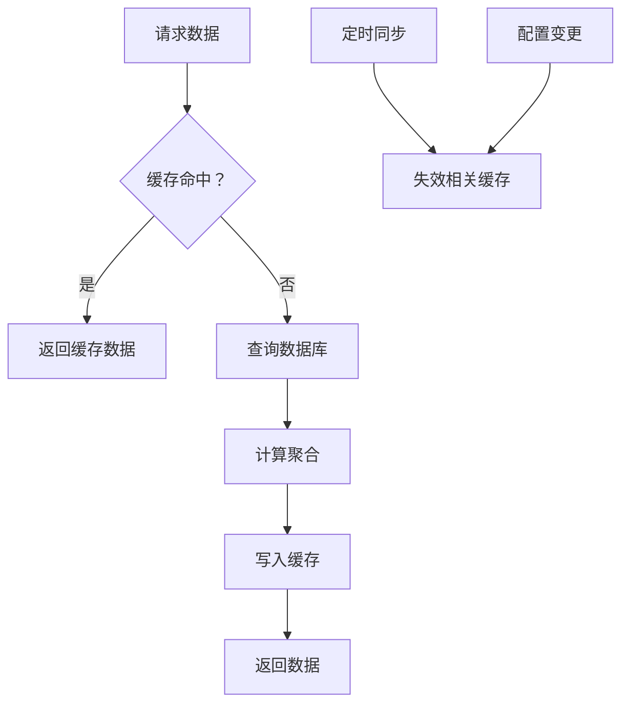

---

### 4.5 数据同步设计

#### 同步策略

| 数据类型 | 同步方式 | 同步频率 | 负责模块 |
|----------|----------|----------|----------|
| Token 使用记录 | 定时全量 | 每日凌晨 2 点 | 数据同步模块 |
| 代码提交记录 | 定时全量 | 每日凌晨 2 点 | 数据同步模块 |
| Bug 记录 | 定时全量 | 每日凌晨 2 点 | 数据同步模块 |
| 项目配置 | 实时同步 | 变更时立即同步 | 配置管理模块 |
| 人员账号 | 实时同步 | 变更时立即同步 | 配置管理模块 |

#### 同步流程

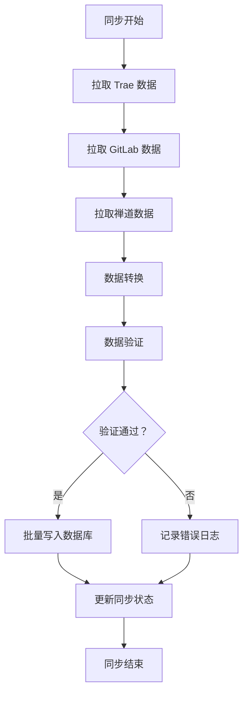

---

## 五、开发视图（Development View）

### 5.1 代码组织结构

```
project-root/
├── frontend/                          # 前端项目
│   ├── src/
│   │   ├── api/                      # API 接口层
│   │   │   ├── stats.ts              # 统计 API
│   │   │   ├── config.ts             # 配置 API
│   │   │   ├── auth.ts               # 认证 API
│   │   │   └── sync.ts               # 同步 API
│   │   ├── components/               # 组件库
│   │   │   ├── global/               # 全局统计组件
│   │   │   ├── project/              # 项目统计组件
│   │   │   ├── personal/             # 个人统计组件
│   │   │   └── config/               # 配置管理组件
│   │   ├── views/                    # 页面视图
│   │   │   ├── Dashboard.vue         # 首页 Dashboard
│   │   │   ├── GlobalStats.vue       # 全局统计页
│   │   │   ├── ProjectList.vue       # 项目列表页
│   │   │   ├── ProjectDetail.vue     # 项目详情页
│   │   │   ├── PersonalStats.vue     # 个人统计页
│   │   │   └── ConfigPage.vue        # 配置管理页
│   │   ├── stores/                   # 状态管理
│   │   │   ├── user.ts               # 用户状态
│   │   │   ├── stats.ts              # 统计数据状态
│   │   │   └── config.ts             # 配置状态
│   │   ├── utils/                    # 工具函数
│   │   └── App.vue
│   ├── package.json
│   └── vite.config.ts
│
├── backend/                           # 后端项目
│   ├── app/
│   │   ├── api/                      # API 路由层
│   │   │   ├── v1/
│   │   │   │   ├── stats.py          # 统计 API
│   │   │   │   ├── config.py         # 配置 API
│   │   │   │   ├── auth.py           # 认证 API
│   │   │   │   └── sync.py           # 同步 API
│   │   │   └── deps.py               # 依赖注入
│   │   ├── core/                     # 核心模块
│   │   │   ├── config.py             # 配置管理
│   │   │   ├── security.py           # 安全认证
│   │   │   └── exceptions.py         # 异常处理
│   │   ├── models/                   # 数据模型
│   │   │   ├── user.py               # 用户模型
│   │   │   ├── project.py            # 项目模型
│   │   │   ├── code_commit.py        # 代码提交模型
│   │   │   ├── bug_record.py         # Bug 记录模型
│   │   │   └── token_usage.py        # Token 使用模型
│   │   ├── schemas/                  # Pydantic 模型
│   │   │   ├── stats.py              # 统计响应模型
│   │   │   ├── config.py             # 配置请求/响应模型
│   │   │   └── auth.py               # 认证模型
│   │   ├── services/                 # 业务服务层
│   │   │   ├── stats_service.py      # 统计服务
│   │   │   ├── sync_service.py       # 同步服务
│   │   │   ├── traee_adapter.py      # Trae API 适配器
│   │   │   ├── gitlab_adapter.py     # GitLab API 适配器
│   │   │   └── zendao_adapter.py     # 禅道 API 适配器
│   │   ├── tasks/                    # Celery 任务
│   │   │   ├── sync_tasks.py         # 同步任务
│   │   │   └── scheduler.py          # 定时调度
│   │   └── db/                       # 数据库层
│   │       ├── session.py            # 数据库会话
│   │       ├── base.py               # 基础模型
│   │       └── crud.py               # CRUD 操作
│   ├── tests/                        # 测试代码
│   ├── alembic/                      # 数据库迁移
│   ├── requirements.txt
│   └── main.py                       # 应用入口
│
├── docker/                            # Docker 配置
│   ├── Dockerfile.frontend
│   ├── Dockerfile.backend
│   └── docker-compose.yml
│
├── nginx/                             # Nginx 配置
│   └── nginx.conf
│
└── docs/                              # 文档
    ├── api.md                         # API 文档
    └── deployment.md                  # 部署文档
```

### 5.2 技术栈映射

| 层级 | 技术选型 | 用途 |
|------|----------|------|
| **前端框架** | Vue 3 + TypeScript | 前端应用开发 |
| **UI 组件库** | Element Plus | UI 组件 |
| **图表库** | ECharts | 数据可视化 |
| **状态管理** | Pinia | 前端状态管理 |
| **构建工具** | Vite | 前端构建 |
| **后端框架** | FastAPI | RESTful API |
| **ORM** | SQLAlchemy | 数据库操作 |
| **数据验证** | Pydantic | 数据模型验证 |
| **认证** | JWT | Token 认证 |
| **数据库** | PostgreSQL 15 | 主数据库 |
| **缓存** | Redis 7 | 缓存/会话/队列 |
| **任务队列** | Celery + Redis | 异步任务 |
| **定时调度** | Celery Beat | 定时任务 |
| **部署** | Docker Compose | 容器化部署 |
| **反向代理** | Nginx | 反向代理/静态文件 |

---

## 六、物理视图（Physical View）

### 6.1 开发环境部署

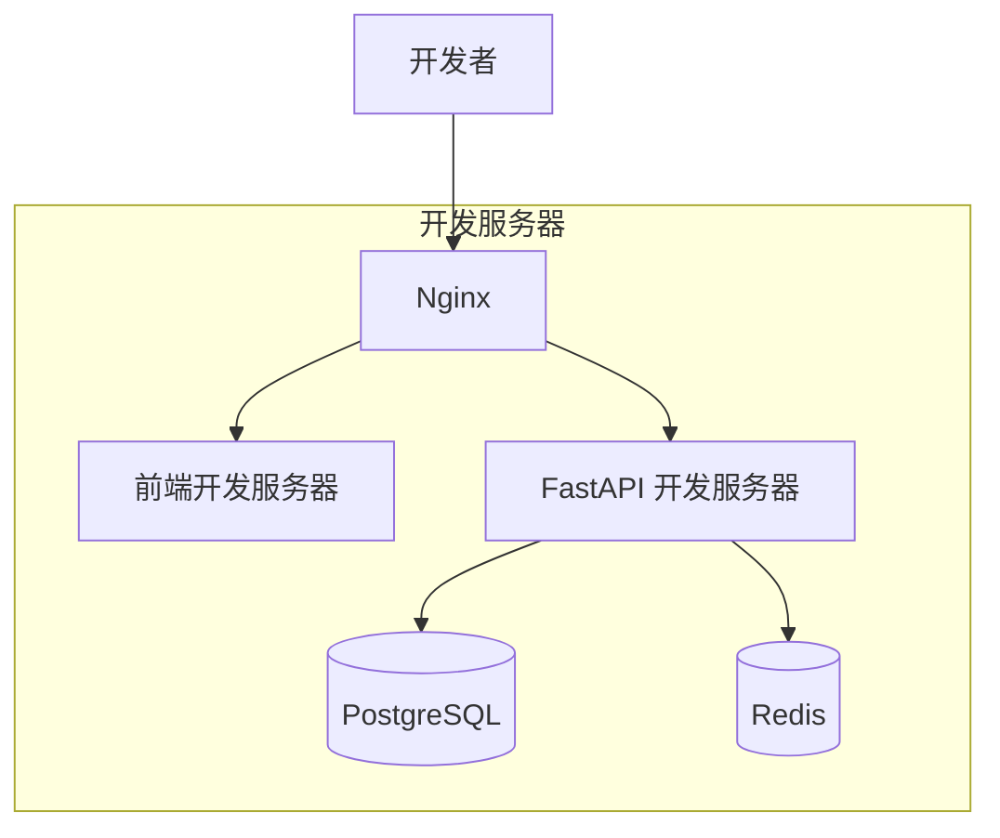

**资源配置**：
- CPU: 4 核
- 内存：8GB
- 磁盘：50GB
- 单节点部署

---

### 6.2 生产环境部署

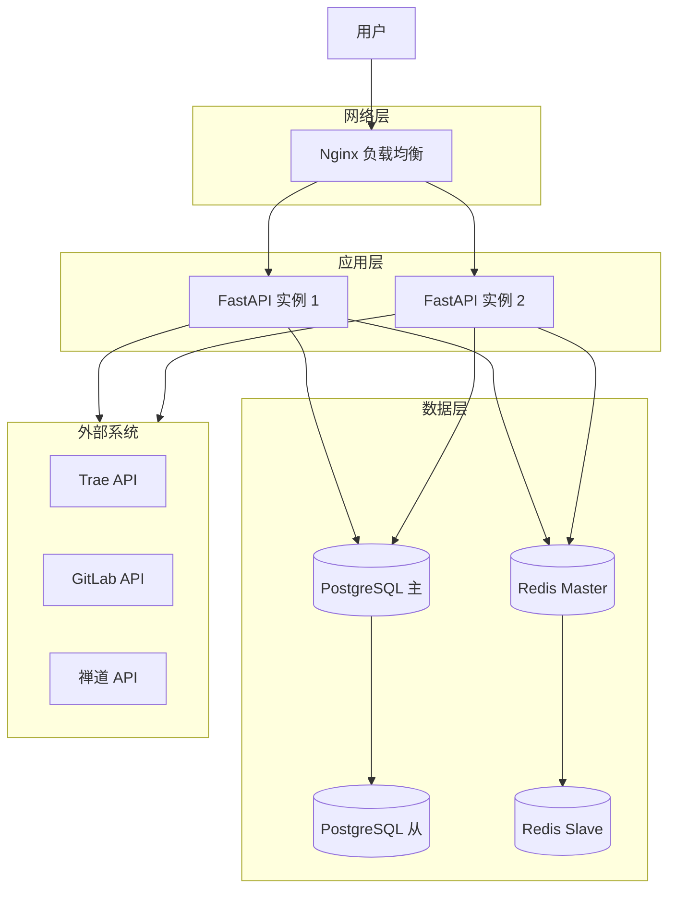

**资源配置**：
- **应用节点**（2 个）：
  - CPU: 4 核
  - 内存：8GB
  - 磁盘：20GB
- **数据库节点**（主从）：
  - CPU: 8 核
  - 内存：16GB
  - 磁盘：200GB SSD
- **缓存节点**（主从）：
  - CPU: 2 核
  - 内存：4GB
  - 磁盘：10GB

---

## 七、架构决策记录

### ADR-001：采用分层架构

- **决策时间**：2026-03-27
- **决策内容**：采用分层架构 + 单体部署
- **决策理由**：匹配当前规模，开发效率高，运维简单
- **影响**：模块职责清晰，易于维护，未来可演进为微服务

### ADR-002：采用 PostgreSQL 分区表

- **决策时间**：2026-03-27
- **决策内容**：时序数据采用 PostgreSQL 分区表
- **决策理由**：简化技术栈，避免引入额外数据库
- **影响**：需要设计分区策略，查询性能可接受

### ADR-003：混合数据同步策略

- **决策时间**：2026-03-27
- **决策内容**：统计数据定时全量 + 配置数据实时同步
- **决策理由**：平衡时效性和系统复杂度
- **影响**：需要设计两种同步机制

---

## 八、评审记录

| 角色 | 姓名 | 评审意见 | 评审时间 | 状态 |
|------|------|----------|----------|:----:|
| **架构师** | - | - | - | ⏳ |
| **技术负责人** | - | - | - | ⏳ |
| **开发代表** | - | - | - | ⏳ |

---

## 九、附录

### 9.1 参考资料

1. S5 通用软件架构设计阶段规范
2. P000001 架构愿景文档
3. 4+1 视图模型标准

### 9.2 术语表

| 术语 | 定义 |
|------|------|
| **逻辑视图** | 描述系统功能模块及其关系的视图 |
| **场景视图** | 描述用户场景和交互流程的视图 |
| **数据视图** | 描述数据流、数据存储的视图 |
| **开发视图** | 描述代码组织和技术栈的视图 |
| **物理视图** | 描述部署节点和网络拓扑的视图 |

---

**文档编制**：架构设计系统  
**编制时间**：2026-03-27  
**文档版本**：v1.0.0  
**文档状态**：待评审

---

*本文档为 P000001 项目架构视图设计，包含逻辑视图、场景视图、数据视图、开发视图和物理视图。*
