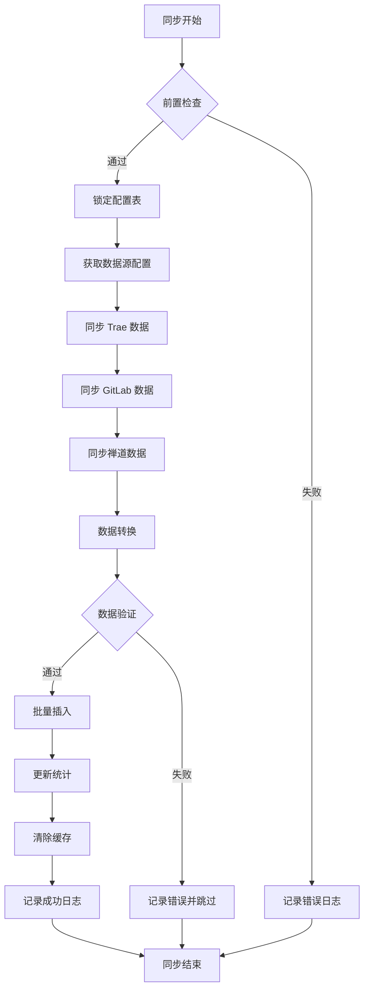

# P000001 S5-A03 数据架构设计文档

---

## 基本信息

| 项目 | 内容 |
|------|------|
| **Plan ID** | P000001 |
| **阶段编号** | S5-A03 |
| **文档名称** | 数据架构设计 |
| **文档版本** | v1.0.0 |
| **生成时间** | 2026-03-27 |
| **生成方式** | 基于架构视图设计自动生成 |
| **文档状态** | 待评审 |

---

## 一、设计输入

### 1.1 前置文档

| 文档名称 | 文档路径 | 状态 |
|----------|----------|:----:|
| 架构愿景定义 | `database/stages/s5/P000001/P000001-S5-A01-001.md` | ✅ 已确认 |
| 架构视图设计 | `database/stages/s5/P000001/P000001-S5-A02-001.md` | ✅ 已评审 |
| 需求分析报告 | `database/plans/P000001-requirements-report.md` | ✅ 已评审 |

### 1.2 设计目标

1. **完整性**：覆盖 12 个数据需求，支持 64 个功能需求
2. **性能**：支持 200 并发，核心查询响应 < 1s
3. **可扩展**：支持数据增长，3 年内无需重构
4. **可维护**：结构清晰，文档齐全，易于理解

---

## 二、数据模型设计

### 2.1 数据实体总览

系统包含以下核心数据实体：

| 实体编号 | 实体名称 | 实体类型 | 数据量预估 | 增长速率 |
|----------|----------|----------|------------|----------|
| ENT-001 | 用户（User） | 主数据 | 500 条 | 10%/年 |
| ENT-002 | 项目（Project） | 主数据 | 100 条 | 20%/年 |
| ENT-003 | 代码提交（Code Commit） | 事务数据 | 50 万条 | 5 万条/月 |
| ENT-004 | Token 使用（Token Usage） | 事务数据 | 30 万条 | 3 万条/月 |
| ENT-005 | Bug 记录（Bug Record） | 事务数据 | 10 万条 | 1 万条/月 |
| ENT-006 | AI 建议（AI Suggestion） | 事务数据 | 100 万条 | 10 万条/月 |
| ENT-007 | AI 采纳（AI Adoption） | 事务数据 | 60 万条 | 6 万条/月 |
| ENT-008 | 角色（Role） | 配置数据 | 10 条 | 稳定 |
| ENT-009 | 权限（Permission） | 配置数据 | 50 条 | 稳定 |
| ENT-010 | 数据源配置（Data Source） | 配置数据 | 200 条 | 10%/年 |
| ENT-011 | 同步任务（Sync Task） | 系统数据 | 1 万条 | 1 千条/月 |
| ENT-012 | 统计快照（Stats Snapshot） | 聚合数据 | 3 万条 | 3 千条/月 |

---

### 2.2 详细表结构设计

#### 2.2.1 用户表（users）

**用途**：存储系统用户基本信息

```sql
CREATE TABLE users (
    id INTEGER GENERATED BY DEFAULT AS IDENTITY PRIMARY KEY,
    username VARCHAR(50) NOT NULL UNIQUE,
    email VARCHAR(100) NOT NULL UNIQUE,
    password_hash VARCHAR(255) NOT NULL,
    department VARCHAR(50) NOT NULL,
    role_id INTEGER REFERENCES roles(id),
    is_active BOOLEAN DEFAULT TRUE NOT NULL,
    last_login_at TIMESTAMP,
    created_at TIMESTAMP DEFAULT CURRENT_TIMESTAMP NOT NULL,
    updated_at TIMESTAMP DEFAULT CURRENT_TIMESTAMP NOT NULL
);

-- 索引
CREATE INDEX idx_users_department ON users(department);
CREATE INDEX idx_users_role_id ON users(role_id);
CREATE INDEX idx_users_is_active ON users(is_active);
CREATE INDEX idx_users_created_at ON users(created_at);

-- 注释
COMMENT ON TABLE users IS '用户表 - 存储系统用户基本信息';
COMMENT ON COLUMN users.username IS '用户名 - 登录账号';
COMMENT ON COLUMN users.email IS '邮箱 - 用于通知和找回密码';
COMMENT ON COLUMN users.password_hash IS '密码哈希 - BCrypt 加密';
COMMENT ON COLUMN users.department IS '部门 - 研发中心/部门名称';
COMMENT ON COLUMN users.role_id IS '角色 ID - 关联角色表';
COMMENT ON COLUMN users.is_active IS '是否激活 - 控制登录权限';
```

**字段说明**：

| 字段名 | 类型 | 约束 | 默认值 | 说明 |
|--------|------|------|--------|------|
| id | INTEGER | PK, AUTO | - | 用户 ID |
| username | VARCHAR(50) | NOT NULL, UNIQUE | - | 用户名（登录账号） |
| email | VARCHAR(100) | NOT NULL, UNIQUE | - | 邮箱 |
| password_hash | VARCHAR(255) | NOT NULL | - | 密码哈希（BCrypt） |
| department | VARCHAR(50) | NOT NULL | - | 部门 |
| role_id | INTEGER | FK | - | 角色 ID |
| is_active | BOOLEAN | NOT NULL | TRUE | 是否激活 |
| last_login_at | TIMESTAMP | - | - | 最后登录时间 |
| created_at | TIMESTAMP | NOT NULL | CURRENT_TIMESTAMP | 创建时间 |
| updated_at | TIMESTAMP | NOT NULL | CURRENT_TIMESTAMP | 更新时间 |

**数据量**：初始 500 条，年增长 10%

---

#### 2.2.2 角色表（roles）

**用途**：存储系统角色信息

```sql
CREATE TABLE roles (
    id INTEGER GENERATED BY DEFAULT AS IDENTITY PRIMARY KEY,
    name VARCHAR(50) NOT NULL UNIQUE,
    description VARCHAR(200),
    permissions JSONB NOT NULL DEFAULT '[]',
    created_at TIMESTAMP DEFAULT CURRENT_TIMESTAMP NOT NULL,
    updated_at TIMESTAMP DEFAULT CURRENT_TIMESTAMP NOT NULL
);

-- 索引
CREATE INDEX idx_roles_name ON roles(name);

-- 注释
COMMENT ON TABLE roles IS '角色表 - 存储系统角色信息';
COMMENT ON COLUMN roles.name IS '角色名称 - 管理员/项目经理/研发人员/测试人员';
COMMENT ON COLUMN roles.permissions IS '权限列表 - JSON 数组存储';
```

**字段说明**：

| 字段名 | 类型 | 约束 | 默认值 | 说明 |
|--------|------|------|--------|------|
| id | INTEGER | PK, AUTO | - | 角色 ID |
| name | VARCHAR(50) | NOT NULL, UNIQUE | - | 角色名称 |
| description | VARCHAR(200) | - | - | 角色描述 |
| permissions | JSONB | NOT NULL | '[]' | 权限列表（JSON 数组） |
| created_at | TIMESTAMP | NOT NULL | CURRENT_TIMESTAMP | 创建时间 |
| updated_at | TIMESTAMP | NOT NULL | CURRENT_TIMESTAMP | 更新时间 |

**预置角色**：
1. 管理员（admin）- 所有权限
2. 项目经理（project_manager）- 项目管理权限
3. 研发人员（developer）- 个人数据查看权限
4. 测试人员（tester）- Bug 相关权限

---

#### 2.2.3 项目表（projects）

**用途**：存储项目基本信息

```sql
CREATE TABLE projects (
    id INTEGER GENERATED BY DEFAULT AS IDENTITY PRIMARY KEY,
    name VARCHAR(100) NOT NULL,
    code VARCHAR(50) UNIQUE,
    description TEXT,
    stage VARCHAR(20) NOT NULL CHECK (stage IN ('调研', '立项', '需求', '设计', '研发', '验收', '发布', '运维')),
    status VARCHAR(20) NOT NULL DEFAULT 'active' CHECK (status IN ('active', 'archived', 'cancelled')),
    manager_id INTEGER REFERENCES users(id),
    gitlab_repo_id INTEGER,
    gitlab_repo_url VARCHAR(500),
    zendao_project_id INTEGER,
    zendao_project_key VARCHAR(50),
    start_date DATE,
    end_date DATE,
    created_at TIMESTAMP DEFAULT CURRENT_TIMESTAMP NOT NULL,
    updated_at TIMESTAMP DEFAULT CURRENT_TIMESTAMP NOT NULL
);

-- 索引
CREATE INDEX idx_projects_stage ON projects(stage);
CREATE INDEX idx_projects_status ON projects(status);
CREATE INDEX idx_projects_manager_id ON projects(manager_id);
CREATE INDEX idx_projects_created_at ON projects(created_at);
CREATE INDEX idx_projects_gitlab_repo_id ON projects(gitlab_repo_id);
CREATE INDEX idx_projects_zendao_project_id ON projects(zendao_project_id);

-- 注释
COMMENT ON TABLE projects IS '项目表 - 存储项目基本信息';
COMMENT ON COLUMN projects.code IS '项目编码 - 唯一标识';
COMMENT ON COLUMN projects.stage IS '项目阶段 - 调研/立项/需求/设计/研发/验收/发布/运维';
COMMENT ON COLUMN projects.status IS '项目状态 - active/archived/cancelled';
COMMENT ON COLUMN projects.manager_id IS '项目经理 ID';
COMMENT ON COLUMN projects.gitlab_repo_id IS 'GitLab 仓库 ID';
COMMENT ON COLUMN projects.zendao_project_id IS '禅道项目 ID';
```

**字段说明**：

| 字段名 | 类型 | 约束 | 默认值 | 说明 |
|--------|------|------|--------|------|
| id | INTEGER | PK, AUTO | - | 项目 ID |
| name | VARCHAR(100) | NOT NULL | - | 项目名称 |
| code | VARCHAR(50) | UNIQUE | - | 项目编码 |
| description | TEXT | - | - | 项目描述 |
| stage | VARCHAR(20) | NOT NULL, CHECK | - | 项目阶段 |
| status | VARCHAR(20) | NOT NULL | 'active' | 项目状态 |
| manager_id | INTEGER | FK | - | 项目经理 ID |
| gitlab_repo_id | INTEGER | - | - | GitLab 仓库 ID |
| gitlab_repo_url | VARCHAR(500) | - | - | GitLab 仓库 URL |
| zendao_project_id | INTEGER | - | - | 禅道项目 ID |
| zendao_project_key | VARCHAR(50) | - | - | 禅道项目标识 |
| start_date | DATE | - | - | 开始日期 |
| end_date | DATE | - | - | 结束日期 |
| created_at | TIMESTAMP | NOT NULL | CURRENT_TIMESTAMP | 创建时间 |
| updated_at | TIMESTAMP | NOT NULL | CURRENT_TIMESTAMP | 更新时间 |

**数据量**：初始 100 条，年增长 20%

---

#### 2.2.4 项目成员表（project_members）

**用途**：存储项目与成员的关联关系

```sql
CREATE TABLE project_members (
    id INTEGER GENERATED BY DEFAULT AS IDENTITY PRIMARY KEY,
    project_id INTEGER NOT NULL REFERENCES projects(id) ON DELETE CASCADE,
    user_id INTEGER NOT NULL REFERENCES users(id) ON DELETE CASCADE,
    role VARCHAR(50) NOT NULL DEFAULT 'member',
    joined_at DATE NOT NULL DEFAULT CURRENT_DATE,
    left_at DATE,
    created_at TIMESTAMP DEFAULT CURRENT_TIMESTAMP NOT NULL,
    UNIQUE (project_id, user_id)
);

-- 索引
CREATE INDEX idx_project_members_project_id ON project_members(project_id);
CREATE INDEX idx_project_members_user_id ON project_members(user_id);
CREATE INDEX idx_project_members_role ON project_members(role);

-- 注释
COMMENT ON TABLE project_members IS '项目成员表 - 存储项目与成员的关联关系';
COMMENT ON COLUMN project_members.role IS '项目角色 - manager/tech_lead/member';
```

**字段说明**：

| 字段名 | 类型 | 约束 | 默认值 | 说明 |
|--------|------|------|--------|------|
| id | INTEGER | PK, AUTO | - | 记录 ID |
| project_id | INTEGER | FK, NOT NULL | - | 项目 ID |
| user_id | INTEGER | FK, NOT NULL | - | 用户 ID |
| role | VARCHAR(50) | NOT NULL | 'member' | 项目角色 |
| joined_at | DATE | NOT NULL | CURRENT_DATE | 加入日期 |
| left_at | DATE | - | - | 离开日期 |
| created_at | TIMESTAMP | NOT NULL | CURRENT_TIMESTAMP | 创建时间 |

**唯一约束**：(project_id, user_id) - 同一用户在同一项目只能有一条记录

---

#### 2.2.5 用户账号表（user_accounts）

**用途**：存储用户在外部平台的账号信息

```sql
CREATE TABLE user_accounts (
    id INTEGER GENERATED BY DEFAULT AS IDENTITY PRIMARY KEY,
    user_id INTEGER NOT NULL REFERENCES users(id) ON DELETE CASCADE,
    platform VARCHAR(20) NOT NULL CHECK (platform IN ('trae', 'gitlab', 'zendao', 'ali_coding')),
    account_id VARCHAR(100) NOT NULL,
    account_name VARCHAR(100),
    api_token VARCHAR(500),
    is_default BOOLEAN DEFAULT FALSE,
    created_at TIMESTAMP DEFAULT CURRENT_TIMESTAMP NOT NULL,
    updated_at TIMESTAMP DEFAULT CURRENT_TIMESTAMP NOT NULL,
    UNIQUE (user_id, platform)
);

-- 索引
CREATE INDEX idx_user_accounts_user_id ON user_accounts(user_id);
CREATE INDEX idx_user_accounts_platform ON user_accounts(platform);

-- 注释
COMMENT ON TABLE user_accounts IS '用户账号表 - 存储用户在外部平台的账号信息';
COMMENT ON COLUMN user_accounts.platform IS '平台 - trae/gitlab/zendao/ali_coding';
COMMENT ON COLUMN user_accounts.account_id IS '平台账号 ID';
COMMENT ON COLUMN user_accounts.api_token IS 'API Token - 加密存储';
```

**字段说明**：

| 字段名 | 类型 | 约束 | 默认值 | 说明 |
|--------|------|------|--------|------|
| id | INTEGER | PK, AUTO | - | 记录 ID |
| user_id | INTEGER | FK, NOT NULL | - | 用户 ID |
| platform | VARCHAR(20) | NOT NULL, CHECK | - | 平台类型 |
| account_id | VARCHAR(100) | NOT NULL | - | 平台账号 ID |
| account_name | VARCHAR(100) | - | - | 平台账号名称 |
| api_token | VARCHAR(500) | - | - | API Token（加密） |
| is_default | BOOLEAN | - | FALSE | 是否默认账号 |
| created_at | TIMESTAMP | NOT NULL | CURRENT_TIMESTAMP | 创建时间 |
| updated_at | TIMESTAMP | NOT NULL | CURRENT_TIMESTAMP | 更新时间 |

**加密策略**：api_token 使用 AES-256 加密存储

---

#### 2.2.6 代码提交表（code_commits）- 分区表

**用途**：存储代码提交记录

```sql
-- 主表
CREATE TABLE code_commits (
    id INTEGER GENERATED BY DEFAULT AS IDENTITY PRIMARY KEY,
    user_id INTEGER NOT NULL REFERENCES users(id),
    project_id INTEGER NOT NULL REFERENCES projects(id),
    commit_hash VARCHAR(64) NOT NULL,
    additions INTEGER NOT NULL DEFAULT 0,
    deletions INTEGER NOT NULL DEFAULT 0,
    language VARCHAR(20) NOT NULL,
    file_count INTEGER NOT NULL DEFAULT 0,
    commit_message TEXT,
    commit_time TIMESTAMP NOT NULL,
    is_ai_generated BOOLEAN DEFAULT FALSE,
    ai_suggestion_ids INTEGER[],
    branch_name VARCHAR(200),
    created_at TIMESTAMP DEFAULT CURRENT_TIMESTAMP NOT NULL,
    UNIQUE (commit_hash, project_id)
) PARTITION BY RANGE (commit_time);

-- 索引
CREATE INDEX idx_code_commits_user_id ON code_commits(user_id);
CREATE INDEX idx_code_commits_project_id ON code_commits(project_id);
CREATE INDEX idx_code_commits_language ON code_commits(language);
CREATE INDEX idx_code_commits_is_ai_generated ON code_commits(is_ai_generated);
CREATE INDEX idx_code_commits_commit_time ON code_commits(commit_time);

-- 注释
COMMENT ON TABLE code_commits IS '代码提交表 - 存储代码提交记录（按月分区）';
COMMENT ON COLUMN code_commits.commit_hash IS 'Git 提交哈希';
COMMENT ON COLUMN code_commits.additions IS '新增行数';
COMMENT ON COLUMN code_commits.deletions IS '删除行数';
COMMENT ON COLUMN code_commits.language IS '主要编程语言';
COMMENT ON COLUMN code_commits.is_ai_generated IS '是否 AI 生成代码';
COMMENT ON COLUMN code_commits.ai_suggestion_ids IS 'AI 建议 ID 数组';
```

**分区策略**：

```sql
-- 按月创建分区
-- 2026 年 1 月
CREATE TABLE code_commits_2026_01 PARTITION OF code_commits
    FOR VALUES FROM ('2026-01-01') TO ('2026-02-01');

-- 2026 年 2 月
CREATE TABLE code_commits_2026_02 PARTITION OF code_commits
    FOR VALUES FROM ('2026-02-01') TO ('2026-03-01');

-- 以此类推...
```

**字段说明**：

| 字段名 | 类型 | 约束 | 默认值 | 说明 |
|--------|------|------|--------|------|
| id | INTEGER | PK, AUTO | - | 提交 ID |
| user_id | INTEGER | FK, NOT NULL | - | 用户 ID |
| project_id | INTEGER | FK, NOT NULL | - | 项目 ID |
| commit_hash | VARCHAR(64) | NOT NULL, UNIQUE | - | Git 提交哈希 |
| additions | INTEGER | NOT NULL | 0 | 新增行数 |
| deletions | INTEGER | NOT NULL | 0 | 删除行数 |
| language | VARCHAR(20) | NOT NULL | - | 主要编程语言 |
| file_count | INTEGER | NOT NULL | 0 | 修改文件数 |
| commit_message | TEXT | - | - | 提交消息 |
| commit_time | TIMESTAMP | NOT NULL | - | 提交时间（分区键） |
| is_ai_generated | BOOLEAN | - | FALSE | 是否 AI 生成 |
| ai_suggestion_ids | INTEGER[] | - | - | AI 建议 ID 数组 |
| branch_name | VARCHAR(200) | - | - | 分支名称 |
| created_at | TIMESTAMP | NOT NULL | CURRENT_TIMESTAMP | 入库时间 |

**数据量**：50 万条初始，5 万条/月增长

**分区理由**：
1. 时序数据，按时间查询频繁
2. 数据量大，分区提升查询性能
3. 便于历史数据归档和清理

---

#### 2.2.7 Token 使用表（token_usage）- 分区表

**用途**：存储 Token 使用记录

```sql
-- 主表
CREATE TABLE token_usage (
    id INTEGER GENERATED BY DEFAULT AS IDENTITY PRIMARY KEY,
    user_id INTEGER NOT NULL REFERENCES users(id),
    project_id INTEGER REFERENCES projects(id),
    platform VARCHAR(20) NOT NULL CHECK (platform IN ('trae', 'ali_coding', 'cursor', 'copilot')),
    token_count INTEGER NOT NULL DEFAULT 0,
    api_calls INTEGER NOT NULL DEFAULT 0,
    usage_date DATE NOT NULL,
    model VARCHAR(50),
    cost DECIMAL(10, 4),
    created_at TIMESTAMP DEFAULT CURRENT_TIMESTAMP NOT NULL,
    UNIQUE (user_id, platform, usage_date)
) PARTITION BY RANGE (usage_date);

-- 索引
CREATE INDEX idx_token_usage_user_id ON token_usage(user_id);
CREATE INDEX idx_token_usage_project_id ON token_usage(project_id);
CREATE INDEX idx_token_usage_platform ON token_usage(platform);
CREATE INDEX idx_token_usage_usage_date ON token_usage(usage_date);

-- 注释
COMMENT ON TABLE token_usage IS 'Token 使用表 - 存储 Token 使用记录（按月分区）';
COMMENT ON COLUMN token_usage.platform IS '平台 - trae/ali_coding/cursor/copilot';
COMMENT ON COLUMN token_usage.model IS 'AI 模型名称';
COMMENT ON COLUMN token_usage.cost IS '成本 - 单位：元';
```

**分区策略**：

```sql
-- 按月创建分区
CREATE TABLE token_usage_2026_01 PARTITION OF token_usage
    FOR VALUES FROM ('2026-01-01') TO ('2026-02-01');

CREATE TABLE token_usage_2026_02 PARTITION OF token_usage
    FOR VALUES FROM ('2026-02-01') TO ('2026-03-01');
```

**字段说明**：

| 字段名 | 类型 | 约束 | 默认值 | 说明 |
|--------|------|------|--------|------|
| id | INTEGER | PK, AUTO | - | 记录 ID |
| user_id | INTEGER | FK, NOT NULL | - | 用户 ID |
| project_id | INTEGER | FK | - | 项目 ID |
| platform | VARCHAR(20) | NOT NULL, CHECK | - | 平台类型 |
| token_count | INTEGER | NOT NULL | 0 | Token 数量 |
| api_calls | INTEGER | NOT NULL | 0 | API 调用次数 |
| usage_date | DATE | NOT NULL | - | 使用日期（分区键） |
| model | VARCHAR(50) | - | - | AI 模型名称 |
| cost | DECIMAL(10,4) | - | - | 成本（元） |
| created_at | TIMESTAMP | NOT NULL | CURRENT_TIMESTAMP | 入库时间 |

**数据量**：30 万条初始，3 万条/月增长

---

#### 2.2.8 Bug 记录表（bug_records）

**用途**：存储 Bug 记录

```sql
CREATE TABLE bug_records (
    id INTEGER GENERATED BY DEFAULT AS IDENTITY PRIMARY KEY,
    project_id INTEGER NOT NULL REFERENCES projects(id),
    assignee_id INTEGER REFERENCES users(id),
    reporter_id INTEGER REFERENCES users(id),
    zendao_bug_id INTEGER,
    title VARCHAR(200) NOT NULL,
    description TEXT,
    severity VARCHAR(20) NOT NULL CHECK (severity IN ('critical', 'major', 'normal', 'minor', 'trivial')),
    priority VARCHAR(20) CHECK (priority IN ('urgent', 'high', 'medium', 'low')),
    status VARCHAR(20) NOT NULL CHECK (status IN ('new', 'assigned', 'active', 'resolved', 'closed', 'rejected')),
    type VARCHAR(20) CHECK (type IN ('bug', 'feature', 'improvement')),
    module VARCHAR(100),
    created_at TIMESTAMP DEFAULT CURRENT_TIMESTAMP NOT NULL,
    updated_at TIMESTAMP DEFAULT CURRENT_TIMESTAMP NOT NULL,
    resolved_at TIMESTAMP,
    closed_at TIMESTAMP,
    resolution VARCHAR(200)
);

-- 索引
CREATE INDEX idx_bug_records_project_id ON bug_records(project_id);
CREATE INDEX idx_bug_records_assignee_id ON bug_records(assignee_id);
CREATE INDEX idx_bug_records_reporter_id ON bug_records(reporter_id);
CREATE INDEX idx_bug_records_severity ON bug_records(severity);
CREATE INDEX idx_bug_records_status ON bug_records(status);
CREATE INDEX idx_bug_records_created_at ON bug_records(created_at);
CREATE INDEX idx_bug_records_zendao_bug_id ON bug_records(zendao_bug_id);

-- 注释
COMMENT ON TABLE bug_records IS 'Bug 记录表 - 存储 Bug 记录';
COMMENT ON COLUMN bug_records.severity IS '严重程度 - critical/major/normal/minor/trivial';
COMMENT ON COLUMN bug_records.status IS '状态 - new/assigned/active/resolved/closed/rejected';
```

**字段说明**：

| 字段名 | 类型 | 约束 | 默认值 | 说明 |
|--------|------|------|--------|------|
| id | INTEGER | PK, AUTO | - | Bug ID |
| project_id | INTEGER | FK, NOT NULL | - | 项目 ID |
| assignee_id | INTEGER | FK | - | 负责人 ID |
| reporter_id | INTEGER | FK | - | 报告人 ID |
| zendao_bug_id | INTEGER | - | - | 禅道 Bug ID |
| title | VARCHAR(200) | NOT NULL | - | Bug 标题 |
| description | TEXT | - | - | Bug 描述 |
| severity | VARCHAR(20) | NOT NULL, CHECK | - | 严重程度 |
| priority | VARCHAR(20) | - | - | 优先级 |
| status | VARCHAR(20) | NOT NULL, CHECK | - | 状态 |
| type | VARCHAR(20) | - | - | 类型 |
| module | VARCHAR(100) | - | - | 所属模块 |
| created_at | TIMESTAMP | NOT NULL | CURRENT_TIMESTAMP | 创建时间 |
| updated_at | TIMESTAMP | NOT NULL | CURRENT_TIMESTAMP | 更新时间 |
| resolved_at | TIMESTAMP | - | - | 解决时间 |
| closed_at | TIMESTAMP | - | - | 关闭时间 |
| resolution | VARCHAR(200) | - | - | 解决方案 |

**数据量**：10 万条初始，1 万条/月增长

---

#### 2.2.9 AI 建议表（ai_suggestions）

**用途**：存储 AI 生成的代码建议

```sql
CREATE TABLE ai_suggestions (
    id INTEGER GENERATED BY DEFAULT AS IDENTITY PRIMARY KEY,
    user_id INTEGER NOT NULL REFERENCES users(id),
    project_id INTEGER REFERENCES projects(id),
    platform VARCHAR(20) NOT NULL,
    suggestion_type VARCHAR(50) NOT NULL CHECK (suggestion_type IN ('code_completion', 'code_generation', 'refactoring', 'bug_fix', 'explanation')),
    content TEXT NOT NULL,
    language VARCHAR(20),
    file_path VARCHAR(500),
    line_number INTEGER,
    token_cost INTEGER,
    is_accepted BOOLEAN DEFAULT FALSE,
    accepted_at TIMESTAMP,
    commit_hash VARCHAR(64),
    created_at TIMESTAMP DEFAULT CURRENT_TIMESTAMP NOT NULL
);

-- 索引
CREATE INDEX idx_ai_suggestions_user_id ON ai_suggestions(user_id);
CREATE INDEX idx_ai_suggestions_project_id ON ai_suggestions(project_id);
CREATE INDEX idx_ai_suggestions_platform ON ai_suggestions(platform);
CREATE INDEX idx_ai_suggestions_type ON ai_suggestions(suggestion_type);
CREATE INDEX idx_ai_suggestions_is_accepted ON ai_suggestions(is_accepted);
CREATE INDEX idx_ai_suggestions_created_at ON ai_suggestions(created_at);

-- 注释
COMMENT ON TABLE ai_suggestions IS 'AI 建议表 - 存储 AI 生成的代码建议';
COMMENT ON COLUMN ai_suggestions.suggestion_type IS '建议类型 - code_completion/code_generation/refactoring/bug_fix/explanation';
COMMENT ON COLUMN ai_suggestions.is_accepted IS '是否采纳';
```

**字段说明**：

| 字段名 | 类型 | 约束 | 默认值 | 说明 |
|--------|------|------|--------|------|
| id | INTEGER | PK, AUTO | - | 建议 ID |
| user_id | INTEGER | FK, NOT NULL | - | 用户 ID |
| project_id | INTEGER | FK | - | 项目 ID |
| platform | VARCHAR(20) | NOT NULL | - | 平台 |
| suggestion_type | VARCHAR(50) | NOT NULL, CHECK | - | 建议类型 |
| content | TEXT | NOT NULL | - | 建议内容 |
| language | VARCHAR(20) | - | - | 编程语言 |
| file_path | VARCHAR(500) | - | - | 文件路径 |
| line_number | INTEGER | - | - | 行号 |
| token_cost | INTEGER | - | - | Token 消耗 |
| is_accepted | BOOLEAN | - | FALSE | 是否采纳 |
| accepted_at | TIMESTAMP | - | - | 采纳时间 |
| commit_hash | VARCHAR(64) | - | - | 关联提交哈希 |
| created_at | TIMESTAMP | NOT NULL | CURRENT_TIMESTAMP | 创建时间 |

**数据量**：100 万条初始，10 万条/月增长

---

#### 2.2.10 数据源配置表（data_sources）

**用途**：存储外部数据源配置

```sql
CREATE TABLE data_sources (
    id INTEGER GENERATED BY DEFAULT AS IDENTITY PRIMARY KEY,
    project_id INTEGER NOT NULL REFERENCES projects(id),
    source_type VARCHAR(20) NOT NULL CHECK (source_type IN ('gitlab', 'zendao')),
    source_name VARCHAR(100) NOT NULL,
    config JSONB NOT NULL,
    credentials JSONB,
    is_active BOOLEAN DEFAULT TRUE,
    last_sync_at TIMESTAMP,
    sync_frequency VARCHAR(20) DEFAULT 'daily',
    created_at TIMESTAMP DEFAULT CURRENT_TIMESTAMP NOT NULL,
    updated_at TIMESTAMP DEFAULT CURRENT_TIMESTAMP NOT NULL
);

-- 索引
CREATE INDEX idx_data_sources_project_id ON data_sources(project_id);
CREATE INDEX idx_data_sources_source_type ON data_sources(source_type);
CREATE INDEX idx_data_sources_is_active ON data_sources(is_active);

-- 注释
COMMENT ON TABLE data_sources IS '数据源配置表 - 存储外部数据源配置';
COMMENT ON COLUMN data_sources.config IS '配置信息 - JSON 格式';
COMMENT ON COLUMN data_sources.credentials IS '凭证信息 - JSON 格式，加密存储';
COMMENT ON COLUMN data_sources.sync_frequency IS '同步频率 - daily/hourly/realtime';
```

**字段说明**：

| 字段名 | 类型 | 约束 | 默认值 | 说明 |
|--------|------|------|--------|------|
| id | INTEGER | PK, AUTO | - | 配置 ID |
| project_id | INTEGER | FK, NOT NULL | - | 项目 ID |
| source_type | VARCHAR(20) | NOT NULL, CHECK | - | 数据源类型 |
| source_name | VARCHAR(100) | NOT NULL | - | 数据源名称 |
| config | JSONB | NOT NULL | - | 配置信息（JSON） |
| credentials | JSONB | - | - | 凭证信息（加密） |
| is_active | BOOLEAN | - | TRUE | 是否激活 |
| last_sync_at | TIMESTAMP | - | - | 最后同步时间 |
| sync_frequency | VARCHAR(20) | - | 'daily' | 同步频率 |
| created_at | TIMESTAMP | NOT NULL | CURRENT_TIMESTAMP | 创建时间 |
| updated_at | TIMESTAMP | NOT NULL | CURRENT_TIMESTAMP | 更新时间 |

**加密策略**：credentials 字段使用 AES-256 加密

---

#### 2.2.11 同步任务表（sync_tasks）

**用途**：存储数据同步任务记录

```sql
CREATE TABLE sync_tasks (
    id INTEGER GENERATED BY DEFAULT AS IDENTITY PRIMARY KEY,
    task_type VARCHAR(50) NOT NULL CHECK (task_type IN ('full_sync', 'incremental_sync', 'config_sync')),
    source_type VARCHAR(20) NOT NULL,
    project_id INTEGER REFERENCES projects(id),
    status VARCHAR(20) NOT NULL CHECK (status IN ('pending', 'running', 'completed', 'failed', 'cancelled')),
    started_at TIMESTAMP,
    completed_at TIMESTAMP,
    records_processed INTEGER DEFAULT 0,
    records_failed INTEGER DEFAULT 0,
    error_message TEXT,
    created_by VARCHAR(50),
    created_at TIMESTAMP DEFAULT CURRENT_TIMESTAMP NOT NULL
);

-- 索引
CREATE INDEX idx_sync_tasks_task_type ON sync_tasks(task_type);
CREATE INDEX idx_sync_tasks_source_type ON sync_tasks(source_type);
CREATE INDEX idx_sync_tasks_project_id ON sync_tasks(project_id);
CREATE INDEX idx_sync_tasks_status ON sync_tasks(status);
CREATE INDEX idx_sync_tasks_created_at ON sync_tasks(created_at);

-- 注释
COMMENT ON TABLE sync_tasks IS '同步任务表 - 存储数据同步任务记录';
COMMENT ON COLUMN sync_tasks.task_type IS '任务类型 - full_sync/incremental_sync/config_sync';
COMMENT ON COLUMN sync_tasks.status IS '任务状态 - pending/running/completed/failed/cancelled';
```

**字段说明**：

| 字段名 | 类型 | 约束 | 默认值 | 说明 |
|--------|------|------|--------|------|
| id | INTEGER | PK, AUTO | - | 任务 ID |
| task_type | VARCHAR(50) | NOT NULL, CHECK | - | 任务类型 |
| source_type | VARCHAR(20) | NOT NULL | - | 数据源类型 |
| project_id | INTEGER | FK | - | 项目 ID |
| status | VARCHAR(20) | NOT NULL, CHECK | - | 任务状态 |
| started_at | TIMESTAMP | - | - | 开始时间 |
| completed_at | TIMESTAMP | - | - | 完成时间 |
| records_processed | INTEGER | - | 0 | 处理记录数 |
| records_failed | INTEGER | - | 0 | 失败记录数 |
| error_message | TEXT | - | - | 错误消息 |
| created_by | VARCHAR(50) | - | - | 创建者 |
| created_at | TIMESTAMP | NOT NULL | CURRENT_TIMESTAMP | 创建时间 |

---

#### 2.2.12 统计快照表（stats_snapshots）

**用途**：存储统计数据的快照

```sql
CREATE TABLE stats_snapshots (
    id INTEGER GENERATED BY DEFAULT AS IDENTITY PRIMARY KEY,
    snapshot_type VARCHAR(50) NOT NULL CHECK (snapshot_type IN ('global', 'project', 'personal')),
    snapshot_date DATE NOT NULL,
    project_id INTEGER REFERENCES projects(id),
    user_id INTEGER REFERENCES users(id),
    metrics JSONB NOT NULL,
    created_at TIMESTAMP DEFAULT CURRENT_TIMESTAMP NOT NULL,
    UNIQUE (snapshot_type, snapshot_date, project_id, user_id)
);

-- 索引
CREATE INDEX idx_stats_snapshots_type ON stats_snapshots(snapshot_type);
CREATE INDEX idx_stats_snapshots_date ON stats_snapshots(snapshot_date);
CREATE INDEX idx_stats_snapshots_project_id ON stats_snapshots(project_id);
CREATE INDEX idx_stats_snapshots_user_id ON stats_snapshots(user_id);

-- 注释
COMMENT ON TABLE stats_snapshots IS '统计快照表 - 存储统计数据的快照';
COMMENT ON COLUMN stats_snapshots.metrics IS '统计指标 - JSON 格式';
```

**字段说明**：

| 字段名 | 类型 | 约束 | 默认值 | 说明 |
|--------|------|------|--------|------|
| id | INTEGER | PK, AUTO | - | 快照 ID |
| snapshot_type | VARCHAR(50) | NOT NULL, CHECK | - | 快照类型 |
| snapshot_date | DATE | NOT NULL | - | 快照日期 |
| project_id | INTEGER | FK | - | 项目 ID |
| user_id | INTEGER | FK | - | 用户 ID |
| metrics | JSONB | NOT NULL | - | 统计指标（JSON） |
| created_at | TIMESTAMP | NOT NULL | CURRENT_TIMESTAMP | 创建时间 |

**metrics 示例**：
```json
{
  "token_count": 150000,
  "api_calls": 5000,
  "code_lines": 25000,
  "commits": 150,
  "bugs": 12,
  "ai_adoption_rate": 0.65
}
```

---

### 2.3 数据字典

#### 枚举值定义

**项目阶段（project_stage）**：
- `调研` - 项目调研阶段
- `立项` - 项目立项阶段
- `需求` - 需求分析阶段
- `设计` - 系统设计阶段
- `研发` - 开发实施阶段
- `验收` - 项目验收阶段
- `发布` - 上线发布阶段
- `运维` - 运维维护阶段

**Bug 严重程度（bug_severity）**：
- `critical` - 严重 - 系统崩溃、数据丢失
- `major` - 主要 - 主要功能失效
- `normal` - 一般 - 一般功能问题
- `minor` - 次要 - 轻微问题
- `trivial` - 轻微 - 界面优化等

**AI 建议类型（ai_suggestion_type）**：
- `code_completion` - 代码补全
- `code_generation` - 代码生成
- `refactoring` - 代码重构
- `bug_fix` - Bug 修复
- `explanation` - 代码解释

---

## 三、索引设计

### 3.1 索引策略

| 索引类型 | 使用场景 | 说明 |
|----------|----------|------|
| **B-Tree** | 等值查询、范围查询 | 默认索引类型 |
| **Hash** | 等值查询 | 简单键值查询 |
| **GIN** | JSONB、数组 | JSON 数据查询 |
| **BRIN** | 大表时序数据 | 块范围索引 |

### 3.2 核心表索引汇总

#### users 表索引

| 索引名 | 字段 | 类型 | 用途 |
|--------|------|------|------|
| idx_users_department | department | B-Tree | 按部门查询 |
| idx_users_role_id | role_id | B-Tree | 按角色查询 |
| idx_users_is_active | is_active | B-Tree | 查询活跃用户 |
| idx_users_created_at | created_at | B-Tree | 按创建时间排序 |

#### code_commits 表索引

| 索引名 | 字段 | 类型 | 用途 |
|--------|------|------|------|
| idx_code_commits_user_id | user_id | B-Tree | 按用户查询提交 |
| idx_code_commits_project_id | project_id | B-Tree | 按项目查询提交 |
| idx_code_commits_language | language | B-Tree | 按语言统计 |
| idx_code_commits_is_ai_generated | is_ai_generated | B-Tree | AI 代码筛选 |
| idx_code_commits_commit_time | commit_time | BRIN | 时间范围查询 |

#### token_usage 表索引

| 索引名 | 字段 | 类型 | 用途 |
|--------|------|------|------|
| idx_token_usage_user_id | user_id | B-Tree | 按用户查询 |
| idx_token_usage_platform | platform | B-Tree | 按平台统计 |
| idx_token_usage_usage_date | usage_date | BRIN | 时间范围查询 |

#### bug_records 表索引

| 索引名 | 字段 | 类型 | 用途 |
|--------|------|------|------|
| idx_bug_records_project_id | project_id | B-Tree | 按项目查询 |
| idx_bug_records_assignee_id | assignee_id | B-Tree | 按负责人查询 |
| idx_bug_records_status | status | B-Tree | 按状态筛选 |
| idx_bug_records_created_at | created_at | BRIN | 时间范围查询 |

### 3.3 组合索引

```sql
-- 代码提交：用户 + 时间（个人统计常用）
CREATE INDEX idx_code_commits_user_time ON code_commits(user_id, commit_time DESC);

-- 代码提交：项目 + 时间（项目统计常用）
CREATE INDEX idx_code_commits_project_time ON code_commits(project_id, commit_time DESC);

-- Token 使用：用户 + 平台 + 日期（个人统计常用）
CREATE INDEX idx_token_usage_user_platform_date ON token_usage(user_id, platform, usage_date DESC);

-- Bug 记录：项目 + 状态 + 严重程度（项目看板常用）
CREATE INDEX idx_bug_records_project_status_severity ON bug_records(project_id, status, severity);

-- Bug 记录：负责人 + 状态（个人任务常用）
CREATE INDEX idx_bug_records_assignee_status ON bug_records(assignee_id, status);
```

### 3.4 全文索引

```sql
-- Bug 标题和描述的全文搜索
CREATE INDEX idx_bug_records_title_search ON bug_records USING GIN (to_tsvector('simple', title));
CREATE INDEX idx_bug_records_desc_search ON bug_records USING GIN (to_tsvector('simple', description));

-- 提交消息的全文搜索
CREATE INDEX idx_code_commits_message_search ON code_commits USING GIN (to_tsvector('simple', commit_message));
```

---

## 四、分区策略

### 4.1 分区表清单

| 表名 | 分区键 | 分区策略 | 分区粒度 |
|------|--------|----------|----------|
| code_commits | commit_time | RANGE | 按月分区 |
| token_usage | usage_date | RANGE | 按月分区 |

### 4.2 分区管理

#### 分区创建脚本

```sql
-- 创建分区的存储过程
CREATE OR REPLACE FUNCTION create_monthly_partition(
    table_name TEXT,
    year INTEGER,
    month INTEGER
) RETURNS VOID AS $$
DECLARE
    partition_name TEXT;
    start_date DATE;
    end_date DATE;
BEGIN
    partition_name := table_name || '_' || year || '_' || LPAD(month::TEXT, 2, '0');
    start_date := MAKE_DATE(year, month, 1);
    end_date := start_date + INTERVAL '1 month';
    
    EXECUTE format(
        'CREATE TABLE IF NOT EXISTS %I PARTITION OF %I
         FOR VALUES FROM (%L) TO (%L)',
        partition_name, table_name, start_date, end_date
    );
    
    RAISE NOTICE 'Created partition: %', partition_name;
END;
$$ LANGUAGE plpgsql;

-- 示例：创建 code_commits 2026 年各月分区
SELECT create_monthly_partition('code_commits', 2026, 1);
SELECT create_monthly_partition('code_commits', 2026, 2);
-- ... 依次创建
```

#### 自动分区管理

```sql
-- 创建定时任务，每月 1 号创建下月分区
-- 使用 pg_cron 扩展

-- 创建 code_commits 下月分区
SELECT cron.schedule(
    'create-code-commits-partition',
    '0 0 1 * *',
    $$SELECT create_monthly_partition('code_commits', 
       EXTRACT(YEAR FROM CURRENT_DATE + INTERVAL '1 month')::INTEGER,
       EXTRACT(MONTH FROM CURRENT_DATE + INTERVAL '1 month')::INTEGER)$$
);

-- 创建 token_usage 下月分区
SELECT cron.schedule(
    'create-token-usage-partition',
    '0 0 1 * *',
    $$SELECT create_monthly_partition('token_usage',
       EXTRACT(YEAR FROM CURRENT_DATE + INTERVAL '1 month')::INTEGER,
       EXTRACT(MONTH FROM CURRENT_DATE + INTERVAL '1 month')::INTEGER)$$
);
```

### 4.3 历史数据归档

```sql
-- 归档策略：保留最近 2 年的详细数据，更早数据聚合到统计表

-- 创建归档存储过程
CREATE OR REPLACE FUNCTION archive_old_data(
    table_name TEXT,
    before_date DATE
) RETURNS INTEGER AS $$
DECLARE
    archived_count INTEGER;
BEGIN
    -- 先聚合统计
    INSERT INTO stats_snapshots (snapshot_type, snapshot_date, metrics)
    SELECT 
        'project',
        DATE_TRUNC('month', commit_time)::DATE,
        jsonb_build_object(
            'total_commits', COUNT(*),
            'total_lines', SUM(additions + deletions),
            'ai_commits', COUNT(*) FILTER (WHERE is_ai_generated)
        )
    FROM code_commits
    WHERE commit_time < before_date
    GROUP BY DATE_TRUNC('month', commit_time);
    
    -- 获取归档数量
    SELECT COUNT(*) INTO archived_count
    FROM code_commits
    WHERE commit_time < before_date;
    
    -- 删除旧数据
    DELETE FROM code_commits
    WHERE commit_time < before_date;
    
    RETURN archived_count;
END;
$$ LANGUAGE plpgsql;
```

---

## 五、数据同步设计

### 5.1 同步流程



### 5.2 同步频率

| 数据类型 | 同步方式 | 同步频率 | 同步时间 |
|----------|----------|----------|----------|
| Token 使用 | 定时全量 | 每日 1 次 | 凌晨 2:00 |
| 代码提交 | 定时全量 | 每日 1 次 | 凌晨 2:00 |
| Bug 记录 | 定时全量 | 每日 1 次 | 凌晨 2:00 |
| AI 建议 | 定时全量 | 每日 1 次 | 凌晨 2:00 |
| 项目配置 | 实时同步 | 变更时 | - |
| 人员账号 | 实时同步 | 变更时 | - |

### 5.3 冲突处理

**冲突场景**：重复数据

**处理策略**：
1. **代码提交**：以 `commit_hash + project_id` 为唯一键，使用 `ON CONFLICT DO UPDATE`
2. **Token 使用**：以 `user_id + platform + usage_date` 为唯一键，使用 `ON CONFLICT DO UPDATE`
3. **Bug 记录**：以 `zendao_bug_id` 为唯一键，使用 `ON CONFLICT DO UPDATE`

**SQL 示例**：
```sql
INSERT INTO code_commits (user_id, project_id, commit_hash, additions, deletions, ...)
VALUES (?, ?, ?, ?, ?, ...)
ON CONFLICT (commit_hash, project_id) 
DO UPDATE SET
    additions = EXCLUDED.additions,
    deletions = EXCLUDED.deletions,
    updated_at = CURRENT_TIMESTAMP
WHERE code_commits.updated_at < CURRENT_TIMESTAMP;
```

---

## 六、数据安全设计

### 6.1 敏感数据加密

| 字段 | 加密算法 | 密钥管理 |
|------|----------|----------|
| users.password_hash | BCrypt | - |
| user_accounts.api_token | AES-256 | 环境变量 |
| data_sources.credentials | AES-256 | 环境变量 |

### 6.2 访问控制

**行级安全策略（RLS）**：

```sql
-- 启用行级安全
ALTER TABLE code_commits ENABLE ROW LEVEL SECURITY;
ALTER TABLE token_usage ENABLE ROW LEVEL SECURITY;
ALTER TABLE bug_records ENABLE ROW LEVEL SECURITY;

-- 研发人员只能查看自己的数据
CREATE POLICY developer_policy ON code_commits
    FOR SELECT
    USING (user_id = current_setting('app.current_user_id')::INTEGER);

-- 项目经理可以查看所管项目的数据
CREATE POLICY manager_policy ON code_commits
    FOR SELECT
    USING (
        project_id IN (
            SELECT project_id FROM project_members 
            WHERE user_id = current_setting('app.current_user_id')::INTEGER 
            AND role = 'manager'
        )
        OR user_id = current_setting('app.current_user_id')::INTEGER
    );

-- 管理员可以查看所有数据
CREATE POLICY admin_policy ON code_commits
    FOR ALL
    USING (current_setting('app.current_user_role') = 'admin');
```

### 6.3 审计日志

```sql
-- 创建审计日志表
CREATE TABLE audit_logs (
    id INTEGER GENERATED BY DEFAULT AS IDENTITY PRIMARY KEY,
    table_name VARCHAR(50) NOT NULL,
    record_id INTEGER NOT NULL,
    action VARCHAR(20) NOT NULL CHECK (action IN ('INSERT', 'UPDATE', 'DELETE')),
    old_data JSONB,
    new_data JSONB,
    user_id INTEGER,
    ip_address INET,
    created_at TIMESTAMP DEFAULT CURRENT_TIMESTAMP NOT NULL
);

-- 索引
CREATE INDEX idx_audit_logs_table ON audit_logs(table_name);
CREATE INDEX idx_audit_logs_record ON audit_logs(record_id);
CREATE INDEX idx_audit_logs_user ON audit_logs(user_id);
CREATE INDEX idx_audit_logs_created ON audit_logs(created_at);
```

---

## 七、性能优化

### 7.1 查询优化

**物化视图**：

```sql
-- 项目代码统计物化视图
CREATE MATERIALIZED VIEW mv_project_code_stats AS
SELECT 
    project_id,
    DATE_TRUNC('day', commit_time)::DATE AS stat_date,
    COUNT(*) AS total_commits,
    SUM(additions) AS total_additions,
    SUM(deletions) AS total_deletions,
    COUNT(*) FILTER (WHERE is_ai_generated) AS ai_commits,
    COUNT(DISTINCT user_id) AS contributor_count
FROM code_commits
GROUP BY project_id, DATE_TRUNC('day', commit_time)::DATE;

-- 索引
CREATE INDEX mv_idx_project_code_stats_project ON mv_project_code_stats(project_id);
CREATE INDEX mv_idx_project_code_stats_date ON mv_project_code_stats(stat_date);

-- 每日刷新
REFRESH MATERIALIZED VIEW CONCURRENTLY mv_project_code_stats;
```

### 7.2 连接池配置

**推荐配置**：
- 最小连接数：10
- 最大连接数：50
- 空闲超时：300 秒
- 连接超时：10 秒

---

## 八、评审记录

| 角色 | 姓名 | 评审意见 | 评审时间 | 状态 |
|------|------|----------|----------|:----:|
| **架构师** | - | - | - | ⏳ |
| **DBA** | - | - | - | ⏳ |
| **开发代表** | - | - | - | ⏳ |

---

## 九、附录

### 9.1 参考资料

1. PostgreSQL 官方文档 - 分区表
2. PostgreSQL 官方文档 - 索引类型
3. P000001 架构视图设计文档

### 9.2 术语表

| 术语 | 定义 |
|------|------|
| **分区表** | 将大表按规则拆分为多个小表的技术 |
| **物化视图** | 预先计算并存储的查询结果 |
| **行级安全** | 控制用户对表行访问的安全策略 |
| **BRIN 索引** | 块范围索引，适合时序数据 |

---

**文档编制**：架构设计系统  
**编制时间**：2026-03-27  
**文档版本**：v1.0.0  
**文档状态**：待评审

---

*本文档为 P000001 项目数据架构设计，包含详细表结构、索引设计、分区策略、数据安全设计等内容。*
