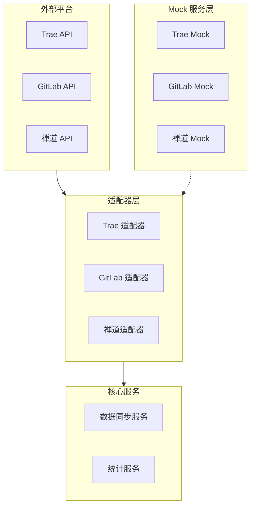
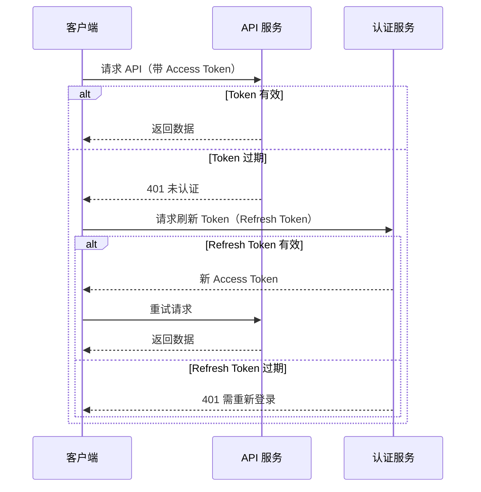
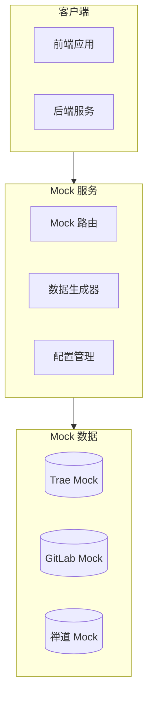
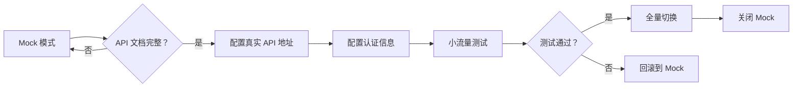
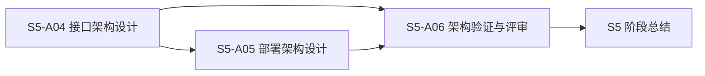

# P000001 S5-A04 接口架构设计文档

---

## 基本信息

| 项目 | 内容 |
|------|------|
| **Plan ID** | P000001 |
| **阶段编号** | S5-A04 |
| **文档名称** | 接口架构设计 |
| **文档版本** | v1.0.0 |
| **生成时间** | 2026-03-27 |
| **生成方式** | 基于架构视图和数据架构设计生成 |
| **文档状态** | 待评审 |

---

## 一、设计输入

### 1.1 前置文档

| 文档名称 | 文档路径 | 状态 |
|----------|----------|:----:|
| 架构愿景定义 | `database/stages/s5/P000001/P000001-S5-A01-001.md` | ✅ 已确认 |
| 架构视图设计 | `database/stages/s5/P000001/P000001-S5-A02-001.md` | ✅ 已评审 |
| 数据架构设计 | `database/stages/s5/P000001/P000001-S5-A03-001.md` | ✅ 待评审 |
| 需求分析报告 | `database/plans/P000001-requirements-report.md` | ✅ 已评审 |

### 1.2 设计目标

1. **标准化**：严格遵循 RESTful 规范，统一接口风格
2. **安全性**：JWT 认证 + 权限控制，确保数据安全
3. **可扩展**：适配器模式设计外部 API，便于扩展
4. **容错性**：Mock 方案兜底，API 文档不完整时仍可开发
5. **可维护**：接口文档齐全，版本管理清晰

### 1.3 关键决策

| 决策项 | 确认方案 | 说明 |
|--------|----------|------|
| **API 风格** | 严格 RESTful | 使用标准 HTTP 方法和状态码 |
| **认证方式** | JWT Token | 支持 Token 刷新机制 |
| **外部 API** | 全部 Mock | 后期根据实际 API 文档替换 |
| **版本管理** | URL 路径版本 | /api/v1/, /api/v2/ |

---

## 二、外部接口设计

### 2.1 外部接口总览

系统需要集成 3 个外部平台：

| 平台名称 | 接口类型 | 数据内容 | 优先级 | Mock 状态 |
|---------|---------|---------|:------:|:---------:|
| **Trae** | RESTful API | Token 使用、AI 建议、AI 采纳 | P0 | ✅ 需 Mock |
| **GitLab** | RESTful API | 代码提交、Merge Request | P0 | ✅ 需 Mock |
| **禅道** | RESTful API | Bug 记录、任务数据 | P0 | ✅ 需 Mock |

### 2.2 外部接口适配器架构



### 2.3 Trae API 适配器设计

#### 2.3.1 接口清单（Mock）

| 接口编号 | 接口名称 | 请求方法 | 请求路径 | 返回数据 |
|---------|---------|---------|---------|---------|
| TR-001 | 获取 Token 使用 | GET | `/api/v1/token-usage` | Token 使用列表 |
| TR-002 | 获取 AI 建议 | GET | `/api/v1/ai-suggestions` | AI 建议列表 |
| TR-003 | 获取 AI 采纳 | GET | `/api/v1/ai-adoptions` | AI 采纳列表 |
| TR-004 | 获取用户信息 | GET | `/api/v1/users/{id}` | 用户信息 |
| TR-005 | 获取 API 接口使用次数 | GET | `/api/v1/token-usage/stats` | API 使用统计 |

#### 2.3.2 数据模型映射

| Trae 字段 | 系统字段 | 转换规则 |
|----------|---------|---------|
| `user_id` | `user_id` | 直接映射 |
| `token_count` | `token_amount` | 字段重命名 |
| `timestamp` | `usage_time` | 时间格式转换 |
| `suggestion_content` | `content` | 字段简化 |

#### 2.3.3 API 接口使用统计

**TR-005 请求参数**：
```json
{
  "start_date": "2026-01-01",
  "end_date": "2026-03-27",
  "granularity": "day",
  "platform": "all"
}
```

**TR-005 返回数据**：
```json
{
  "code": 200,
  "data": {
    "usage": [
      {
        "date": "2026-03-01",
        "api_calls": 15000,
        "unique_users": 45,
        "avg_response_time": 120
      }
    ],
    "summary": {
      "total_calls": 450000,
      "avg_daily_calls": 15000,
      "peak_date": "2026-03-15",
      "top_endpoints": [
        {"endpoint": "/api/v1/token-usage", "calls": 120000},
        {"endpoint": "/api/v1/ai-suggestions", "calls": 80000}
      ]
    }
  },
  "message": "success"
}
```

#### 2.3.4 Mock 数据结构

```json
{
  "code": 200,
  "data": {
    "items": [
      {
        "user_id": "user_001",
        "token_count": 1500,
        "timestamp": "2026-03-27T10:30:00Z",
        "platform": "trae"
      }
    ],
    "total": 100,
    "page": 1,
    "page_size": 20
  },
  "message": "success"
}
```

### 2.4 GitLab API 适配器设计

#### 2.4.1 接口清单（Mock）

| 接口编号 | 接口名称 | 请求方法 | 请求路径 | 返回数据 |
|---------|---------|---------|---------|---------|
| GL-001 | 获取代码提交 | GET | `/api/v4/projects/{id}/repository/commits` | 提交列表 |
| GL-002 | 获取用户贡献 | GET | `/api/v4/projects/{id}/users/{user_id}/contributions` | 贡献数据 |
| GL-003 | 获取 Merge Request | GET | `/api/v4/projects/{id}/merge_requests` | MR 列表 |

#### 2.4.2 数据模型映射

| GitLab 字段 | 系统字段 | 转换规则 |
|------------|---------|---------|
| `author_email` | `author_email` | 关联 users 表 |
| `committed_date` | `commit_time` | 时间格式转换 |
| `message` | `commit_message` | 字段重命名 |
| `id` (commit) | `commit_hash` | 字段重命名 |

#### 2.4.3 Mock 数据结构

```json
{
  "code": 200,
  "data": {
    "items": [
      {
        "commit_hash": "abc123def456",
        "author_email": "dev@example.com",
        "committed_date": "2026-03-27T14:30:00Z",
        "message": "feat: add new feature",
        "project_id": 1
      }
    ],
    "total": 500,
    "page": 1,
    "page_size": 20
  },
  "message": "success"
}
```

### 2.5 禅道 API 适配器设计

#### 2.5.1 接口清单（Mock）

| 接口编号 | 接口名称 | 请求方法 | 请求路径 | 返回数据 |
|---------|---------|---------|---------|---------|
| ZD-001 | 获取 Bug 列表 | GET | `/api/v1/bugs` | Bug 列表 |
| ZD-002 | 获取 Bug 详情 | GET | `/api/v1/bugs/{id}` | Bug 详情 |
| ZD-003 | 获取任务列表 | GET | `/api/v1/tasks` | 任务列表 |

#### 2.5.2 数据模型映射

| 禅道字段 | 系统字段 | 转换规则 |
|---------|---------|---------|
| `assignedTo` | `assignee_id` | 关联 users 表 |
| `openedDate` | `created_at` | 时间格式转换 |
| `resolvedDate` | `resolved_at` | 时间格式转换 |
| `severity` | `severity_level` | 枚举值映射 |

#### 2.5.3 Mock 数据结构

```json
{
  "code": 200,
  "data": {
    "items": [
      {
        "bug_id": "BUG-001",
        "title": "登录页面崩溃",
        "severity_level": 2,
        "status": "active",
        "assignee_id": "user_003",
        "created_at": "2026-03-25T09:00:00Z",
        "project_id": 1
      }
    ],
    "total": 50,
    "page": 1,
    "page_size": 20
  },
  "message": "success"
}
```

### 2.6 适配器实现策略

#### 2.6.1 适配器基类设计

```python
# 适配器基类（概念设计）
class ExternalAPIAdapter:
    def __init__(self, config, mock_enabled=False):
        self.config = config
        self.mock_enabled = mock_enabled
        self.mock_data = {}
    
    async def fetch_data(self, endpoint, params=None):
        if self.mock_enabled:
            return self._get_mock_data(endpoint)
        return await self._fetch_real_data(endpoint, params)
    
    def _get_mock_data(self, endpoint):
        """返回 Mock 数据"""
        return self.mock_data.get(endpoint, {})
    
    async def _fetch_real_data(self, endpoint, params):
        """调用真实 API（子类实现）"""
        raise NotImplementedError
```

#### 2.6.2 Mock 开关控制

| 配置项 | 配置值 | 说明 |
|--------|--------|------|
| `TRADE_MOCK_ENABLED` | true | Trae API 使用 Mock |
| `GITLAB_MOCK_ENABLED` | true | GitLab API 使用 Mock |
| `ZEN_TAO_MOCK_ENABLED` | true | 禅道 API 使用 Mock |
| `MOCK_DATA_PATH` | `/data/mock/` | Mock 数据文件路径 |

---

## 三、内部 API 设计

### 3.1 API 分类总览

系统内部 API 分为 4 大类：

| API 分类 | 接口数量 | 优先级 | 说明 |
|---------|---------|:------:|------|
| **统计 API** | 17 个 | P0 | Token 趋势、活跃度、排名、API 使用统计等 |
| **配置 API** | 10 个 | P0 | 项目、人员、数据源配置 |
| **权限 API** | 5 个 | P0 | 认证、授权 |
| **同步 API** | 5 个 | P1 | 同步任务管理 |
| **合计** | **37 个** | - | 新增 2 个 API 使用统计接口 |

### 3.2 API 规范定义

#### 3.2.1 RESTful 规范

**HTTP 方法使用**：

| 方法 | 用途 | 幂等性 |
|------|------|:------:|
| GET | 查询资源 | ✅ |
| POST | 创建资源 | ❌ |
| PUT | 更新资源（全量） | ✅ |
| PATCH | 更新资源（部分） | ✅ |
| DELETE | 删除资源 | ✅ |

**URL 命名规范**：
- 使用小写字母
- 单词间用连字符分隔（kebab-case）
- 使用复数名词表示资源集合
- 格式：`/api/v{version}/{resource}/{id}/{sub-resource}`

**示例**：
- ✅ `/api/v1/users` - 获取用户列表
- ✅ `/api/v1/projects/123/members` - 获取项目成员
- ❌ `/api/v1/getUsers` - 不符合 RESTful

#### 3.2.2 统一响应格式

**成功响应**：
```json
{
  "code": 200,
  "data": {
    "items": [],
    "total": 0,
    "page": 1,
    "page_size": 20
  },
  "message": "success"
}
```

**错误响应**：
```json
{
  "code": 400,
  "error": {
    "type": "VALIDATION_ERROR",
    "message": "参数验证失败",
    "details": [
      {
        "field": "email",
        "message": "邮箱格式不正确"
      }
    ]
  },
  "message": "请求失败"
}
```

#### 3.2.3 HTTP 状态码使用

| 状态码 | 使用场景 | 说明 |
|:------:|---------|------|
| 200 | 成功 | GET/PUT/PATCH 成功 |
| 201 | 创建成功 | POST 成功 |
| 204 | 删除成功 | DELETE 成功 |
| 400 | 请求参数错误 | 参数验证失败 |
| 401 | 未认证 | Token 缺失或过期 |
| 403 | 无权限 | 权限不足 |
| 404 | 资源不存在 | 资源未找到 |
| 409 | 资源冲突 | 资源已存在 |
| 429 | 请求过多 | 触发限流 |
| 500 | 服务器错误 | 内部错误 |

### 3.3 统计 API 设计

#### 3.3.1 全局统计 API

| 接口编号 | 接口名称 | 请求方法 | 请求路径 | 返回数据 |
|---------|---------|---------|---------|---------|
| ST-001 | 获取 Token 趋势 | GET | `/api/v1/stats/token-trend` | Token 趋势数据 |
| ST-002 | 获取活跃度趋势 | GET | `/api/v1/stats/activity-trend` | 活跃度趋势 |
| ST-003 | 获取人员排名 | GET | `/api/v1/stats/user-ranking` | 人员排名列表 |
| ST-004 | 获取项目排名 | GET | `/api/v1/stats/project-ranking` | 项目排名列表 |
| ST-005 | 获取全局汇总 | GET | `/api/v1/stats/summary` | 全局汇总数据 |

**ST-001 请求参数**：
```json
{
  "start_date": "2026-01-01",
  "end_date": "2026-03-27",
  "granularity": "day",
  "platform": "all"
}
```

**ST-001 返回数据**：
```json
{
  "code": 200,
  "data": {
    "trend": [
      {
        "date": "2026-03-01",
        "token_amount": 150000,
        "active_users": 45
      }
    ],
    "summary": {
      "total_tokens": 4500000,
      "avg_daily_tokens": 150000,
      "peak_date": "2026-03-15"
    }
  }
}
```

#### 3.3.2 项目统计 API

| 接口编号 | 接口名称 | 请求方法 | 请求路径 | 返回数据 |
|---------|---------|---------|---------|---------|
| ST-101 | 获取项目 Token 统计 | GET | `/api/v1/projects/{id}/stats/token` | Token 统计 |
| ST-102 | 获取项目代码统计 | GET | `/api/v1/projects/{id}/stats/code` | 代码统计 |
| ST-103 | 获取项目 Bug 统计 | GET | `/api/v1/projects/{id}/stats/bugs` | Bug 统计 |
| ST-104 | 获取项目成员贡献 | GET | `/api/v1/projects/{id}/stats/members` | 成员贡献 |

#### 3.3.3 个人统计 API

| 接口编号 | 接口名称 | 请求方法 | 请求路径 | 返回数据 |
|---------|---------|---------|---------|---------|
| ST-201 | 获取个人 Token 使用 | GET | `/api/v1/users/{id}/stats/token` | Token 使用 |
| ST-202 | 获取个人代码贡献 | GET | `/api/v1/users/{id}/stats/code` | 代码贡献 |
| ST-203 | 获取个人 Bug 处理 | GET | `/api/v1/users/{id}/stats/bugs` | Bug 处理 |
| ST-204 | 获取个人 AI 使用 | GET | `/api/v1/users/{id}/stats/ai` | AI 使用统计 |
| ST-205 | 获取个人 API 接口使用次数 | GET | `/api/v1/users/{id}/stats/api-usage` | API 使用统计 |

**ST-205 请求参数**：
```json
{
  "start_date": "2026-01-01",
  "end_date": "2026-03-27",
  "granularity": "day"
}
```

**ST-205 返回数据**：
```json
{
  "code": 200,
  "data": {
    "usage": [
      {
        "date": "2026-03-01",
        "api_calls": 500,
        "avg_response_time": 110
      }
    ],
    "summary": {
      "total_calls": 15000,
      "avg_daily_calls": 500,
      "peak_date": "2026-03-15",
      "top_endpoints": [
        {"endpoint": "/api/v1/token-usage", "calls": 5000},
        {"endpoint": "/api/v1/ai-suggestions", "calls": 3000}
      ]
    }
  },
  "message": "success"
}
```

### 3.4 配置 API 设计

#### 3.4.1 项目配置 API

| 接口编号 | 接口名称 | 请求方法 | 请求路径 | 返回数据 |
|---------|---------|---------|---------|---------|
| CF-001 | 获取项目列表 | GET | `/api/v1/projects` | 项目列表 |
| CF-002 | 创建项目 | POST | `/api/v1/projects` | 项目详情 |
| CF-003 | 更新项目 | PUT | `/api/v1/projects/{id}` | 项目详情 |
| CF-004 | 删除项目 | DELETE | `/api/v1/projects/{id}` | - |
| CF-005 | 获取项目成员 | GET | `/api/v1/projects/{id}/members` | 成员列表 |
| CF-006 | 添加项目成员 | POST | `/api/v1/projects/{id}/members` | - |

#### 3.4.2 人员配置 API

| 接口编号 | 接口名称 | 请求方法 | 请求路径 | 返回数据 |
|---------|---------|---------|---------|---------|
| CF-101 | 获取人员列表 | GET | `/api/v1/users` | 人员列表 |
| CF-102 | 创建人员 | POST | `/api/v1/users` | 人员详情 |
| CF-103 | 更新人员 | PUT | `/api/v1/users/{id}` | 人员详情 |
| CF-104 | 删除人员 | DELETE | `/api/v1/users/{id}` | - |

#### 3.4.3 数据源配置 API

| 接口编号 | 接口名称 | 请求方法 | 请求路径 | 返回数据 |
|---------|---------|---------|---------|---------|
| CF-201 | 获取数据源列表 | GET | `/api/v1/data-sources` | 数据源列表 |
| CF-202 | 创建数据源 | POST | `/api/v1/data-sources` | 数据源详情 |
| CF-203 | 更新数据源 | PUT | `/api/v1/data-sources/{id}` | 数据源详情 |
| CF-204 | 测试数据源 | POST | `/api/v1/data-sources/{id}/test` | 测试结果 |
| CF-205 | 删除数据源 | DELETE | `/api/v1/data-sources/{id}` | - |

### 3.5 权限 API 设计

#### 3.5.1 认证 API

| 接口编号 | 接口名称 | 请求方法 | 请求路径 | 返回数据 |
|---------|---------|---------|---------|---------|
| AU-001 | 用户登录 | POST | `/api/v1/auth/login` | Token |
| AU-002 | 刷新 Token | POST | `/api/v1/auth/refresh` | 新 Token |
| AU-003 | 用户登出 | POST | `/api/v1/auth/logout` | - |
| AU-004 | 获取当前用户 | GET | `/api/v1/auth/me` | 用户信息 |

**AU-001 请求参数**：
```json
{
  "username": "admin",
  "password": "password123"
}
```

**AU-001 返回数据**：
```json
{
  "code": 200,
  "data": {
    "access_token": "eyJhbGciOiJIUzI1NiIsInR5cCI6IkpXVCJ9...",
    "refresh_token": "eyJhbGciOiJIUzI1NiIsInR5cCI6IkpXVCJ9...",
    "token_type": "Bearer",
    "expires_in": 3600
  }
}
```

#### 3.5.2 授权 API

| 接口编号 | 接口名称 | 请求方法 | 请求路径 | 返回数据 |
|---------|---------|---------|---------|---------|
| AU-101 | 获取角色列表 | GET | `/api/v1/roles` | 角色列表 |
| AU-102 | 创建角色 | POST | `/api/v1/roles` | 角色详情 |
| AU-103 | 更新角色 | PUT | `/api/v1/roles/{id}` | 角色详情 |
| AU-104 | 分配权限 | POST | `/api/v1/roles/{id}/permissions` | - |

### 3.6 同步 API 设计

#### 3.6.1 同步任务 API

| 接口编号 | 接口名称 | 请求方法 | 请求路径 | 返回数据 |
|---------|---------|---------|---------|---------|
| SY-001 | 获取同步任务列表 | GET | `/api/v1/sync-tasks` | 任务列表 |
| SY-002 | 创建同步任务 | POST | `/api/v1/sync-tasks` | 任务详情 |
| SY-003 | 触发同步 | POST | `/api/v1/sync-tasks/{id}/trigger` | 任务状态 |
| SY-004 | 获取同步状态 | GET | `/api/v1/sync-tasks/{id}/status` | 同步状态 |
| SY-005 | 取消同步 | POST | `/api/v1/sync-tasks/{id}/cancel` | - |

---

## 四、JWT 认证设计

### 4.1 Token 结构

JWT Token 包含 3 部分：
- **Header**：算法和 Token 类型
- **Payload**：用户信息和权限
- **Signature**：签名验证

### 4.2 Token 配置

| 配置项 | 配置值 | 说明 |
|--------|--------|------|
| **Access Token 有效期** | 1 小时 | 短期访问令牌 |
| **Refresh Token 有效期** | 7 天 | 长期刷新令牌 |
| **加密算法** | HS256 | HMAC-SHA256 |
| **Issuer** | `stats-platform` | 签发者 |
| **Audience** | `stats-api` | 接收者 |

### 4.3 Token 刷新流程



---

## 五、错误码规范

### 5.1 错误码分类

| 错误码范围 | 错误类型 | 说明 |
|-----------|---------|------|
| 1000-1999 | 认证错误 | 登录、Token 相关 |
| 2000-2999 | 权限错误 | 授权、角色相关 |
| 3000-3999 | 参数错误 | 请求参数验证 |
| 4000-4999 | 资源错误 | 资源不存在、冲突 |
| 5000-5999 | 业务错误 | 业务逻辑错误 |
| 6000-6999 | 外部 API 错误 | 外部接口调用失败 |
| 9000-9999 | 系统错误 | 服务器内部错误 |

### 5.2 核心错误码清单

| 错误码 | 错误类型 | 错误消息 | HTTP 状态码 |
|--------|---------|---------|:----------:|
| 1001 | 认证错误 | 用户名或密码错误 | 401 |
| 1002 | 认证错误 | Token 已过期 | 401 |
| 1003 | 认证错误 | Token 无效 | 401 |
| 1004 | 认证错误 | Token 缺失 | 401 |
| 2001 | 权限错误 | 权限不足 | 403 |
| 2002 | 权限错误 | 角色不存在 | 404 |
| 3001 | 参数错误 | 参数格式不正确 | 400 |
| 3002 | 参数错误 | 必填参数缺失 | 400 |
| 4001 | 资源错误 | 资源不存在 | 404 |
| 4002 | 资源错误 | 资源已存在 | 409 |
| 5001 | 业务错误 | 操作失败 | 500 |
| 6001 | 外部 API 错误 | 外部 API 调用失败 | 502 |
| 6002 | 外部 API 错误 | 外部 API 超时 | 504 |
| 9001 | 系统错误 | 服务器内部错误 | 500 |
| 9002 | 系统错误 | 数据库错误 | 500 |

---

## 六、API 版本管理

### 6.1 版本策略

采用 URL 路径版本管理：
- **当前版本**：`/api/v1/`
- **历史版本**：`/api/v0/`（已废弃）
- **未来版本**：`/api/v2/`（规划中）

### 6.2 版本兼容性

| 版本 | 状态 | 支持周期 | 说明 |
|------|------|---------|------|
| v0 | 已废弃 | - | 初始版本，已废弃 |
| v1 | 当前版本 | 2026-03 ~ 2027-03 | 当前生产版本 |
| v2 | 规划中 | - | 预留扩展版本 |

### 6.3 版本切换策略

1. **向后兼容**：新版本尽量保持向后兼容
2. **过渡期**：旧版本保留 3 个月过渡期
3. **废弃通知**：提前 1 个月通知废弃计划
4. **文档同步**：每个版本独立文档

---

## 七、限流与熔断

### 7.1 限流策略

| 限流维度 | 限流值 | 说明 |
|---------|:------:|------|
| **全局限流** | 1000 请求/秒 | 保护整体系统 |
| **用户限流** | 100 请求/秒 | 防止单用户滥用 |
| **IP 限流** | 50 请求/秒 | 防止 IP 攻击 |
| **接口限流** | 200 请求/秒 | 核心接口保护 |

### 7.2 熔断策略

**外部 API 熔断配置**：

| 配置项 | 配置值 | 说明 |
|--------|--------|------|
| **失败阈值** | 5 次失败 | 触发熔断 |
| **熔断时长** | 30 秒 | 熔断持续时间 |
| **半开状态** | 10 秒 | 尝试恢复时间 |
| **成功阈值** | 3 次成功 | 恢复正常状态 |

### 7.3 降级策略

| 降级场景 | 降级方案 |
|---------|---------|
| 外部 API 不可用 | 使用 Mock 数据兜底 |
| 数据库不可用 | 使用缓存数据兜底 |
| 缓存不可用 | 直接查询数据库 |
| 统计服务不可用 | 返回最近一次快照 |

---

## 八、接口文档管理

### 8.1 文档格式

采用 OpenAPI 3.0 规范（Swagger）：
- **文档路径**：`/api/v1/docs/swagger.json`
- **UI 路径**：`/api/v1/docs/swagger-ui`
- **更新方式**：代码自动生成

### 8.2 文档内容

每个接口文档包含：
1. 接口基本信息（路径、方法、描述）
2. 请求参数（路径参数、查询参数、请求体）
3. 响应格式（成功响应、错误响应）
4. 认证要求（是否需要 Token）
5. 限流配置（限流值）
6. 示例代码（cURL、Python、JavaScript）

### 8.3 文档示例

```yaml
openapi: 3.0.0
info:
  title: 绩效统计平台 API
  version: 1.0.0
  description: 研发中心 Coding Agent 绩效统计平台

paths:
  /api/v1/stats/token-trend:
    get:
      summary: 获取 Token 趋势
      description: 获取指定时间范围内的 Token 使用趋势
      tags:
        - 统计 API
      parameters:
        - name: start_date
          in: query
          required: true
          schema:
            type: string
            format: date
        - name: end_date
          in: query
          required: true
          schema:
            type: string
            format: date
      responses:
        '200':
          description: 成功
          content:
            application/json:
              schema:
                $ref: '#/components/schemas/TokenTrendResponse'
```

---

## 九、Mock 方案设计

### 9.1 Mock 服务架构



### 9.2 Mock 数据生成策略

| 数据类型 | 生成策略 | 说明 |
|---------|---------|------|
| **用户数据** | 固定 50 个测试用户 | 保证数据一致性 |
| **项目数据** | 固定 10 个测试项目 | 覆盖不同规模 |
| **Token 数据** | 随机生成（正态分布） | 模拟真实使用模式 |
| **代码提交** | 随机生成（泊松分布） | 模拟提交频率 |
| **Bug 数据** | 固定 100 条 + 随机 | 覆盖不同严重等级 |

### 9.3 Mock 配置管理

**配置文件**：`config/mock.yaml`

```yaml
mock:
  enabled: true
  seed: 42  # 随机种子，保证数据可复现
  
  adapters:
    trae:
      enabled: true
      data_path: /data/mock/trae/
      latency: 100ms  # 模拟网络延迟
    
    gitlab:
      enabled: true
      data_path: /data/mock/gitlab/
      latency: 150ms
    
    zen_tao:
      enabled: true
      data_path: /data/mock/zen_tao/
      latency: 120ms
```

### 9.4 Mock 切换真实 API 流程



---

## 十、API 安全设计

### 10.1 认证机制

**多层认证**：
1. **JWT Token**：用户身份认证
2. **API Key**：服务间认证
3. **签名验证**：外部 API 调用

### 10.2 权限控制

**RBAC 权限模型**：

| 角色 | 权限范围 | 数据范围 |
|------|---------|---------|
| **超级管理员** | 所有权限 | 所有数据 |
| **管理员** | 配置管理 + 统计查看 | 所有数据 |
| **项目经理** | 项目配置 + 项目统计 | 所管项目数据 |
| **研发人员** | 个人统计查看 | 个人数据 |

### 10.3 数据安全

| 安全措施 | 实现方式 | 说明 |
|---------|---------|------|
| **传输加密** | HTTPS/TLS | 全链路加密 |
| **数据脱敏** | 敏感字段掩码 | 密码、Token 不返回 |
| **SQL 注入防护** | 参数化查询 | 使用 ORM |
| **XSS 防护** | 输入过滤 | 过滤恶意脚本 |
| **CSRF 防护** | Token 验证 | 验证请求来源 |

### 10.4 审计日志

**审计内容**：
- 所有写操作（POST/PUT/DELETE）
- 敏感数据访问
- 认证失败记录
- 权限变更操作

**日志格式**：
```json
{
  "timestamp": "2026-03-27T10:30:00Z",
  "user_id": "user_001",
  "action": "UPDATE_PROJECT",
  "resource": "projects/1",
  "ip": "192.168.1.100",
  "status": "SUCCESS",
  "details": {
    "changed_fields": ["name", "description"]
  }
}
```

---

## 十一、性能优化

### 11.1 缓存策略

| 缓存类型 | 缓存对象 | 过期时间 | 说明 |
|---------|---------|:------:|------|
| **用户信息缓存** | 用户基本信息 | 5 分钟 | Redis 缓存 |
| **项目配置缓存** | 项目信息 | 10 分钟 | Redis 缓存 |
| **统计结果缓存** | 统计 API 结果 | 1 小时 | Redis 缓存 |
| **Token 缓存** | JWT Token 黑名单 | 1 小时 | Redis 缓存 |

### 11.2 分页策略

**统一分页参数**：
- `page`：页码（从 1 开始）
- `page_size`：每页数量（默认 20，最大 100）

**分页响应**：
```json
{
  "code": 200,
  "data": {
    "items": [],
    "total": 100,
    "page": 1,
    "page_size": 20,
    "total_pages": 5
  }
}
```

### 11.3 查询优化

**数据库查询优化**：
1. 使用索引覆盖查询
2. 避免 N+1 查询
3. 批量查询代替循环查询
4. 使用连接池

**API 查询优化**：
1. 支持字段过滤（`?fields=id,name,email`）
2. 支持嵌套资源展开（`?expand=project,members`）
3. 支持排序（`?sort=-created_at`）

---

## 十二、测试策略

### 12.1 测试类型

| 测试类型 | 测试内容 | 覆盖率目标 |
|---------|---------|:---------:|
| **单元测试** | 单个函数/方法 | 80%+ |
| **集成测试** | API 接口集成 | 100% 核心接口 |
| **性能测试** | 并发、压力 | 满足性能指标 |
| **安全测试** | 认证、授权、注入 | 100% 安全用例 |

### 12.2 Mock 测试

**Mock 测试场景**：
1. 外部 API 正常响应
2. 外部 API 超时
3. 外部 API 返回错误
4. 外部 API 数据格式异常

---

## 十三、产出物清单

### 已生成文件

| 文件路径 | 文件名称 | 状态 |
|---------|---------|:----:|
| `database/stages/s5/P000001/P000001-S5-A04-001.md` | 接口架构设计 | ✅ |

### 配套文件（待生成）

| 文件路径 | 文件名称 | 说明 |
|---------|---------|------|
| `api/specs/openapi.yaml` | OpenAPI 规范文件 | Swagger 文档 |
| `api/mocks/trae/` | Trae Mock 数据 | Mock 数据文件 |
| `api/mocks/gitlab/` | GitLab Mock 数据 | Mock 数据文件 |
| `api/mocks/zen_tao/` | 禅道 Mock 数据 | Mock 数据文件 |
| `config/mock.yaml` | Mock 配置 | 配置文件 |

---

## 十四、架构决策记录

### ADR-005：API 风格选择

| 决策项 | 决策内容 |
|--------|----------|
| **决策编号** | ADR-005 |
| **决策时间** | 2026-03-27 |
| **决策者** | 架构团队 |
| **决策方案** | 严格 RESTful 风格 |
| **决策原因** | 1. 标准化程度高<br>2. 生态工具丰富<br>3. 易于理解和维护 |

### ADR-006：外部 API Mock 策略

| 决策项 | 决策内容 |
|--------|----------|
| **决策编号** | ADR-006 |
| **决策时间** | 2026-03-27 |
| **决策者** | 架构团队 |
| **决策方案** | 全部使用 Mock，后期替换 |
| **决策原因** | 1. API 文档不完整<br>2. 并行开发需求<br>3. 降低开发风险 |

### ADR-007：JWT Token 配置

| 决策项 | 决策内容 |
|--------|----------|
| **决策编号** | ADR-007 |
| **决策时间** | 2026-03-27 |
| **决策者** | 架构团队 |
| **决策方案** | Access Token 1 小时 + Refresh Token 7 天 |
| **决策原因** | 1. 平衡安全性和用户体验<br>2. 符合行业最佳实践 |

---

## 十五、待确认事项

### 15.1 待评审内容

| 评审项 | 评审要点 | 优先级 |
|--------|---------|:------:|
| **外部接口设计** | Mock 方案可行性、适配器设计 | P0 |
| **内部 API 设计** | API 完整性、RESTful 规范性 | P0 |
| **认证授权设计** | JWT 配置、权限模型 | P0 |
| **错误码规范** | 错误码覆盖度 | P1 |
| **限流熔断策略** | 限流值合理性 | P1 |

### 15.2 待补充内容

| 补充项 | 补充内容 | 依赖条件 |
|--------|---------|---------|
| **真实 API 文档** | Trae/GitLab/禅道 API 文档 | 外部平台支持 |
| **API 性能指标** | 响应时间、吞吐量 | 性能测试完成 |
| **安全测试报告** | 渗透测试结果 | 安全测试完成 |

---

## 十六、下一步工作

### 16.1 后续任务

| 任务编号 | 任务名称 | 预计工时 | 状态 |
|---------|---------|:------:|:----:|
| **S5-A05** | 部署架构设计 | 8h | ⏳ 待执行 |
| **S5-A06** | 架构验证与评审 | 8h | ⏳ 待执行 |

### 16.2 输入输出关系



---

**文档生成完成！**

**下一步**：请评审本文档，确认后可继续执行 S5-A05 部署架构设计任务。

---

*本文档由 AI 自动生成，记录了 P000001 项目 S5-A04 接口架构设计的完整内容。*
