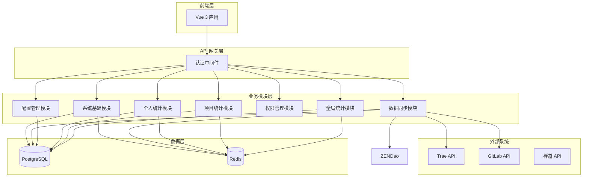

# P000001 S6-A01 模块详细设计文档

---

## 基本信息

| 项目 | 内容 |
|------|------|
| **Plan ID** | P000001 |
| **阶段编号** | S6-A01 |
| **文档名称** | 模块详细设计 |
| **文档版本** | v1.0.0 |
| **生成时间** | 2026-03-27 |
| **文档状态** | 待评审 |

---

## 一、设计输入

### 1.1 前置文档

| 文档名称 | 文档路径 | 状态 |
|----------|----------|:----:|
| 架构愿景定义 | `database/stages/s5/P000001/P000001-S5-A01-001.md` | ✅ 已确认 |
| 架构视图设计 | `database/stages/s5/P000001/P000001-S5-A02-001.md` | ✅ 已确认 |
| 数据架构设计 | `database/stages/s5/P000001/P000001-S5-A03-001.md` | ✅ 已确认 |
| 接口架构设计 | `database/stages/s5/P000001/P000001-S5-A04-001.md` | ✅ 已确认 |
| 部署架构设计 | `database/stages/s5/P000001/P000001-S5-A05-001.md` | ✅ 已确认 |

### 1.2 模块概览

基于 S5 架构设计，系统划分为 7 大核心模块：

| 模块编号 | 模块名称 | 优先级 | 复杂度 |
|----------|----------|:------:|:------:|
| MOD-001 | 全局统计模块 | P0 | 中 |
| MOD-002 | 项目统计模块 | P0 | 高 |
| MOD-003 | 个人统计模块 | P0 | 中 |
| MOD-004 | 配置管理模块 | P0 | 低 |
| MOD-005 | 权限管理模块 | P0 | 中 |
| MOD-006 | 数据同步模块 | P0 | 高 |
| MOD-007 | 系统基础模块 | P1 | 低 |

---

## 二、全局统计模块（MOD-001）

### 2.1 模块概述

| 属性 | 内容 |
|------|------|
| **模块编号** | MOD-001 |
| **模块名称** | 全局统计模块 |
| **核心职责** | 提供全中心维度的 Coding Agent 使用统计 |
| **主要用户** | 中心领导、技术负责人 |
| **使用场景** | 全局监控、趋势分析、人员排名 |

### 2.2 功能分解

#### F-001：全局 Token 使用趋势看板

**功能描述**：
展示全中心 Token 使用量随时间变化的趋势，支持按日/周/月维度查看。

**输入**：
- 时间范围（开始日期、结束日期）
- 统计维度（日/周/月）
- 平台筛选（可选：Trae/阿里/其他）

**处理逻辑**：
1. 从缓存查询聚合数据，未命中则查询数据库
2. 按时间维度聚合 Token 使用量
3. 计算环比和同比数据
4. 返回趋势数据点

**输出**：
```json
{
  "period": "daily",
  "data_points": [
    {
      "date": "2026-03-27",
      "token_count": 150000,
      "api_calls": 3500,
      "mom_change": 0.15,
      "yoy_change": null
    }
  ],
  "summary": {
    "total_tokens": 4500000,
    "total_calls": 105000,
    "avg_daily_tokens": 150000
  }
}
```

**界面元素**：
- 折线图（Token 趋势）
- 柱状图（API 调用次数）
- 数据卡片（总计、日均、环比）

**性能要求**：
- 响应时间 < 500ms（缓存命中）
- 响应时间 < 2s（数据库查询）
- 缓存 TTL：1 小时

---

#### F-002：全中心活跃度趋势

**功能描述**：
展示全中心使用 Coding Agent 的活跃度趋势，包括活跃用户数、活跃项目数。

**输入**：
- 时间范围
- 活跃度定义（有 Token 使用记录/有代码提交）

**处理逻辑**：
1. 统计每日/周/月活跃用户数（去重）
2. 统计活跃项目数（去重）
3. 计算活跃度指标（活跃用户/总用户）

**输出**：
```json
{
  "period": "weekly",
  "active_users": [
    {"period": "2026-W13", "count": 45, "rate": 0.75}
  ],
  "active_projects": [
    {"period": "2026-W13", "count": 12}
  ]
}
```

**界面元素**：
- 双轴折线图（活跃用户数 + 活跃项目数）
- 活跃度仪表盘

---

#### F-003：高频使用人员 TOP 20

**功能描述**：
展示 Token 使用量排名前 20 的用户，支持按日/周/月切换。

**输入**：
- 排名维度（日/周/月）
- 筛选条件（可选：部门、项目）

**处理逻辑**：
1. 按用户聚合 Token 使用量
2. 按使用量降序排序
3. 取前 20 名
4. 关联用户基本信息

**输出**：
```json
{
  "period": "monthly",
  "top_users": [
    {
      "rank": 1,
      "user_id": 1001,
      "username": "张三",
      "department": "研发一部",
      "token_count": 500000,
      "api_calls": 12000,
      "project_count": 3
    }
  ]
}
```

**界面元素**：
- 排行榜表格
- 用户头像（可选）
- 趋势小图（sparkline）

---

### 2.3 类设计

#### GlobalStatsService

```python
class GlobalStatsService:
    """全局统计服务类"""
    
    def __init__(self, db_session: Session, redis_client: Redis):
        self.db = db_session
        self.redis = redis_client
    
    def get_token_trend(
        self, 
        start_date: date, 
        end_date: date, 
        period: str = "daily",
        platform: Optional[str] = None
    ) -> TokenTrendResponse:
        """获取 Token 使用趋势"""
        pass
    
    def get_activity_trend(
        self,
        start_date: date,
        end_date: date,
        period: str = "daily"
    ) -> ActivityTrendResponse:
        """获取活跃度趋势"""
        pass
    
    def get_top_users(
        self,
        period: str = "monthly",
        limit: int = 20,
        department: Optional[str] = None
    ) -> List[TopUserResponse]:
        """获取高频使用人员排名"""
        pass
    
    def _get_cached_data(self, cache_key: str) -> Optional[dict]:
        """从缓存获取数据"""
        pass
    
    def _set_cache_data(self, cache_key: str, data: dict, ttl: int = 3600):
        """设置缓存数据"""
        pass
```

#### TokenTrendCalculator

```python
class TokenTrendCalculator:
    """Token 趋势计算器"""
    
    def __init__(self, db_session: Session):
        self.db = db_session
    
    def calculate_daily_trend(
        self,
        start_date: date,
        end_date: date,
        platform: Optional[str] = None
    ) -> List[TokenTrendPoint]:
        """计算日级别趋势"""
        pass
    
    def calculate_weekly_trend(
        self,
        start_date: date,
        end_date: date
    ) -> List[TokenTrendPoint]:
        """计算周级别趋势"""
        pass
    
    def calculate_monthly_trend(
        self,
        start_date: date,
        end_date: date
    ) -> List[TokenTrendPoint]:
        """计算月级别趋势"""
        pass
    
    def calculate_mom_change(self, current: int, previous: int) -> float:
        """计算环比变化"""
        pass
```

### 2.4 数据库操作

#### 查询 Token 趋势数据

```sql
-- 日级别 Token 使用趋势
SELECT 
    usage_date,
    SUM(token_count) as total_tokens,
    SUM(api_calls) as total_calls,
    COUNT(DISTINCT user_id) as active_users
FROM token_usage
WHERE usage_date BETWEEN :start_date AND :end_date
  AND (:platform IS NULL OR platform = :platform)
GROUP BY usage_date
ORDER BY usage_date;
```

### 2.5 接口设计

| 接口编号 | 接口路径 | 方法 | 描述 |
|----------|----------|------|------|
| API-GS-001 | `/api/v1/stats/global/token-trend` | GET | 获取 Token 趋势 |
| API-GS-002 | `/api/v1/stats/global/activity-trend` | GET | 获取活跃度趋势 |
| API-GS-003 | `/api/v1/stats/global/top-users` | GET | 获取高频用户排名 |

---

## 三、项目统计模块（MOD-002）

### 3.1 模块概述

| 属性 | 内容 |
|------|------|
| **模块编号** | MOD-002 |
| **模块名称** | 项目统计模块 |
| **核心职责** | 提供项目维度的统计视图 |
| **主要用户** | 项目经理、技术负责人 |
| **使用场景** | 项目监控、代码质量分析、Bug 趋势跟踪 |

### 3.2 功能分解

#### F-004：项目维度统计视图

**功能描述**：
展示单个项目的综合统计信息，包括代码、Token、Bug、AI 采纳率等指标。

**输入**：
- 项目 ID
- 时间范围（可选）

**处理逻辑**：
1. 验证项目访问权限
2. 聚合代码提交数据（总数、新增、删除）
3. 聚合 Token 使用数据
4. 聚合 Bug 数据（新增、解决、未解决）
5. 计算 AI 代码采纳率
6. 计算人均产出

**输出**：
```json
{
  "project_id": 1001,
  "project_name": "项目管理平台",
  "period": {
    "start_date": "2026-03-01",
    "end_date": "2026-03-27"
  },
  "code_stats": {
    "total_commits": 350,
    "total_additions": 15000,
    "total_deletions": 5000,
    "net_additions": 10000
  },
  "token_stats": {
    "total_tokens": 800000,
    "total_calls": 20000,
    "avg_daily_tokens": 29630
  },
  "bug_stats": {
    "new_bugs": 25,
    "resolved_bugs": 20,
    "open_bugs": 5,
    "bug_rate": 0.0025
  },
  "ai_adoption": {
    "ai_commits": 120,
    "ai_adoption_rate": 0.34
  },
  "team_stats": {
    "member_count": 8,
    "avg_code_per_person": 1250
  }
}
```

**界面元素**：
- 数据卡片（代码、Token、Bug、AI 采纳率）
- 趋势图（代码提交、Bug 趋势）
- 团队产出柱状图

---

#### F-005：项目代码行排名

**功能描述**：
展示项目内用户的代码提交行数排名。

**输入**：
- 项目 ID
- 时间范围（可选）
- 排名类型（新增/删除/净增）

**处理逻辑**：
1. 按用户聚合代码提交数据
2. 计算新增、删除、净增行数
3. 按指定类型排序
4. 关联用户信息

**输出**：
```json
{
  "project_id": 1001,
  "rank_type": "net_additions",
  "rankings": [
    {
      "rank": 1,
      "user_id": 1001,
      "username": "张三",
      "commits": 50,
      "additions": 3000,
      "deletions": 500,
      "net_additions": 2500
    }
  ]
}
```

**界面元素**：
- 排行榜表格
- 用户代码贡献堆叠柱状图

---

#### F-006：项目 Bug 趋势看板

**功能描述**：
展示项目 Bug 随时间变化的趋势，包括新增、解决、未解决数量。

**输入**：
- 项目 ID
- 时间范围
- 统计维度（日/周/月）

**处理逻辑**：
1. 按时间维度聚合 Bug 数据
2. 计算累计未解决 Bug 数
3. 计算 Bug 解决率
4. 计算 Bug 率（Bug 数/代码行数）

**输出**：
```json
{
  "project_id": 1001,
  "period": "weekly",
  "bug_trend": [
    {
      "period": "2026-W13",
      "new_bugs": 5,
      "resolved_bugs": 3,
      "open_bugs": 8,
      "bug_rate": 0.0008,
      "resolution_rate": 0.6
    }
  ]
}
```

**界面元素**：
- 堆叠面积图（新增/解决/未解决）
- Bug 解决率折线图
- Bug 率仪表盘

---

#### F-007：项目 AI 代码采纳率

**功能描述**：
展示项目中 AI 生成代码的采纳情况。

**输入**：
- 项目 ID
- 时间范围（可选）

**处理逻辑**：
1. 统计 AI 生成的代码提交数
2. 统计总代码提交数
3. 计算采纳率（AI 提交数/总提交数）
4. 按用户维度展示采纳率分布

**输出**：
```json
{
  "project_id": 1001,
  "ai_adoption": {
    "total_commits": 350,
    "ai_commits": 120,
    "adoption_rate": 0.34,
    "ai_code_lines": 4500,
    "total_code_lines": 15000,
    "ai_line_rate": 0.30
  },
  "user_adoption": [
    {
      "user_id": 1001,
      "username": "张三",
      "total_commits": 50,
      "ai_commits": 25,
      "adoption_rate": 0.50
    }
  ]
}
```

**界面元素**：
- 采纳率仪表盘
- 用户采纳率柱状图
- AI 代码占比饼图

---

#### F-008：项目代码提交量排行

**功能描述**：
展示项目代码提交次数的排名。

**输入**：
- 项目 ID
- 时间范围（可选）

**处理逻辑**：
1. 按用户聚合提交次数
2. 计算总代码行数
3. 按提交次数降序排序

**输出**：
```json
{
  "project_id": 1001,
  "commit_rankings": [
    {
      "rank": 1,
      "user_id": 1001,
      "username": "张三",
      "commits": 50,
      "total_lines": 3000,
      "avg_lines_per_commit": 60
    }
  ]
}
```

**界面元素**：
- 排行榜表格
- 提交量柱状图

---

### 3.3 类设计

#### ProjectStatsService

```python
class ProjectStatsService:
    """项目统计服务类"""
    
    def __init__(self, db_session: Session, redis_client: Redis):
        self.db = db_session
        self.redis = redis_client
    
    def get_project_overview(
        self,
        project_id: int,
        start_date: Optional[date] = None,
        end_date: Optional[date] = None
    ) -> ProjectOverviewResponse:
        """获取项目综合统计概览"""
        pass
    
    def get_code_ranking(
        self,
        project_id: int,
        rank_type: str = "net_additions",
        start_date: Optional[date] = None,
        end_date: Optional[date] = None
    ) -> List[CodeRankingResponse]:
        """获取代码行数排名"""
        pass
    
    def get_bug_trend(
        self,
        project_id: int,
        start_date: date,
        end_date: date,
        period: str = "daily"
    ) -> List[BugTrendPoint]:
        """获取 Bug 趋势"""
        pass
    
    def get_ai_adoption(
        self,
        project_id: int,
        start_date: Optional[date] = None,
        end_date: Optional[date] = None
    ) -> AIAdoptionResponse:
        """获取 AI 采纳率"""
        pass
    
    def get_commit_ranking(
        self,
        project_id: int,
        start_date: Optional[date] = None,
        end_date: Optional[date] = None
    ) -> List[CommitRankingResponse]:
        """获取提交量排名"""
        pass
    
    def _check_project_permission(self, user_id: int, project_id: int):
        """检查项目访问权限"""
        pass
```

#### BugTrendCalculator

```python
class BugTrendCalculator:
    """Bug 趋势计算器"""
    
    def __init__(self, db_session: Session):
        self.db = db_session
    
    def calculate_cumulative_open_bugs(
        self,
        project_id: int,
        end_date: date
    ) -> int:
        """计算累计未解决 Bug 数"""
        pass
    
    def calculate_bug_rate(
        self,
        bug_count: int,
        code_lines: int
    ) -> float:
        """计算 Bug 率"""
        pass
    
    def calculate_resolution_rate(
        self,
        resolved_count: int,
        new_count: int
    ) -> float:
        """计算 Bug 解决率"""
        pass
```

### 3.4 接口设计

| 接口编号 | 接口路径 | 方法 | 描述 |
|----------|----------|------|------|
| API-PS-001 | `/api/v1/stats/projects/{id}` | GET | 获取项目综合统计 |
| API-PS-002 | `/api/v1/stats/projects/{id}/code-rank` | GET | 获取代码行数排名 |
| API-PS-003 | `/api/v1/stats/projects/{id}/bug-trend` | GET | 获取 Bug 趋势 |
| API-PS-004 | `/api/v1/stats/projects/{id}/ai-adoption` | GET | 获取 AI 采纳率 |
| API-PS-005 | `/api/v1/stats/projects/{id}/commit-rank` | GET | 获取提交量排名 |

---

## 四、个人统计模块（MOD-003）

### 4.1 模块概述

| 属性 | 内容 |
|------|------|
| **模块编号** | MOD-003 |
| **模块名称** | 个人统计模块 |
| **核心职责** | 提供个人维度的统计视图 |
| **主要用户** | 研发人员、项目经理 |
| **使用场景** | 个人绩效查看、工作量统计 |

### 4.2 功能分解

#### F-009：个人代码统计

**功能描述**：
展示个人的代码提交统计数据。

**输入**：
- 用户 ID（默认为当前用户）
- 时间范围（可选）
- 项目筛选（可选）

**处理逻辑**：
1. 验证数据访问权限（只能查看本人或直接下属）
2. 聚合代码提交数据
3. 按项目分组统计
4. 计算日均产出

**输出**：
```json
{
  "user_id": 1001,
  "username": "张三",
  "department": "研发一部",
  "period": {
    "start_date": "2026-03-01",
    "end_date": "2026-03-27"
  },
  "code_stats": {
    "total_commits": 50,
    "total_additions": 3000,
    "total_deletions": 500,
    "net_additions": 2500,
    "avg_daily_commits": 1.85,
    "avg_daily_lines": 92.59
  },
  "project_breakdown": [
    {
      "project_id": 1001,
      "project_name": "项目管理平台",
      "commits": 30,
      "additions": 2000,
      "deletions": 300
    }
  ]
}
```

**界面元素**：
- 数据卡片（提交数、代码行数）
- 项目分布饼图
- 代码提交日历热力图

---

#### F-010：个人 Token 使用统计

**功能描述**：
展示个人的 Token 使用情况。

**输入**：
- 用户 ID
- 时间范围（可选）
- 平台筛选（可选）

**处理逻辑**：
1. 聚合 Token 使用记录
2. 按平台分组统计
3. 计算日均使用量
4. 对比团队平均水平

**输出**：
```json
{
  "user_id": 1001,
  "username": "张三",
  "period": {
    "start_date": "2026-03-01",
    "end_date": "2026-03-27"
  },
  "token_stats": {
    "total_tokens": 150000,
    "total_calls": 3500,
    "avg_daily_tokens": 5555,
    "avg_daily_calls": 129
  },
  "platform_breakdown": [
    {
      "platform": "Trae",
      "tokens": 120000,
      "calls": 2800
    },
    {
      "platform": "阿里",
      "tokens": 30000,
      "calls": 700
    }
  ],
  "team_comparison": {
    "team_avg_tokens": 100000,
    "vs_team": 1.5
  }
}
```

**界面元素**：
- 数据卡片（Token 总量、调用次数）
- 平台分布饼图
- 团队对比柱状图

---

#### F-011：个人 Bug 率统计

**功能描述**：
展示个人的 Bug 率统计。

**输入**：
- 用户 ID
- 时间范围（可选）

**处理逻辑**：
1. 统计负责的 Bug 数量
2. 统计解决的 Bug 数量
3. 计算 Bug 率（Bug 数/代码行数）
4. 计算 Bug 解决率
5. 对比团队平均水平

**输出**：
```json
{
  "user_id": 1001,
  "username": "张三",
  "period": {
    "start_date": "2026-03-01",
    "end_date": "2026-03-27"
  },
  "bug_stats": {
    "assigned_bugs": 5,
    "resolved_bugs": 4,
    "open_bugs": 1,
    "resolution_rate": 0.8,
    "bug_rate": 0.002,
    "avg_resolution_days": 2.5
  },
  "team_comparison": {
    "team_avg_bug_rate": 0.003,
    "vs_team": 0.67
  }
}
```

**界面元素**：
- Bug 统计卡片
- Bug 解决率仪表盘
- 团队对比图

---

### 4.3 接口设计

| 接口编号 | 接口路径 | 方法 | 描述 |
|----------|----------|------|------|
| API-PER-001 | `/api/v1/stats/personal/code` | GET | 获取个人代码统计 |
| API-PER-002 | `/api/v1/stats/personal/token` | GET | 获取个人 Token 统计 |
| API-PER-003 | `/api/v1/stats/personal/bug-rate` | GET | 获取个人 Bug 率统计 |
| API-PER-004 | `/api/v1/stats/personal/overview` | GET | 获取个人综合统计概览 |

---

## 五、配置管理模块（MOD-004）

### 5.1 模块概述

| 属性 | 内容 |
|------|------|
| **模块编号** | MOD-004 |
| **模块名称** | 配置管理模块 |
| **核心职责** | 管理系统基础配置信息 |
| **主要用户** | 系统管理员 |
| **使用场景** | 项目配置、数据源配置、人员账号配置 |

### 5.2 功能分解

#### F-012：项目基础信息管理

**功能描述**：
管理系统项目的基础信息，包括增删改查操作。

**输入**：
- 项目信息（名称、描述、阶段、状态）
- GitLab 仓库 ID（可选）
- 禅道项目 ID（可选）

**处理逻辑**：
1. 验证管理员权限
2. 数据验证（名称唯一性、必填字段）
3. 创建/更新项目记录
4. 清除相关缓存

**输出**：
```json
{
  "success": true,
  "project_id": 1001,
  "message": "项目创建成功"
}
```

**界面元素**：
- 项目列表表格
- 项目创建/编辑表单
- 项目详情弹窗

---

#### F-013：项目数据源关联配置

**功能描述**：
配置项目与外部数据源的关联关系。

**输入**：
- 项目 ID
- Trae 项目 ID
- GitLab 仓库 ID
- 禅道项目 ID

**处理逻辑**：
1. 验证项目存在性
2. 验证数据源格式
3. 更新项目关联配置
4. 触发首次数据同步（可选）

**输出**：
```json
{
  "success": true,
  "message": "数据源配置已更新",
  "sync_triggered": true
}
```

**界面元素**：
- 数据源配置表单
- 关联状态指示器
- 同步按钮

---

#### F-014：人员平台账号配置

**功能描述**：
管理用户在各个平台的账号信息。

**输入**：
- 用户 ID
- Trae 账号
- GitLab 账号
- 禅道账号

**处理逻辑**：
1. 验证用户存在性
2. 验证账号格式
3. 创建/更新用户账号关联
4. 清除用户相关缓存

**输出**：
```json
{
  "success": true,
  "user_id": 1001,
  "accounts": {
    "trae": "zhangsan@company.com",
    "gitlab": "zhangsan",
    "zendao": "zhangsan"
  }
}
```

**界面元素**：
- 用户账号列表
- 账号配置表单
- 账号绑定状态

---

### 5.3 接口设计

| 接口编号 | 接口路径 | 方法 | 描述 |
|----------|----------|------|------|
| API-CFG-001 | `/api/v1/config/projects` | GET | 获取项目列表 |
| API-CFG-002 | `/api/v1/config/projects` | POST | 创建项目 |
| API-CFG-003 | `/api/v1/config/projects/{id}` | PUT | 更新项目 |
| API-CFG-004 | `/api/v1/config/projects/{id}` | DELETE | 删除项目 |
| API-CFG-005 | `/api/v1/config/data-sources` | GET | 获取数据源配置 |
| API-CFG-006 | `/api/v1/config/data-sources` | POST | 配置数据源 |
| API-CFG-007 | `/api/v1/config/user-accounts` | GET | 获取用户账号列表 |
| API-CFG-008 | `/api/v1/config/user-accounts` | POST | 配置用户账号 |

---

## 六、权限管理模块（MOD-005）

### 6.1 模块概述

| 属性 | 内容 |
|------|------|
| **模块编号** | MOD-005 |
| **模块名称** | 权限管理模块 |
| **核心职责** | 管理用户角色和权限 |
| **主要用户** | 系统管理员、所有用户 |
| **使用场景** | 用户认证、权限控制、角色管理 |

### 6.2 功能分解

#### F-015：角色权限管理

**功能描述**：
管理系统角色和权限配置。

**输入**：
- 角色信息（名称、描述、权限列表）

**处理逻辑**：
1. 验证管理员权限
2. 创建/更新角色
3. 分配权限
4. 清除权限缓存

**权限定义**：
- `stats:global:view` - 查看全局统计
- `stats:project:view` - 查看项目统计
- `stats:personal:view` - 查看个人统计
- `config:manage` - 配置管理
- `sync:trigger` - 触发同步

**输出**：
```json
{
  "success": true,
  "role_id": 1,
  "role_name": "项目经理",
  "permissions": [
    "stats:global:view",
    "stats:project:view",
    "stats:personal:view"
  ]
}
```

**界面元素**：
- 角色列表
- 权限配置树
- 角色创建/编辑表单

---

#### F-016：用户认证

**功能描述**：
处理用户登录和 Token 发放。

**输入**：
- 用户名
- 密码

**处理逻辑**：
1. 验证用户名和密码
2. 生成 JWT Token（access_token + refresh_token）
3. 记录登录日志
4. 返回 Token 和用户信息

**Token 配置**：
- Access Token：1 小时
- Refresh Token：7 天
- Token 刷新机制：Refresh Token 换取新 Access Token

**输出**：
```json
{
  "success": true,
  "access_token": "eyJhbGciOiJIUzI1NiIs...",
  "refresh_token": "eyJhbGciOiJIUzI1NiIs...",
  "token_type": "Bearer",
  "expires_in": 3600,
  "user": {
    "id": 1001,
    "username": "张三",
    "role": "研发人员"
  }
}
```

**界面元素**：
- 登录表单
- Token 刷新按钮（前端自动处理）

---

#### F-017：数据访问控制

**功能描述**：
根据用户角色控制数据访问权限。

**权限规则**：
- 全局统计：仅中心领导、技术负责人可查看
- 项目统计：项目成员可查看本项目，管理员可查看所有项目
- 个人统计：仅可查看本人和直接下属

**处理逻辑**：
1. 解析 JWT Token 获取用户信息
2. 查询用户角色和权限
3. 根据权限过滤数据
4. 记录数据访问日志

---

### 6.3 接口设计

| 接口编号 | 接口路径 | 方法 | 描述 |
|----------|----------|------|------|
| API-AUTH-001 | `/api/v1/auth/login` | POST | 用户登录 |
| API-AUTH-002 | `/api/v1/auth/refresh` | POST | 刷新 Token |
| API-AUTH-003 | `/api/v1/auth/logout` | POST | 用户登出 |
| API-AUTH-004 | `/api/v1/auth/roles` | GET | 获取角色列表 |
| API-AUTH-005 | `/api/v1/auth/roles` | POST | 创建角色 |
| API-AUTH-006 | `/api/v1/auth/permissions` | GET | 获取当前用户权限 |

---

## 七、数据同步模块（MOD-006）

### 7.1 模块概述

| 属性 | 内容 |
|------|------|
| **模块编号** | MOD-006 |
| **模块名称** | 数据同步模块 |
| **核心职责** | 负责外部平台数据同步 |
| **主要用户** | 系统（自动执行） |
| **使用场景** | 定时同步、手动触发同步 |

### 7.2 功能分解

#### F-018：Trae 数据同步

**功能描述**：
从 Trae 平台同步 Token 使用数据。

**输入**：
- 同步时间范围（默认：最近 30 天）
- 用户账号映射

**处理逻辑**：
1. 调用 Trae API 获取 Token 使用记录
2. 数据转换（Trae 格式 → 系统格式）
3. 数据验证（去重、完整性检查）
4. 批量写入数据库
5. 记录同步日志

**API 调用**：
```python
async def fetch_trae_token_data(
    api_key: str,
    start_date: date,
    end_date: date
) -> List[TraeTokenRecord]:
    """从 Trae API 获取 Token 数据"""
    pass
```

**数据转换**：
```python
def transform_trae_record(
    trae_record: TraeTokenRecord,
    user_id: int,
    project_id: Optional[int]
) -> TokenUsage:
    """转换 Trae 数据为系统格式"""
    pass
```

---

#### F-019：GitLab 数据同步

**功能描述**：
从 GitLab 平台同步代码提交数据。

**输入**：
- 项目 GitLab 仓库 ID 列表
- 同步时间范围

**处理逻辑**：
1. 遍历项目仓库
2. 调用 GitLab API 获取 Commits
3. 提取代码行数变化（additions/deletions）
4. 匹配用户账号
5. 批量写入代码提交表

**API 调用**：
```python
async def fetch_gitlab_commits(
    repo_id: int,
    since: datetime,
    until: datetime
) -> List[GitLabCommit]:
    """从 GitLab API 获取代码提交"""
    pass
```

---

#### F-020：禅道数据同步

**功能描述**：
从禅道平台同步 Bug 数据。

**输入**：
- 项目禅道 ID 列表
- 同步时间范围

**处理逻辑**：
1. 调用禅道 API 获取 Bug 列表
2. 数据转换（禅道 Bug → 系统 Bug）
3. 匹配负责人账号
4. 批量写入 Bug 记录表

**API 调用**：
```python
async def fetch_zendao_bugs(
    project_id: int,
    start_date: date,
    end_date: date
) -> List[ZendaoBug]:
    """从禅道 API 获取 Bug 数据"""
    pass
```

---

#### F-021：定时任务调度

**功能描述**：
定时调度同步任务（每日凌晨 2 点）。

**处理逻辑**：
1. Celery Beat 定时触发
2. 创建同步任务（入队）
3. Celery Worker 异步执行
4. 更新同步状态和日志

**定时配置**：
```python
CELERY_BEAT_SCHEDULE = {
    'daily-sync': {
        'task': 'app.tasks.sync_tasks.daily_sync',
        'schedule': crontab(hour=2, minute=0),
    }
}
```

---

#### F-022：同步状态查询

**功能描述**：
查询同步任务的状态和日志。

**输入**：
- 任务 ID（可选）
- 时间范围（可选）

**输出**：
```json
{
  "tasks": [
    {
      "task_id": "abc123",
      "task_type": "daily_sync",
      "status": "SUCCESS",
      "started_at": "2026-03-27T02:00:00",
      "completed_at": "2026-03-27T02:15:00",
      "records_synced": 1500,
      "errors": []
    }
  ]
}
```

**界面元素**：
- 同步任务列表
- 同步状态指示器
- 同步日志详情

---

### 7.3 接口设计

| 接口编号 | 接口路径 | 方法 | 描述 |
|----------|----------|------|------|
| API-SYNC-001 | `/api/v1/sync/trigger` | POST | 手动触发同步 |
| API-SYNC-002 | `/api/v1/sync/status` | GET | 查询同步状态 |
| API-SYNC-003 | `/api/v1/sync/logs` | GET | 查询同步日志 |
| API-SYNC-004 | `/api/v1/sync/tasks` | GET | 查询同步任务列表 |

---

## 八、系统基础模块（MOD-007）

### 8.1 模块概述

| 属性 | 内容 |
|------|------|
| **模块编号** | MOD-007 |
| **模块名称** | 系统基础模块 |
| **核心职责** | 提供系统基础服务 |
| **主要用户** | 运维人员、开发人员 |
| **使用场景** | 健康检查、日志查看、监控指标 |

### 8.2 功能分解

#### F-023：健康检查

**功能描述**：
检查系统各组件的健康状态。

**检查项**：
- 数据库连接
- Redis 连接
- 外部 API 连通性
- 磁盘空间
- 内存使用

**输出**：
```json
{
  "status": "healthy",
  "checks": {
    "database": {"status": "up", "latency_ms": 5},
    "redis": {"status": "up", "latency_ms": 2},
    "trae_api": {"status": "up", "latency_ms": 150},
    "gitlab_api": {"status": "up", "latency_ms": 200},
    "zendao_api": {"status": "up", "latency_ms": 180},
    "disk": {"status": "up", "usage_percent": 45},
    "memory": {"status": "up", "usage_percent": 60}
  },
  "timestamp": "2026-03-27T10:00:00"
}
```

---

#### F-024：系统监控指标

**功能描述**：
提供 Prometheus 格式的监控指标。

**指标类型**：
- HTTP 请求数（按状态码、路径）
- 请求延迟（P50、P95、P99）
- 数据库连接池状态
- 缓存命中率
- 同步任务执行时间

**输出**（Prometheus 格式）：
```
http_requests_total{method="GET",status="200"} 15000
http_request_duration_seconds{path="/api/v1/stats/global/token-trend",quantile="0.95"} 0.45
cache_hits_total{name="token_stats"} 8000
cache_misses_total{name="token_stats"} 200
sync_task_duration_seconds{task="daily_sync"} 900
```

---

#### F-025：日志管理

**功能描述**：
查看系统日志。

**输入**：
- 日志级别（INFO/WARNING/ERROR）
- 时间范围
- 模块筛选
- 关键字搜索

**输出**：
```json
{
  "logs": [
    {
      "timestamp": "2026-03-27T10:00:00",
      "level": "INFO",
      "module": "sync_service",
      "message": "同步任务完成，同步 1500 条记录",
      "context": {"task_id": "abc123", "records": 1500}
    }
  ],
  "total": 1500,
  "page": 1,
  "page_size": 50
}
```

**界面元素**：
- 日志列表
- 日志级别筛选
- 日志搜索框
- 日志详情弹窗

---

### 8.3 接口设计

| 接口编号 | 接口路径 | 方法 | 描述 |
|----------|----------|------|------|
| API-SYS-001 | `/api/v1/health` | GET | 健康检查 |
| API-SYS-002 | `/api/v1/metrics` | GET | 监控指标（Prometheus 格式） |
| API-SYS-003 | `/api/v1/logs` | GET | 查看日志 |

---

## 九、模块依赖关系

### 9.1 模块依赖矩阵

| 模块 | 依赖模块 | 依赖类型 |
|------|----------|----------|
| 全局统计模块 | 数据同步模块 | 数据依赖 |
| 项目统计模块 | 数据同步模块、权限管理模块 | 数据依赖、权限依赖 |
| 个人统计模块 | 数据同步模块、权限管理模块 | 数据依赖、权限依赖 |
| 配置管理模块 | 权限管理模块 | 权限依赖 |
| 权限管理模块 | 无 | - |
| 数据同步模块 | 配置管理模块 | 配置依赖 |
| 系统基础模块 | 无 | - |

### 9.2 模块调用关系图



---

## 十、开发计划

### 10.1 开发优先级

| 优先级 | 模块 | 预计工时 | 依赖 |
|:------:|------|----------|------|
| P0 | 权限管理模块 | 8h | 无 |
| P0 | 配置管理模块 | 12h | 权限管理模块 |
| P0 | 数据同步模块 | 24h | 配置管理模块 |
| P0 | 全局统计模块 | 16h | 数据同步模块 |
| P0 | 项目统计模块 | 20h | 数据同步模块、权限管理模块 |
| P0 | 个人统计模块 | 12h | 数据同步模块、权限管理模块 |
| P1 | 系统基础模块 | 8h | 无 |

**总预计工时**：100 小时

### 10.2 开发顺序建议

1. **第一阶段**（20h）：权限管理 + 配置管理
   - 建立基础权限体系
   - 完成项目、数据源、账号配置功能

2. **第二阶段**（24h）：数据同步模块
   - 实现三个外部 API 适配器
   - 实现定时任务调度

3. **第三阶段**（48h）：统计模块（全局、项目、个人）
   - 实现数据聚合计算
   - 实现缓存机制

4. **第四阶段**（8h）：系统基础模块
   - 健康检查
   - 监控指标
   - 日志管理

---

## 十一、测试策略

### 11.1 单元测试

**覆盖范围**：
- 服务类方法
- 数据计算器
- API 适配器
- 数据转换函数

**目标覆盖率**：
- 行覆盖率：≥ 80%
- 分支覆盖率：≥ 70%

### 11.2 集成测试

**测试场景**：
- API 接口测试
- 数据库操作测试
- 缓存操作测试
- 外部 API Mock 测试

### 11.3 性能测试

**测试指标**：
- API 响应时间：P95 < 1s
- 缓存命中率：≥ 80%
- 并发用户数：支持 50 并发

---

## 十二、评审记录

| 角色 | 姓名 | 评审意见 | 评审时间 | 状态 |
|------|------|----------|----------|:----:|
| **架构师** | - | - | - | ⏳ |
| **技术负责人** | - | - | - | ⏳ |
| **开发代表** | - | - | - | ⏳ |

---

## 十三、附录

### 13.1 术语表

| 术语 | 定义 |
|------|------|
| **Token** | AI 模型调用的计费单位 |
| **AI 采纳率** | AI 生成代码被采纳的比例 |
| **Bug 率** | Bug 数量与代码行数的比值 |

### 13.2 参考资料

1. S5 架构视图设计文档
2. S5 数据架构设计文档
3. S5 接口架构设计文档

---

**文档编制**：架构设计系统  
**编制时间**：2026-03-27  
**文档版本**：v1.0.0  
**文档状态**：待评审

---

*本文档为 P000001 项目 S6-A01 模块详细设计，包含 7 大核心模块的详细功能设计、类设计、接口设计和数据库操作。*
