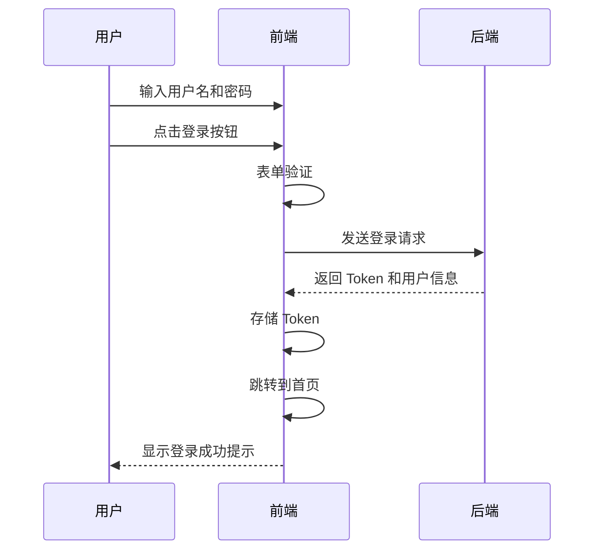

# P000001 S6-A03 UI/UX 详细设计文档

---

## 基本信息

| 项目 | 内容 |
|------|------|
| **Plan ID** | P000001 |
| **阶段编号** | S6-A03 |
| **文档名称** | UI/UX 详细设计 |
| **文档版本** | v1.0.0 |
| **生成时间** | 2026-03-27 |
| **文档状态** | 待评审 |

---

## 一、设计输入

### 1.1 前置文档

| 文档名称 | 文档路径 | 状态 |
|----------|----------|:----:|
| S5 架构视图设计 | `database/stages/s5/P000001/P000001-S5-A02-001.md` | ✅ 已确认 |
| S6 模块详细设计 | `database/stages/s6/P000001/P000001-S6-A01-001.md` | ✅ 已确认 |
| S6 数据库详细设计 | `database/stages/s6/P000001/P000001-S6-A02-001.md` | ✅ 已确认 |

### 1.2 设计目标

1. **一致性**：统一的视觉语言和交互模式
2. **易用性**：直观的操作流程，降低学习成本
3. **响应性**：适配不同屏幕尺寸
4. **性能**：快速加载，流畅交互

---

## 二、设计规范

### 2.1 色彩系统

#### 主色调

| 色彩名称 | 色值 | 用途 |
|----------|------|------|
| Primary | `#1890FF` | 主按钮、链接、选中状态 |
| Primary Hover | `#40A9FF` | 悬停状态 |
| Primary Active | `#096DD9` | 点击状态 |
| Primary Background | `#E6F7FF` | 浅色背景 |

#### 辅助色

| 色彩名称 | 色值 | 用途 |
|----------|------|------|
| Success | `#52C41A` | 成功状态、完成指标 |
| Warning | `#FAAD14` | 警告提示 |
| Error | `#F5222D` | 错误状态、危险操作 |
| Info | `#13C2C2` | 信息提示 |

#### 中性色

| 色彩名称 | 色值 | 用途 |
|----------|------|------|
| Title | `#262626` | 主标题 |
| Text | `#595959` | 正文文本 |
| Text Secondary | `#8C8C8C` | 次要文本 |
| Text Disabled | `#BFBFBF` | 禁用文本 |
| Border | `#D9D9D9` | 边框 |
| Background | `#F5F5F5` | 页面背景 |
| Container Background | `#FFFFFF` | 容器背景 |

### 2.2 字体系统

#### 字体家族

```css
font-family: -apple-system, BlinkMacSystemFont, 'Segoe UI', 'PingFang SC', 
             'Hiragino Sans GB', 'Microsoft YaHei', 'Helvetica Neue', 
             Helvetica, Arial, sans-serif;
```

#### 字号规范

| 级别 | 字号 | 行高 | 用途 |
|------|------|------|------|
| H1 | 38px | 46px | 页面大标题 |
| H2 | 30px | 38px | 模块标题 |
| H3 | 24px | 32px | 子模块标题 |
| H4 | 20px | 28px | 卡片标题 |
| Body Large | 16px | 24px | 重要正文 |
| Body | 14px | 22px | 标准正文 |
| Body Small | 12px | 20px | 辅助说明 |

#### 字重规范

| 字重 | 值 | 用途 |
|------|-----|------|
| Regular | 400 | 标准文本 |
| Medium | 500 | 强调文本 |
| SemiBold | 600 | 次级标题 |
| Bold | 700 | 主标题 |

### 2.3 间距系统

采用 8px 基准网格系统：

| 间距名称 | 值 | 用途 |
|----------|-----|------|
| XS | 4px | 紧凑元素间距 |
| SM | 8px | 小组件间距 |
| MD | 16px | 标准间距 |
| LG | 24px | 大间距 |
| XL | 32px | 超大间距 |
| XXL | 48px | 模块间距 |

### 2.4 圆角规范

| 圆角名称 | 值 | 用途 |
|----------|-----|------|
| Small | 4px | 小按钮、标签 |
| Default | 6px | 标准卡片、输入框 |
| Large | 12px | 大卡片、弹窗 |
| Round | 999px | 圆形按钮、头像 |

### 2.5 阴影规范

```css
/* 轻微阴影 */
shadow-sm: 0 1px 2px 0 rgba(0, 0, 0, 0.03),
           0 1px 6px -1px rgba(0, 0, 0, 0.02),
           0 2px 4px 0 rgba(0, 0, 0, 0.02);

/* 标准阴影 */
shadow: 0 1px 2px 0 rgba(0, 0, 0, 0.06),
        0 1px 6px -1px rgba(0, 0, 0, 0.02),
        0 2px 4px 0 rgba(0, 0, 0, 0.02);

/* 强烈阴影 */
shadow-md: 0 1px 3px 0 rgba(0, 0, 0, 0.1),
           0 1px 2px 0 rgba(0, 0, 0, 0.06);

/* 悬浮阴影 */
shadow-lg: 0 10px 15px -3px rgba(0, 0, 0, 0.1),
           0 4px 6px -2px rgba(0, 0, 0, 0.05);
```

---

## 三、页面架构

### 3.1 整体布局

采用经典的上下结构 + 左侧导航布局：

```
+------------------------------------------+
|              Header (64px)               |
+----------+-------------------------------+
|          |                               |
| Sidebar  |         Main Content          |
| (256px)  |                               |
|          |                               |
+----------+-------------------------------+
|              Footer (optional)           |
+------------------------------------------+
```

#### Header 区域

**高度**：64px

**包含元素**：
- Logo（左侧）
- 全局搜索框（可选）
- 通知图标
- 用户头像下拉菜单

#### Sidebar 区域

**宽度**：256px

**包含内容**：
- 主导航菜单
- 项目快速切换（可选）

**交互**：
- 支持收起/展开
- 当前页面高亮
- 支持子菜单展开

#### Main Content 区域

**布局**：自适应宽度

**内边距**：24px

**最大宽度**：1440px（居中）

---

### 3.2 响应式断点

| 断点名称 | 宽度范围 | 布局调整 |
|----------|----------|----------|
| XS | < 576px | 单栏布局，导航隐藏 |
| SM | ≥ 576px | 单栏布局，导航可展开 |
| MD | ≥ 768px | 双栏布局，侧边栏显示 |
| LG | ≥ 992px | 标准双栏布局 |
| XL | ≥ 1200px | 宽屏布局，内容区域加宽 |
| XXL | ≥ 1600px | 超大屏布局，内容最大宽度 1440px |

---

## 四、页面设计

### 4.1 登录页面

#### 页面布局

```
+------------------------------------------+
|                   Logo                   |
|                                          |
|            +-----------------+           |
|            |   用户登录      |           |
|            +-----------------+           |
|            |  用户名输入框   |           |
|            |  密码输入框     |           |
|            |  [记住我] [登录] |           |
|            +-----------------+           |
|                                          |
|         忘记密码 | 注册账号              |
+------------------------------------------+
```

#### 组件规格

**登录表单卡片**：
- 宽度：400px
- 内边距：48px
- 圆角：12px
- 阴影：shadow-lg

**输入框**：
- 高度：40px
- 圆角：6px
- 边框：1px solid #D9D9D9

**登录按钮**：
- 高度：40px
- 宽度：100%
- 背景色：Primary
- 圆角：6px

#### 交互流程



---

### 4.2 首页 Dashboard

#### 页面布局

```
+--------------------------------------------------+
|  欢迎回来，张三                      日期筛选器  |
+--------------------------------------------------+
|                                                  |
|  +------------+ +------------+ +------------+   |
|  | 今日 Token  | | 本周提交   | | 本月 Bug 率 |   |
|  |  15,000   | |   256     | |   0.5%    |   |
|  +------------+ +------------+ +------------+   |
|                                                  |
|  +--------------------------------------------+  |
|  |                                            |  |
|  |         Token 使用趋势（折线图）            |  |
|  |                                            |  |
|  +--------------------------------------------+  |
|                                                  |
|  +------------------+  +----------------------+  |
|  |  项目活跃度排名   |  |  高频使用人员 TOP 10  |  |
|  |                  |  |                      |  |
|  |  1. 项目管理平台  |  |  1. 张三  500K      |  |
|  |  2. 数据统计系统  |  |  2. 李四  450K      |  |
|  |  3. CRM 系统      |  |  3. 王五  400K      |  |
|  +------------------+  +----------------------+  |
+--------------------------------------------------+
```

#### 数据卡片组件

**规格**：
- 宽度：280px
- 高度：120px
- 内边距：24px
- 背景：白色
- 圆角：8px
- 阴影：shadow

**内容结构**：
- 标题（14px，#8C8C8C）
- 数值（32px，Bold，#262626）
- 趋势指示器（12px，绿色上升/红色下降）

#### 图表规格

**Token 使用趋势图**：
- 类型：平滑折线图
- 高度：300px
- X 轴：日期
- Y 轴：Token 数量
- 颜色：Primary (#1890FF)
- 显示数据点：悬停时显示

---

### 4.3 全局统计页面

#### 页面布局

```
+--------------------------------------------------+
|  全局统计                              时间筛选  |
+--------------------------------------------------+
|  [Token 使用趋势] [活跃度趋势] [人员排名]        |
+--------------------------------------------------+
|                                                  |
|  +--------------------------------------------+  |
|  |                                            |  |
|  |        Token 使用趋势（多系列折线图）        |  |
|  |                                            |  |
|  +--------------------------------------------+  |
|                                                  |
|  +--------------------------------------------+  |
|  |                                            |  |
|  |        活跃度趋势（双轴图）                 |  |
|  |                                            |  |
|  +--------------------------------------------+  |
|                                                  |
|  +--------------------------------------------+  |
|  |        高频使用人员 TOP 20（排行榜）        |  |
|  +--------------------------------------------+  |
+--------------------------------------------------+
```

#### Token 使用趋势图

**图表类型**：多系列折线图

**配置**：
- X 轴：时间（日/周/月）
- Y 轴：Token 数量
- 系列：按平台区分（Trae/阿里）
- 图例：可点击切换显示/隐藏

**交互**：
- 悬停显示详细数据
- 支持缩放
- 支持数据点选择

#### 活跃度趋势图

**图表类型**：双轴图

**配置**：
- 左 Y 轴：活跃用户数（柱状图）
- 右 Y 轴：活跃项目数（折线图）
- X 轴：时间

#### 人员排行榜

**表格规格**：
- 列：排名、用户、部门、Token 用量、API 调用数、趋势
- 排序：可点击列头排序
- 分页：20 条/页

**排名显示**：
- 1-3 名：金牌/银牌/铜牌图标
- 4-20 名：数字

---

### 4.4 项目列表页面

#### 页面布局

```
+--------------------------------------------------+
|  项目管理              [+ 新建项目] [搜索框]     |
+--------------------------------------------------+
|  筛选：[全部项目 v] [阶段 v] [状态 v]            |
+--------------------------------------------------+
|                                                  |
|  +--------------------------------------------+  |
|  | 项目名称 | 阶段 | 状态 | 成员 | Bug | 进度 |  |
|  +--------------------------------------------+  |
|  | 项目管理平台 | 研发 | 🟢 | 8 | 5 | 75% |  |
|  | 数据统计系统 | 研发 | 🟢 | 6 | 3 | 60% |  |
|  | CRM 系统 | 需求 | 🟡 | 4 | 0 | 30% |  |
|  +--------------------------------------------+  |
|                                    [1] [2] [3]  |
+--------------------------------------------------+
```

#### 项目卡片视图（可选）

```
+------------------+  +------------------+
|  项目管理平台     |  |  数据统计系统     |
|  🟢 研发中        |  |  🟢 研发中        |
|                  |  |                  |
|  成员：8 人       |  |  成员：6 人       |
|  Bug: 5          |  |  Bug: 3          |
|  进度：75%       |  |  进度：60%       |
|                  |  |                  |
|  [查看详情]      |  |  [查看详情]      |
+------------------+  +------------------+
```

#### 项目状态标识

| 状态 | 图标 | 颜色 |
|------|------|------|
| Active | 🟢 | #52C41A |
| Archived | 🟡 | #FAAD14 |
| Cancelled | 🔴 | #F5222D |

---

### 4.5 项目详情页面

#### 页面布局

```
+--------------------------------------------------+
|  < 返回  项目管理平台           [编辑] [删除]    |
+--------------------------------------------------+
|  [概览] [代码统计] [Bug 趋势] [AI 采纳] [成员]   |
+--------------------------------------------------+
|                                                  |
|  +--------------------------------------------+  |
|  |  数据概览                                  |  |
|  |  +------+ +------+ +------+ +------+      |  |
|  |  | 提交  | | Token | | Bug  | | AI 率 |      |  |
|  |  | 350  | | 800K | | 5    | | 34%  |      |  |
|  |  +------+ +------+ +------+ +------+      |  |
|  +--------------------------------------------+  |
|                                                  |
|  +--------------------------------------------+  |
|  |        代码提交趋势（折线图）                |  |
|  +--------------------------------------------+  |
|                                                  |
|  +------------------+  +----------------------+  |
|  |  成员贡献排名     |  |  Bug 状态分布        |  |
|  +------------------+  +----------------------+  |
+--------------------------------------------------+
```

#### 选项卡设计

**样式**：
- 高度：48px
- 字体：14px
- 选中：底部 2px 蓝色线条
- 悬停：浅灰色背景

#### 代码提交趋势图

**图表类型**：堆叠面积图

**配置**：
- X 轴：日期
- Y 轴：提交行数
- 系列：新增（绿色）、删除（红色）

---

### 4.6 个人统计页面

#### 页面布局

```
+--------------------------------------------------+
|  个人统计                            时间筛选    |
+--------------------------------------------------+
|  [我的代码] [我的 Token] [我的 Bug] [我的 AI]    |
+--------------------------------------------------+
|                                                  |
|  +--------------------------------------------+  |
|  |  数据概览                                  |  |
|  |  +------+ +------+ +------+ +------+      |  |
|  |  | 提交  | | 代码  | | Token | | Bug 率 |   |  |
|  |  | 50   | | 2500 | | 150K | | 0.2% |      |  |
|  |  +------+ +------+ +------+ +------+      |  |
|  +--------------------------------------------+  |
|                                                  |
|  +--------------------------------------------+  |
|  |        代码提交日历热力图                    |  |
|  +--------------------------------------------+  |
|                                                  |
|  +------------------+  +----------------------+  |
|  |  项目贡献分布     |  |  与团队对比          |  |
|  +------------------+  +----------------------+  |
+--------------------------------------------------+
```

#### 代码提交日历热力图

**规格**：
- 显示：最近 12 个月
- 单元格：12px × 12px
- 间距：2px
- 颜色梯度：浅绿 → 深绿（按提交量）

**交互**：
- 悬停显示日期和提交数
- 点击跳转到该日提交详情

---

### 4.7 配置管理页面

#### 页面布局（项目配置）

```
+--------------------------------------------------+
|  项目配置                  [+ 新建项目]          |
+--------------------------------------------------+
|                                                  |
|  +--------------------------------------------+  |
|  |  项目名称     |  阶段  |  状态  |  操作    |  |
|  +--------------------------------------------+  |
|  |  项目管理平台 |  研发  |  🟢   | [编辑]   |  |
|  |  数据统计系统 |  研发  |  🟢   | [编辑]   |  |
|  +--------------------------------------------+  |
+--------------------------------------------------+
```

#### 项目编辑弹窗

```
+------------------------------------------+
|  编辑项目                        [X]     |
+------------------------------------------+
|                                          |
|  项目名称 *                              |
|  +----------------------------------+    |
|  |  项目管理平台                    |    |
|  +----------------------------------+    |
|                                          |
|  项目编码 *                              |
|  +----------------------------------+    |
|  |  PMP-2026                        |    |
|  +----------------------------------+    |
|                                          |
|  项目阶段 *                              |
|  [调研 v]                                |
|                                          |
|  项目状态 *                              |
|  (•) Active  ( ) Archived  ( ) Cancelled |
|                                          |
|  项目经理                                |
|  [选择用户 v]                            |
|                                          |
|  开始日期        结束日期                |
|  [2026-01-01]   [2026-12-31]            |
|                                          |
|              [取消] [保存]               |
+------------------------------------------+
```

**弹窗规格**：
- 宽度：600px
- 内边距：24px
- 圆角：12px
- 阴影：shadow-lg

---

### 4.8 数据源配置页面

#### 页面布局

```
+--------------------------------------------------+
|  数据源配置                                      |
+--------------------------------------------------+
|                                                  |
|  +--------------------------------------------+  |
|  |  GitLab 配置                               |  |
|  |  状态：🟢 已连接                           |  |
|  |  最后同步：2026-03-27 02:00                |  |
|  |  [编辑配置] [立即同步]                     |  |
|  +--------------------------------------------+  |
|                                                  |
|  +--------------------------------------------+  |
|  |  禅道配置                                  |  |
|  |  状态：🟢 已连接                           |  |
|  |  最后同步：2026-03-27 02:00                |  |
|  |  [编辑配置] [立即同步]                     |  |
|  +--------------------------------------------+  |
+--------------------------------------------------+
```

#### 数据源配置表单

```
+------------------------------------------+
|  配置 GitLab                     [X]     |
+------------------------------------------+
|                                          |
|  数据源名称 *                            |
|  +----------------------------------+    |
|  |  公司 GitLab                     |    |
|  +----------------------------------+    |
|                                          |
|  GitLab URL *                            |
|  +----------------------------------+    |
|  |  https://gitlab.company.com    |    |
|  +----------------------------------+    |
|                                          |
|  Access Token *                          |
|  +----------------------------------+    |
|  |  ••••••••••••••••••••          |    |
|  +----------------------------------+    |
|                                          |
|  同步频率 *                              |
|  [每日 v]                                |
|                                          |
|              [取消] [保存]               |
+------------------------------------------+
```

---

### 4.9 同步任务页面

#### 页面布局

```
+--------------------------------------------------+
|  同步任务                    [手动触发同步]      |
+--------------------------------------------------+
|  筛选：[全部类型 v] [全部状态 v] [日期范围]     |
+--------------------------------------------------+
|                                                  |
|  +--------------------------------------------+  |
|  |  任务类型 | 数据源 | 状态 | 进度 | 时间   |  |
|  +--------------------------------------------+  |
|  |  全量同步 | GitLab | ✅ 成功 | 1500 | 02:15 |  |
|  |  全量同步 | 禅道   | ✅ 成功 | 320  | 02:10 |  |
|  |  增量同步 | Trae   | 🔄 运行中 | 60%  | -   |  |
|  +--------------------------------------------+  |
+--------------------------------------------------+
```

#### 状态标识

| 状态 | 图标 | 颜色 | 说明 |
|------|------|------|------|
| Pending | ⏳ | #FAAD14 | 等待中 |
| Running | 🔄 | #1890FF | 运行中 |
| Completed | ✅ | #52C41A | 成功 |
| Failed | ❌ | #F5222D | 失败 |
| Cancelled | ⛔ | #8C8C8C | 已取消 |

---

## 五、组件库设计

### 5.1 按钮组件

#### 按钮类型

**Primary 按钮**：
```css
background: #1890FF;
color: #FFFFFF;
border: 1px solid #1890FF;
```

**Default 按钮**：
```css
background: #FFFFFF;
color: #595959;
border: 1px solid #D9D9D9;
```

**Danger 按钮**：
```css
background: #FFFFFF;
color: #F5222D;
border: 1px solid #F5222D;
```

**Link 按钮**：
```css
background: transparent;
color: #1890FF;
border: none;
```

#### 按钮尺寸

| 尺寸 | 高度 | 内边距 | 字号 |
|------|------|--------|------|
| Large | 48px | 0 24px | 16px |
| Default | 40px | 0 16px | 14px |
| Small | 32px | 0 12px | 12px |

#### 按钮状态

| 状态 | 说明 | 样式 |
|------|------|------|
| Default | 默认 | 正常样式 |
| Hover | 悬停 | 亮度 +10% |
| Active | 点击 | 亮度 -10% |
| Disabled | 禁用 | opacity: 0.5 |
| Loading | 加载中 | 显示 loading 图标 |

---

### 5.2 输入框组件

#### 输入框类型

**文本输入框**：
```css
height: 40px;
border: 1px solid #D9D9D9;
border-radius: 6px;
padding: 0 12px;
```

**文本域**：
```css
min-height: 100px;
border: 1px solid #D9D9D9;
border-radius: 6px;
padding: 12px;
resize: vertical;
```

**选择器**：
```css
height: 40px;
border: 1px solid #D9D9D9;
border-radius: 6px;
padding: 0 12px;
cursor: pointer;
```

#### 输入框状态

| 状态 | 边框颜色 | 背景 |
|------|----------|------|
| Default | #D9D9D9 | #FFFFFF |
| Hover | #40A9FF | #FFFFFF |
| Focus | #40A9FF | #FFFFFF |
| Disabled | #D9D9D9 | #F5F5F5 |
| Error | #F5222D | #FFFFFF |

#### 输入框尺寸

| 尺寸 | 高度 | 字号 |
|------|------|------|
| Large | 48px | 16px |
| Default | 40px | 14px |
| Small | 32px | 12px |

---

### 5.3 表格组件

#### 表格结构

```html
<table>
  <thead>
    <tr>
      <th>列标题</th>
    </tr>
  </thead>
  <tbody>
    <tr>
      <td>数据单元格</td>
    </tr>
  </tbody>
</table>
```

#### 表格样式

**表头**：
```css
background: #FAFAFA;
font-weight: 500;
height: 56px;
border-bottom: 1px solid #F0F0F0;
```

**表格行**：
```css
height: 64px;
border-bottom: 1px solid #F0F0F0;
transition: background 0.3s;
```

**表格行悬停**：
```css
background: #FAFAFA;
```

#### 表格密度

| 密度 | 行高 | 内边距 |
|------|------|--------|
| Default | 64px | 16px |
| Middle | 56px | 12px |
| Small | 48px | 8px |

---

### 5.4 卡片组件

#### 卡片结构

```
+------------------------------------------+
|  [标题]                          [操作]  |
+------------------------------------------+
|                                          |
|  内容区域                                |
|                                          |
+------------------------------------------+
```

#### 卡片样式

```css
background: #FFFFFF;
border-radius: 8px;
box-shadow: 0 1px 2px 0 rgba(0, 0, 0, 0.03),
            0 1px 6px -1px rgba(0, 0, 0, 0.02),
            0 2px 4px 0 rgba(0, 0, 0, 0.02);
padding: 24px;
```

#### 卡片尺寸

| 尺寸 | 宽度 | 内边距 |
|------|------|--------|
| Small | 100%（自适应） | 16px |
| Default | 100%（自适应） | 24px |
| Large | 100%（自适应） | 32px |

---

### 5.5 弹窗组件

#### 弹窗结构

```
+------------------------------------------+
|  标题                              [X]   |
+------------------------------------------+
|                                          |
|  内容区域                                |
|                                          |
+------------------------------------------+
|                    [取消] [确认]         |
+------------------------------------------+
```

#### 弹窗样式

```css
background: #FFFFFF;
border-radius: 12px;
box-shadow: 0 10px 15px -3px rgba(0, 0, 0, 0.1),
            0 4px 6px -2px rgba(0, 0, 0, 0.05);
```

#### 弹窗尺寸

| 尺寸 | 宽度 | 用途 |
|------|------|------|
| Small | 400px | 简单表单、确认框 |
| Default | 600px | 标准表单 |
| Large | 800px | 复杂表单、详情 |
| Full | 100% | 全屏弹窗 |

---

### 5.6 消息提示组件

#### 消息类型

| 类型 | 图标 | 背景色 | 边框色 |
|------|------|--------|--------|
| Success | ✅ | #F6FFED | #B7EB8F |
| Info | ℹ️ | #E6F7FF | #91D5FF |
| Warning | ⚠️ | #FFFBE6 | #FFE58F |
| Error | ❌ | #FFF2F0 | #FFCCC7 |

#### 消息位置

- Top（默认）
- TopLeft
- TopRight
- Bottom
- BottomLeft
- BottomRight

#### 自动关闭时间

| 类型 | 时间 |
|------|------|
| Success | 3 秒 |
| Info | 3 秒 |
| Warning | 4 秒 |
| Error | 5 秒 |

---

### 5.7 加载组件

#### Loading 旋转

```css
width: 32px;
height: 32px;
border: 3px solid #F0F0F0;
border-top-color: #1890FF;
border-radius: 50%;
animation: spin 1s linear infinite;
```

#### 加载状态

**页面加载**：
- 显示全屏遮罩
- 居中显示 Loading 图标
- 显示加载文案

**局部加载**：
- 显示在组件内部
- 半透明遮罩
- 不影响其他区域操作

---

### 5.8 图表组件

#### 通用配置

**字体**：
- 标题：14px, #262626
- 轴标签：12px, #595959
- 图例：12px, #595959

**颜色 palette**：
```javascript
const colors = [
  '#1890FF', // 蓝
  '#52C41A', // 绿
  '#FAAD14', // 橙
  '#F5222D', // 红
  '#13C2C2', // 青
  '#722ED1', // 紫
  '#FA8C16', // 橘
  '#EB2F96'  // 粉
];
```

#### 图表类型

**折线图**：
- 用途：趋势展示
- 线条：2px，平滑曲线
- 数据点：悬停显示

**柱状图**：
- 用途：对比展示
- 柱宽：自适应
- 间距：柱宽的 30%

**饼图**：
- 用途：占比展示
- 内径：0（饼图）/ 0.6（环图）
- 标签：显示百分比

**面积图**：
- 用途：累积趋势
- 填充：透明度 0.3

---

## 六、交互设计

### 6.1 导航交互

#### 侧边栏导航

**展开状态**：
- 显示图标 + 文字
- 宽度：256px

**收起状态**：
- 仅显示图标
- 宽度：80px

**交互**：
- 点击菜单项跳转
- 悬停显示子菜单（展开状态）
- 当前页面高亮

#### 面包屑导航

**位置**：页面标题上方

**样式**：
```
首页 / 项目统计 / 项目管理平台 / 详情
```

**交互**：
- 可点击跳转
- 最后一级不可点击

---

### 6.2 表单交互

#### 输入验证

**实时验证**：
- 失去焦点时验证
- 显示验证结果

**提交验证**：
- 点击提交按钮时验证
- 显示所有错误

#### 错误提示

**行内错误**：
```
+----------------------------------+
|  用户名                          |
+----------------------------------+
⚠️ 用户名已存在
```

**错误样式**：
- 边框：#F5222D
- 错误图标：显示在输入框右侧
- 错误文案：12px，#F5222D

---

### 6.3 表格交互

#### 排序

**交互**：
- 点击列头排序
- 循环：升序 → 降序 → 不排序
- 显示排序图标

#### 筛选

**方式**：
- 列头筛选按钮
- 弹出筛选面板
- 支持多选/输入

#### 分页

**位置**：表格右下角

**元素**：
- 总条数
- 页码
- 上一页/下一页
- 跳转页码

---

### 6.4 图表交互

#### 悬停提示

**内容**：
- 数据点值
- 系列名称
- 格式化后的数值

**样式**：
- 背景：白色
- 阴影：shadow-lg
- 圆角：6px

#### 图例点击

**交互**：
- 点击切换显示/隐藏
- 双击独占显示
- 拖拽重新排序

#### 缩放和平移

**缩放**：
- 鼠标滚轮缩放
- 双击还原

**平移**：
- 拖拽平移
- 坐标轴拖拽

---

### 6.5 快捷操作

#### 键盘快捷键

| 快捷键 | 功能 | 场景 |
|--------|------|------|
| Ctrl + K | 全局搜索 | 全局 |
| Esc | 关闭弹窗/取消 | 全局 |
| Enter | 确认/提交 | 表单 |
| Ctrl + S | 保存 | 编辑页面 |
| / | 聚焦搜索框 | 全局 |

#### 右键菜单

**触发**：
- 右键点击表格行
- 右键点击图表

**内容**：
- 查看详情
- 编辑
- 删除
- 导出

---

## 七、动效设计

### 7.1 过渡动画

#### 页面切换

**时长**：300ms

**效果**：
- 淡入淡出
- 轻微位移动画

#### 弹窗出现

**时长**：200ms

**效果**：
- 从中心缩放出现
- 背景遮罩淡入

### 7.2 微交互

#### 按钮悬停

**效果**：
- 背景亮度变化
- 轻微阴影
- 时长：150ms

#### 图标动画

**Loading**：
- 360 度旋转
- 时长：1s
- 无限循环

**Success**：
- 缩放弹跳
- 时长：300ms

---

## 八、评审记录

| 角色 | 姓名 | 评审意见 | 评审时间 | 状态 |
|------|------|----------|----------|:----:|
| **UI 设计师** | - | - | - | ⏳ |
| **前端负责人** | - | - | - | ⏳ |
| **产品经理** | - | - | - | ⏳ |

---

## 九、附录

### 9.1 设计资源

- Figma 设计稿链接：[待补充]
- 图标库：Ant Design Icons
- 图表库：Apache ECharts

### 9.2 参考资料

1. Ant Design 设计规范
2. Material Design 指南
3. Vue 3 + Element Plus 最佳实践

---

**文档编制**：架构设计系统  
**编制时间**：2026-03-27  
**文档版本**：v1.0.0  
**文档状态**：待评审

---

*本文档为 P000001 项目 S6-A03 UI/UX 详细设计，包含设计规范、页面设计、组件库设计和交互设计。*
