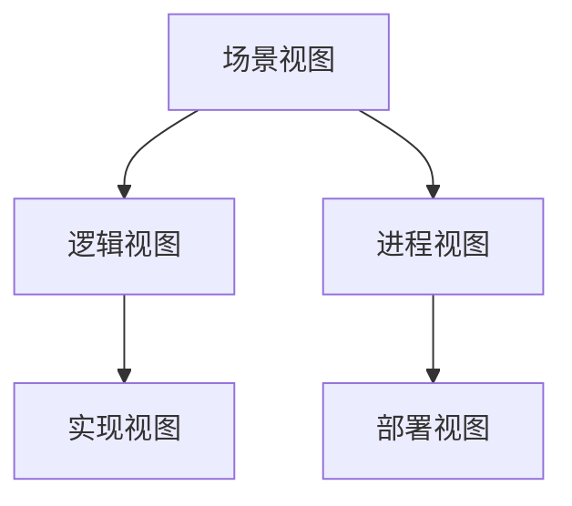
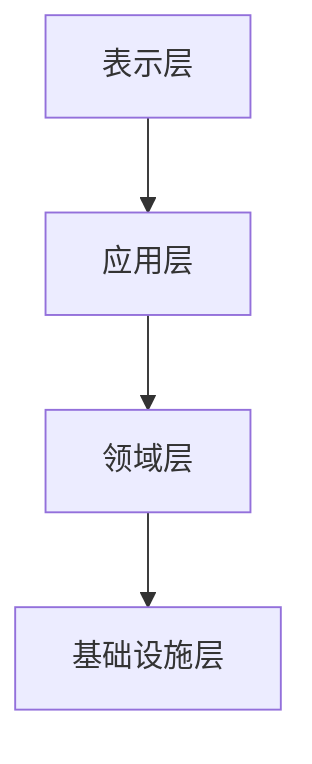
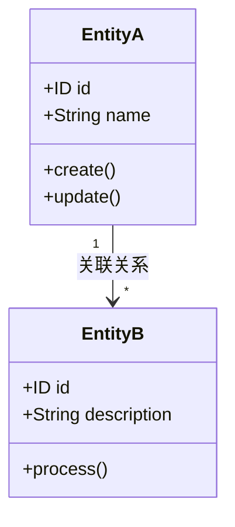
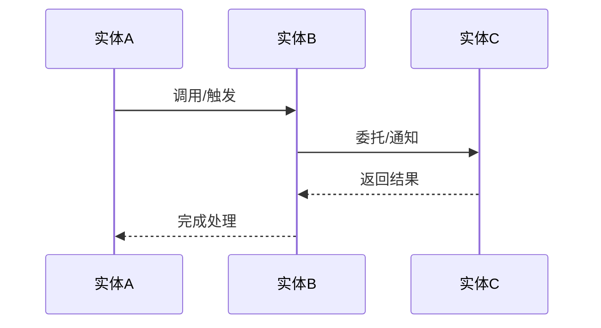
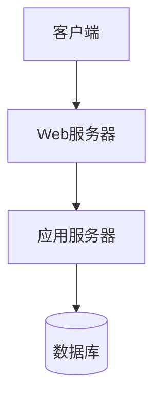
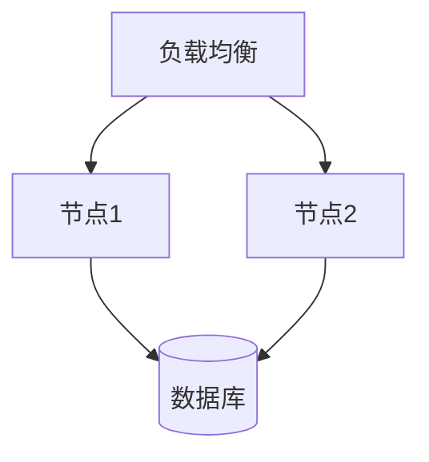
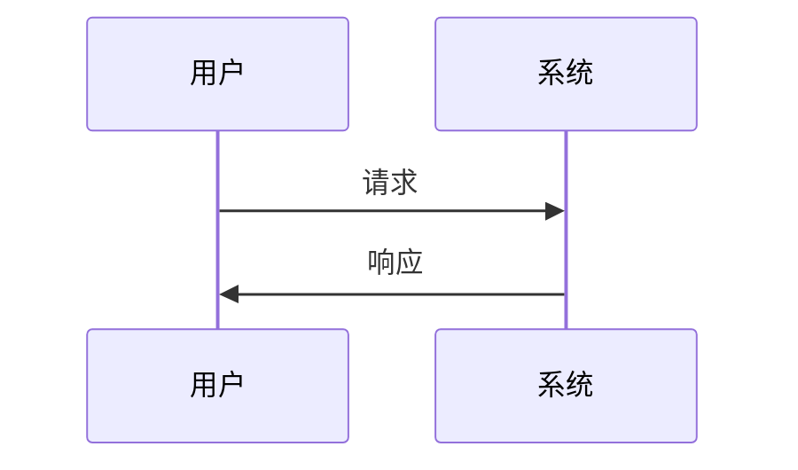

# S5-A02 架构视图设计

---

## 元信息

| 属性 | 内容 |
|------|------|
| **Skill 编号** | S5-A02 |
| **Skill 名称** | 架构视图设计 |
| **所属阶段** | S5 - 架构设计阶段 |
| **前置 Skill** | S5-A01 架构愿景定义 |
| **后置 Skill** | S5-A03 数据架构设计 |
| **执行模式** | 自动分析 + 用户交互 |
| **参考标准** | IEEE 1016, ISO/IEC/IEEE 42010:2011 |

---

## 触发条件

当满足以下任一条件时，触发本 Skill：

1. 架构愿景文档已生成，需要细化架构设计
2. 需要基于架构愿景生成多维度架构视图
3. 需要明确系统的分层和模块结构

---

## 输入

| 输入项 | 说明 | 来源 |
|--------|------|------|
| 架构愿景文档 | 系统定位、架构目标、关键决策 | S5-A01 产物 |
| 需求规格说明书 | 功能需求和非功能需求 | 需求工程阶段产物 |
| 显性需求清单 | 功能模块、接口需求 | S1-S02 产物 |

---

## 输出

| 产物 | 说明 | 存储路径 |
|------|------|----------|
| 架构视图设计文档 | 4+1视图设计、分层架构、模块划分 | `database/stages/s5/{PlanID}/{PlanID}-S5-A02-001.md` |

---

## 执行流程

### 步骤 1：读取架构愿景和需求产物

自动读取以下产物：
- 架构愿景文档（S5-A01-001）
- 需求规格说明书
- 显性需求清单（功能模块划分）

### 步骤 2：自动选择架构视图类型

基于架构愿景中的系统特征，自动选择需要设计的视图：

| 系统特征 | 推荐视图组合 | 理由 |
|----------|--------------|------|
| 简单单体应用 | 逻辑视图 + 实现视图 | 核心模块和代码组织 |
| 企业级应用 | 4+1完整视图 | 全面覆盖各维度 |
| 微服务架构 | 逻辑视图 + 进程视图 + 部署视图 | 服务拆分和通信 |
| 数据密集型 | 逻辑视图 + 数据视图 | 数据模型和流转 |
| 高并发系统 | 进程视图 + 部署视图 | 并发和分布 |

**4+1 视图模型说明：**

| 视图名称 | 关注点 | 主要元素 | 适用场景 |
|----------|--------|----------|----------|
| 逻辑视图 | 功能需求 | 类、包、子系统 | 所有系统 |
| 进程视图 | 并发和性能 | 进程、线程、通信 | 多线程/分布式系统 |
| 实现视图 | 代码组织 | 模块、层、目录 | 所有系统 |
| 部署视图 | 物理分布 | 节点、网络、部署 | 分布式系统 |
| 场景视图 | 用例实现 | 用例、交互、序列 | 验证架构 |

### 步骤 3：自动生成分层架构

基于架构风格自动推导分层结构：

**分层架构模式：**

| 架构风格 | 推荐分层 | 各层职责 |
|----------|----------|----------|
| 分层架构 | 表示层/业务层/数据层 | 经典三层架构 |
| 分层架构（增强） | 表示层/应用层/领域层/基础设施层 | DDD四层架构 |
| 微服务架构 | 网关层/服务层/数据层 | 服务边界划分 |
| 前后端分离 | 前端层/BFF层/服务层/数据层 | 多端适配 |
| 事件驱动 | 事件源/处理层/投影层/查询层 | CQRS模式 |

**分层依赖规则：**
- 上层依赖下层，下层不依赖上层
- 同层之间通过接口解耦
- 跨层调用需通过明确定义的接口

### 步骤 4：自动识别模块和组件

基于功能需求自动识别系统模块：

**模块识别规则：**

| 识别依据 | 模块类型 | 示例 |
|----------|----------|------|
| 核心业务实体 | 领域模块 | 用户管理、订单管理 |
| 横向功能 | 支撑模块 | 认证授权、日志审计 |
| 外部集成 | 适配器模块 | 支付网关、短信服务 |
| 技术能力 | 基础设施模块 | 缓存、消息队列 |

**组件粒度建议：**

| 系统规模 | 建议组件数 | 粒度说明 |
|----------|-----------|----------|
| 小型（<10功能点） | 3-5个 | 粗粒度模块 |
| 中型（10-50功能点） | 5-10个 | 中等粒度 |
| 大型（>50功能点） | 10-20个 | 细粒度模块 |

### 步骤 5：自动设计视图内容

#### 5.1 逻辑视图设计

自动识别核心领域对象和关系：

**核心领域对象识别：**
```
逻辑视图内容：
├── 核心领域对象
│   ├── 实体（有唯一标识）
│   ├── 值对象（无唯一标识）
│   └── 聚合根
├── 领域服务
│   └── 跨实体的业务逻辑
├── 应用服务
│   └── 用例协调
└── 领域事件
    └── 业务状态变更通知
```

**实体关系识别规则：**

| 识别依据 | 关系类型 | 设计建议 |
|----------|----------|----------|
| 业务规则中的从属描述 | 一对多 | 聚合根持有实体引用 |
| 独立生命周期的对象 | 多对多 | 引入关联对象/中间表 |
| 强一致性要求 | 内聚关系 | 放在同一聚合内 |
| 最终一致性可接受 | 松散关系 | 通过领域事件关联 |

**实体交互识别规则：**

| 交互场景 | 交互类型 | 实现方式 |
|----------|----------|----------|
| 业务流程中的顺序操作 | 同步调用 | 方法调用/服务编排 |
| 状态变更后的后续处理 | 异步事件 | 领域事件发布订阅 |
| 跨聚合的数据查询 | 查询分离 | CQRS模式/读模型 |
| 长时间运行的流程 |  Saga 模式 | 补偿事务/状态机 |

**交互流程建模：**
```
实体交互分析：
├── 调用关系识别
│   ├── 从用例描述中提取动词
│   ├── 识别主语（调用方）和宾语（被调用方）
│   └── 确定调用方向
├── 事件流识别
│   ├── 识别状态变更动词（创建/更新/删除）
│   ├── 确定事件发布方
│   └── 确定事件订阅方
└── 数据流识别
    ├── 输入数据项
    ├── 输出数据项
    └── 数据转换规则
```

#### 5.2 进程视图设计

基于性能需求自动设计并发模型：

| 并发需求 | 推荐模型 | 说明 |
|----------|----------|------|
| 无特殊要求 | 单进程多线程 | Web服务器默认模式 |
| 高并发读 | 主从复制 + 读写分离 | 数据库层面 |
| 高并发写 | 分片 + 异步处理 | 水平扩展 |
| 实时性要求 | 事件循环 + 非阻塞IO | 高性能模式 |
| 计算密集型 | 多进程 + 任务队列 | 分布式计算 |

#### 5.3 实现视图设计

自动生成代码结构建议：

| 架构风格 | 目录结构 | 说明 |
|----------|----------|------|
| 分层架构 | src/{layer}/{module}/ | 按层组织 |
| 微服务 | services/{service-name}/ | 按服务组织 |
| DDD | src/{bounded-context}/{layer}/ | 按限界上下文组织 |
| 前后端分离 | frontend/ + backend/ | 分离组织 |

#### 5.4 部署视图设计

基于部署约束自动推荐部署架构：

| 部署约束 | 推荐方案 | 说明 |
|----------|----------|------|
| 单机部署 | 单体应用 + 反向代理 | 简单场景 |
| 高可用要求 | 主备 + 负载均衡 | 双机热备 |
| 水平扩展 | 无状态服务 + 共享存储 | 弹性伸缩 |
| 多云部署 | 容器化 + 编排平台 | Kubernetes |
| 边缘部署 | CDN + 边缘节点 | 就近访问 |

#### 5.5 场景视图设计

选择关键用例进行架构验证：

**场景选择标准：**
- 覆盖核心业务场景
- 覆盖技术风险点
- 覆盖非功能需求

### 步骤 6：识别需要用户确认的决策点

**常见决策点：**

1. **分层粒度**
   - 三层 vs 四层 vs 六边形架构
   - 需要用户基于团队熟悉度选择

2. **模块边界**
   - 当功能耦合度高时
   - 需要用户确认拆分或合并策略

3. **通信方式**
   - 同步调用 vs 异步消息
   - 需要用户基于一致性要求选择

4. **数据共享**
   - 共享数据库 vs 服务私有数据
   - 需要用户基于服务独立性选择

### 步骤 7：用户交互确认

**交互方式 1：提供选项**

```
基于系统特征，推荐以下分层架构方案：

A. 经典三层架构（推荐）
   - 表示层 → 业务逻辑层 → 数据访问层
   - 适合当前规模，团队熟悉度高
   
B. DDD 四层架构
   - 用户接口层 → 应用层 → 领域层 → 基础设施层
   - 适合复杂业务，需要领域建模

C. 六边形架构（端口适配器）
   - 核心业务 + 适配器层
   - 适合测试驱动，技术可替换性要求高

请选择分层架构方案（A/B/C）：
```

**交互方式 2：询问澄清**

```
检测到以下功能模块之间存在高耦合：
- 订单管理模块
- 库存管理模块

处理方案：
A. 合并为一个模块（降低复杂度）
B. 保持分离，通过领域事件解耦（提高独立性）
C. 保持分离，通过共享数据库表（简单但耦合高）

请确认处理方案（A/B/C）：
```

**交互方式 3：确认假设**

```
基于需求分析，做出以下架构假设：

假设 1：认证授权使用独立的认证服务，不嵌入业务模块
假设 2：核心业务数据采用关系型数据库，缓存数据采用Redis
假设 3：模块间通信优先使用同步HTTP，异步场景使用消息队列

请确认以上假设是否成立（是/否）：
如有不成立的假设，请说明：_____
```

### 步骤 8：生成架构视图设计文档

基于自动设计和用户确认，生成完整架构视图文档：

**文档内容包括：**

1. **视图选择说明**
   - 选择的视图类型及理由
   - 未选择视图的原因

2. **分层架构设计**
   - 分层结构图（Mermaid）
   - 各层职责说明
   - 层间依赖关系

3. **模块划分设计**
   - 模块列表及职责
   - 模块依赖关系
   - 接口定义

4. **4+1 视图详情**
   - 每个视图的详细设计
   - 关键组件说明
   - 交互关系

5. **设计决策记录**
   - 所有决策及理由
   - 决策方式（自动/用户选择）

### 步骤 9：用户评审

生成架构视图初稿后，进入用户评审：

**评审内容：**
1. 分层架构是否合理
2. 模块划分是否清晰
3. 视图设计是否完整
4. 组件粒度是否合适

**评审选项：**
- **确认** → 进入步骤 10
- **修改：{具体意见}** → 返回步骤 6-8 调整
- **补充：{新增内容}** → 补充设计后重新评审

### 步骤 10：生成产物

评审通过后，生成以下产物：

1. **架构视图设计文档**（Markdown 格式）
2. **更新 Todo-List**：标记 S5-A02 为已完成

---

## 视图设计规则

### 逻辑视图设计规则

| 场景 | 设计建议 |
|------|----------|
| 实体关系复杂 | 使用领域模型图，明确聚合边界 |
| 业务规则多 | 提取领域服务，避免贫血模型 |
| 多租户需求 | 设计租户隔离策略（独立DB/共享DB+隔离字段） |
| 工作流场景 | 引入状态机模型，明确状态流转 |

### 进程视图设计规则

| 性能需求 | 设计建议 |
|----------|----------|
| 高并发读 | 缓存 + 读写分离 + CDN |
| 高并发写 | 异步处理 + 消息队列 + 分片 |
| 低延迟 | 内存计算 + 本地缓存 + 预加载 |
| 高吞吐 | 批处理 + 流处理 + 并行计算 |

### 实现视图设计规则

| 质量属性 | 设计建议 |
|----------|----------|
| 可测试性 | 依赖注入 + 接口隔离 + Mock支持 |
| 可维护性 | 单一职责 + 开闭原则 + 清晰命名 |
| 可扩展性 | 插件机制 + 配置驱动 + 扩展点设计 |
| 可移植性 | 容器化 + 配置外部化 + 无状态设计 |

### 部署视图设计规则

| 运维需求 | 设计建议 |
|----------|----------|
| 快速部署 | 蓝绿部署 + 健康检查 + 自动回滚 |
| 弹性伸缩 | 无状态服务 + 自动扩缩容 + 负载均衡 |
| 故障隔离 | 熔断降级 + 限流 + 舱壁模式 |
| 监控告警 | 指标采集 + 日志聚合 + 链路追踪 |

---

## 产物模板

### 架构视图设计文档结构

```markdown
# {PlanID}-S5-A02-001 架构视图设计文档

## 1. 视图选择

### 1.1 选择的视图
| 视图名称 | 选择理由 | 详细程度 |
|----------|----------|----------|
| 逻辑视图 | | |
| 进程视图 | | |
| 实现视图 | | |
| 部署视图 | | |
| 场景视图 | | |

### 1.2 视图关系


## 2. 分层架构设计

### 2.1 分层结构


### 2.2 各层职责
| 层级 | 职责 | 包含组件 |
|------|------|----------|
| | | |

### 2.3 层间依赖
- 依赖方向：
- 接口定义位置：
- 跨层调用规则：

## 3. 模块划分

### 3.1 模块清单
| 模块名称 | 职责描述 | 所属层级 | 依赖模块 |
|----------|----------|----------|----------|
| | | | |

### 3.2 模块依赖关系


## 4. 逻辑视图

### 4.1 核心领域模型

#### 4.1.1 实体定义


#### 4.1.2 实体关系说明
| 实体A | 关系类型 | 实体B | 关系描述 | 业务含义 |
|-------|----------|-------|----------|----------|
| | 一对一/一对多/多对多 | | | |

#### 4.1.3 实体交互流程


**实体交互说明：**
| 步骤 | 调用方 | 被调用方 | 交互类型 | 业务场景 | 数据传递 |
|------|--------|----------|----------|----------|----------|
| 1 | | | 同步调用/异步事件/状态变更 | | |

#### 4.1.4 领域事件流


| 事件名称 | 发布实体 | 订阅实体 | 触发条件 | 处理逻辑 |
|----------|----------|----------|----------|----------|
| | | | | |

### 4.2 领域服务
| 服务名称 | 职责 | 输入 | 输出 | 调用实体 |
|----------|------|------|------|----------|
| | | | | |

## 5. 进程视图

### 5.1 运行时进程


### 5.2 并发模型
- 并发策略：
- 线程池配置：
- 连接池配置：

## 6. 实现视图

### 6.1 代码结构
```
src/
├── layer1/
│   └── module1/
├── layer2/
│   └── module2/
```

### 6.2 模块目录结构
| 模块 | 目录结构 | 关键文件 |
|------|----------|----------|
| | | |

## 7. 部署视图

### 7.1 部署架构


### 7.2 部署节点
| 节点类型 | 数量 | 配置 | 部署组件 |
|----------|------|------|----------|
| | | | |

## 8. 场景视图

### 8.1 关键场景列表
| 场景名称 | 用例 | 验证目标 |
|----------|------|----------|
| | | |

### 8.2 场景实现


## 9. 设计决策

| 决策项 | 决策结果 | 决策理由 | 决策方式 |
|--------|----------|----------|----------|
| 分层架构 | | | 自动推导/用户选择 |
| 模块划分 | | | 自动推导/用户选择 |
| 通信方式 | | | 自动推导/用户选择 |

## 10. 风险与约束

### 10.1 架构风险
| 风险描述 | 风险等级 | 缓解策略 |
|----------|----------|----------|
| | | |

### 10.2 设计约束
- 技术约束：
- 业务约束：
- 法规约束：
```

---

## 关联 Skill

| Skill | 关系 | 说明 |
|-------|------|------|
| S5-A01 架构愿景定义 | 前置 | 基于愿景中的系统特征选择视图 |
| S5-A03 数据架构设计 | 后置 | 逻辑视图中的数据模型输入 |
| S5-A04 接口架构设计 | 后置 | 模块间接口详细设计 |
| S5-A06 架构验证与评审 | 关联 | 场景视图用于架构验证 |
