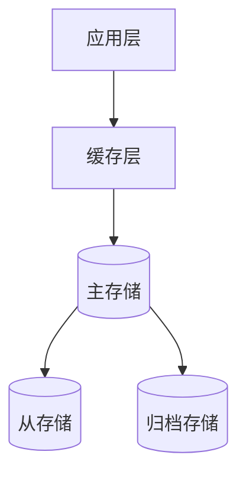
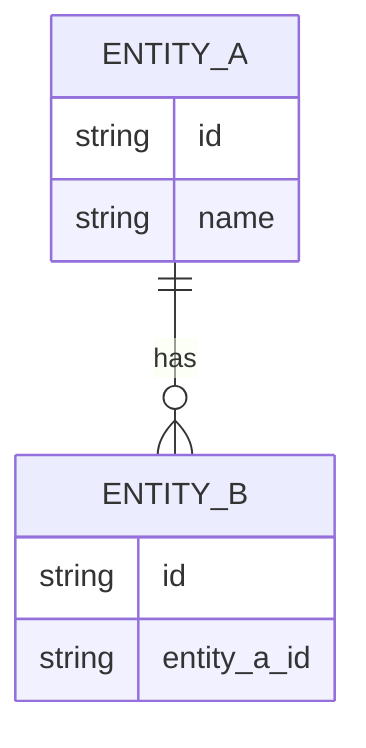

# S5-A03 数据架构设计

---

## 元信息

| 属性 | 内容 |
|------|------|
| **Skill 编号** | S5-A03 |
| **Skill 名称** | 数据架构设计 |
| **所属阶段** | S5 - 架构设计阶段 |
| **前置 Skill** | S5-A02 架构视图设计 |
| **后置 Skill** | S5-A04 接口架构设计 |
| **执行模式** | 自动分析 + 用户交互 |
| **参考标准** | ISO/IEC 11179, ISO/IEC 19506 |

---

## 触发条件

当满足以下任一条件时，触发本 Skill：

1. 架构视图设计已完成，需要细化数据存储方案
2. 需要基于数据需求设计数据模型和存储架构
3. 需要选择合适的数据存储技术

---

## 输入

| 输入项 | 说明 | 来源 |
|--------|------|------|
| 架构视图设计文档 | 逻辑视图中的领域模型 | S5-A02 产物 |
| 数据需求清单 | 数据实体、数据关系、数据量 | S1-S02 产物 |
| 非功能需求 | 性能、可用性、一致性要求 | 需求工程阶段 |
| 架构愿景文档 | 系统特征、技术约束 | S5-A01 产物 |

---

## 输出

| 产物 | 说明 | 存储路径 |
|------|------|----------|
| 数据架构设计文档 | 数据模型、存储方案、数据流转 | `database/stages/s5/{PlanID}/{PlanID}-S5-A03-001.md` |

---

## 执行流程

### 步骤 1：读取输入产物

自动读取以下产物：
- 架构视图设计文档（逻辑视图中的领域模型）
- 数据需求清单（数据实体、数据关系）
- 非功能需求（性能、一致性要求）
- 架构愿景文档（数据特征、安全等级）

### 步骤 2：自动分析数据特征

基于输入数据自动分析数据特征：

| 分析维度 | 分析内容 | 输出 |
|----------|----------|------|
| **数据结构** | 结构化/半结构化/非结构化 | 数据类型判定 |
| **数据关系** | 简单关系/复杂关系/图关系 | 关系复杂度判定 |
| **数据规模** | 数据量、增长率、保留周期 | 规模等级判定 |
| **访问模式** | 读多写少/读写均衡/写多读少 | 访问模式判定 |
| **一致性要求** | 强一致性/最终一致性 | 一致性级别判定 |
| **查询特征** | 点查/范围查/全文检索/聚合分析 | 查询类型判定 |

### 步骤 3：自动推导存储方案

基于数据特征自动推荐存储方案：

**存储类型选择矩阵：**

| 数据特征 | 推荐存储类型 | 理由 |
|----------|--------------|------|
| 结构化数据 + 复杂关系 + 事务要求 | 关系型数据库 | ACID支持，成熟稳定 |
| 半结构化数据 + 灵活Schema | 文档数据库 | 灵活模型，水平扩展 |
| 键值对 + 高并发访问 | 键值存储 | 极高性能，简单模型 |
| 宽列 + 海量数据 | 列式数据库 | 高效存储，批量处理 |
| 图关系 + 复杂查询 | 图数据库 | 关系遍历优化 |
| 时序数据 + 高写入 | 时序数据库 | 时间序列优化 |
| 全文检索 + 模糊查询 | 搜索引擎 | 倒排索引，相关性排序 |
| 缓存 + 会话数据 | 内存数据库 | 亚毫秒级响应 |

**多存储组合策略：**

| 场景 | 推荐组合 | 分工说明 |
|------|----------|----------|
| 事务型应用 | 关系库 + 缓存 | 主存储+加速读 |
| 内容管理 | 文档库 + 搜索引擎 | 内容存储+全文检索 |
| 实时分析 | 时序库 + OLAP | 实时写入+批量分析 |
| 社交网络 | 图库 + 关系库 | 关系查询+事务数据 |
| 电商系统 | 关系库+缓存+搜索引擎 | 事务+加速+检索 |

### 步骤 4：自动设计数据模型

#### 4.1 关系型数据模型设计

**实体到表的映射规则：**

| 领域概念 | 映射规则 | 示例 |
|----------|----------|------|
| 聚合根 | 主表 + 唯一主键 | 订单表（订单ID） |
| 实体 | 独立表/嵌入表 | 订单项表（独立） |
| 值对象 | 嵌入表/JSON字段 | 地址（嵌入用户表） |
| 多对多关系 | 关联表 | 用户角色关联表 |
| 继承关系 | 单表/类表/具体表继承 | 根据查询模式选择 |

**表设计原则：**

| 设计目标 | 设计原则 | 具体措施 |
|----------|----------|----------|
| 查询性能 | 反规范化 | 适当冗余，减少关联 |
| 写入性能 | 分区分片 | 按时间/范围分区 |
| 数据一致性 | 规范化 | 第三范式，消除冗余 |
| 扩展性 | 垂直/水平分割 | 冷热分离，读写分离 |

#### 4.2 文档数据模型设计

**集合设计策略：**

| 场景 | 设计策略 | 示例 |
|------|----------|------|
| 一对一关系 | 嵌入文档 | 用户+用户详情 |
| 一对少关系 | 嵌入数组 | 订单+少量订单项 |
| 一对多关系 | 引用+冗余 | 用户+订单（引用） |
| 多对多关系 | 双向引用 | 学生+课程 |

**文档结构示例：**

| 字段名 | 类型 | 说明 |
|--------|------|------|
| _id | String | 订单唯一标识 |
| 用户ID | String | 关联用户（引用） |
| 订单项 | Array | 订单商品列表 |
| ├─ 商品ID | String | 商品标识 |
| ├─ 数量 | Number | 购买数量 |
| └─ 价格 | Number | 单价 |
| 地址 | Object | 配送地址 |
| ├─ 省 | String | 省份 |
| ├─ 市 | String | 城市 |
| └─ 详细地址 | String | 详细地址 |
| 状态 | String | 订单状态（已支付） |
| 创建时间 | DateTime | 创建时间 |

#### 4.3 缓存数据模型设计

**缓存策略选择：**

| 策略 | 适用场景 | 实现方式 |
|------|----------|----------|
| Cache-Aside | 读多写少 | 应用管理缓存 |
| Read-Through | 简化应用逻辑 | 缓存层加载数据 |
| Write-Through | 强一致性 | 同步写缓存和存储 |
| Write-Behind | 高写入性能 | 异步写回存储 |

**缓存键设计：**

| 数据类型 | 键格式 | 示例 |
|----------|--------|------|
| 单条记录 | `实体:ID` | `user:12345` |
| 列表数据 | `实体:list:条件` | `orders:list:user:123` |
| 聚合数据 | `agg:维度:指标` | `agg:daily:sales` |

### 步骤 5：自动设计数据流转

**数据生命周期管理：**

```
数据流转设计：
├── 数据产生
│   ├── 用户操作产生
│   ├── 系统生成
│   └── 外部导入
├── 数据处理
│   ├── 实时处理
│   ├── 批量处理
│   └── 流处理
├── 数据存储
│   ├── 热数据（高频访问）
│   ├── 温数据（中频访问）
│   └── 冷数据（归档）
└── 数据销毁
    ├── 过期删除
    ├── 合规删除
    └── 归档清理
```

**数据同步策略：**

| 同步场景 | 推荐方案 | 一致性保证 |
|----------|----------|------------|
| 主从复制 | 数据库原生复制 | 最终一致性 |
| 跨库同步 | CDC + 消息队列 | 最终一致性 |
| 缓存同步 | 发布订阅/失效通知 | 最终一致性 |
| 搜索索引同步 | 双写/CDC | 最终一致性 |

### 步骤 6：识别需要用户确认的决策点

**常见决策点：**

1. **数据库选型**
   - 当多个数据库都满足需求时
   - 需要用户基于团队熟悉度选择

2. **分库分表策略**
   - 当数据量达到分片阈值时
   - 需要用户确认分片键和策略

3. **一致性级别**
   - 强一致性 vs 最终一致性
   - 需要用户基于业务容忍度选择

4. **数据保留策略**
   - 数据保留周期和归档策略
   - 需要用户基于合规要求选择

### 步骤 7：用户交互确认

**交互方式 1：提供选项**

```
基于数据特征分析，推荐以下存储方案：

A. 单一关系型数据库（推荐）
   - PostgreSQL / MySQL
   - 适合当前数据规模和关系复杂度
   - 团队技术栈匹配度高
   
B. 关系型 + 缓存组合
   - PostgreSQL + Redis
   - 提升读性能，适合读多写少场景
   - 增加运维复杂度

C. 文档数据库
   - MongoDB
   - 灵活Schema，适合快速迭代
   - 事务支持相对较弱

请选择存储方案（A/B/C）：
```

**交互方式 2：询问澄清**

```
检测到以下数据实体数据量预估较大：
- 操作日志表：预计每月 1000万 条记录
- 访问记录表：预计每月 5000万 条记录

处理方案：
A. 按月分区，保留最近12个月（推荐）
B. 按用户ID哈希分片
C. 独立时序数据库存储

请确认处理方案（A/B/C）：
```

**交互方式 3：确认假设**

```
基于需求分析，做出以下数据架构假设：

假设 1：核心业务数据采用强一致性，分析数据采用最终一致性
假设 2：用户会话数据保留7天，操作日志保留90天
假设 3：热点数据缓存TTL设置为1小时

请确认以上假设是否成立（是/否）：
如有不成立的假设，请说明：_____
```

### 步骤 8：生成数据架构设计文档

基于自动设计和用户确认，生成完整数据架构文档：

**文档内容包括：**

1. **数据特征分析**
   - 数据类型、规模、访问模式分析结果

2. **存储架构设计**
   - 存储选型及理由
   - 多存储组合方案
   - 存储部署架构

3. **数据模型设计**
   - 逻辑数据模型（ER 图）
   - 物理数据模型（表结构）
   - 文档模型（如适用）
   - 缓存模型

4. **核心表结构设计（新增）**
   - 核心表结构详细设计
   - 字段说明和约束
   - 索引设计
   - 表关系说明

5. **数据流转设计**
   - 数据生命周期
   - 数据同步策略
   - 数据迁移方案

6. **数据治理**
   - 数据质量标准
   - 数据安全策略
   - 备份恢复策略

#### 4.1 核心表结构详细设计模板

**表结构设计内容：**

| 表名 | 中文名 | 用途说明 | 预估数据量 |
|------|--------|----------|------------|
| users | 用户表 | 存储用户基本信息 | 100 万 |
| orders | 订单表 | 存储订单主数据 | 5000 万 |
| order_items | 订单明细表 | 存储订单商品明细 | 2 亿 |

**详细表结构示例：**

```
表名：users
描述：用户信息表

字段清单：
├── id: BIGINT, 主键，自增
├── username: VARCHAR(50), 非空，唯一，用户名
├── email: VARCHAR(100), 非空，唯一，邮箱
├── password_hash: VARCHAR(255), 非空，密码哈希
├── nickname: VARCHAR(50), 可空，昵称
├── avatar_url: VARCHAR(255), 可空，头像 URL
├── status: TINYINT, 非空，默认 1，状态（1 正常 0 禁用）
├── created_at: DATETIME, 非空，创建时间
├── updated_at: DATETIME, 非空，更新时间
└── deleted_at: DATETIME, 可空，删除时间（软删除）

索引：
├── PRIMARY KEY (id)
├── UNIQUE KEY uk_username (username)
├── UNIQUE KEY uk_email (email)
└── KEY idx_status (status)

约束：
├── CHECK status IN (0, 1)
└── CHECK email 格式验证

表关系：
├── 一对多 → orders (user_id)
└── 一对多 → user_profiles (user_id)
```

**核心表识别规则：**

| 规则 | 说明 | 示例 |
|------|------|------|
| 高频访问 | 日均访问>1 万次的表 | users, orders |
| 核心业务 | 支撑核心业务流程的表 | orders, order_items |
| 大数据量 | 预估数据量>1000 万的表 | logs, audit_trail |
| 复杂关系 | 关联>5 个其他表的表 | products, users |

### 步骤 9：用户评审

生成数据架构初稿后，进入用户评审：

**评审内容：**
1. 存储选型是否合理
2. 数据模型是否完整
3. 数据流转是否清晰
4. 扩展性是否满足需求

**评审选项：**
- **确认** → 进入步骤 10
- **修改：{具体意见}** → 返回步骤 6-8 调整
- **补充：{新增内容}** → 补充设计后重新评审

### 步骤 10：生成产物

评审通过后，生成以下产物：

1. **数据架构设计文档**（Markdown 格式）
2. **更新 Todo-List**：标记 S5-A03 为已完成

---

## 数据建模规则

### 关系型数据库设计规则

| 设计目标 | 规则 | 示例 |
|----------|------|------|
| 主键设计 | 业务无关的代理键 | 自增ID/UUID |
| 索引设计 | 高频查询字段建索引 | 用户ID、状态、时间 |
| 分区策略 | 按时间/范围分区 | 按月分区日志表 |
| 分片策略 | 选择 Cardinality 高的字段 | 用户ID分片 |
| 冗余设计 | 反规范化热点数据 | 用户名冗余到订单表 |

### 文档数据库设计规则

| 场景 | 设计建议 | 理由 |
|------|----------|------|
| 频繁一起查询 | 嵌入文档 | 减少查询次数 |
| 独立生命周期 | 引用文档 | 避免数据不一致 |
| 数组元素过多 | 拆分为独立集合 | 避免文档过大 |
| 频繁更新的字段 | 单独存储 | 减少写放大 |

### 缓存设计规则

| 场景 | 策略 | 说明 |
|------|------|------|
| 热点数据 | 永久缓存 + 主动更新 | 配置信息 |
| 会话数据 | TTL缓存 | 过期自动清理 |
| 计算结果 | 缓存 + 失效机制 | 数据变更时失效 |
| 列表数据 | 分页缓存 | 避免缓存过大 |

---

## 产物模板

### 数据架构设计文档结构

```markdown
# {PlanID}-S5-A03-001 数据架构设计文档

## 1. 数据特征分析

### 1.1 数据类型分布
| 数据类型 | 数据量 | 增长率 | 访问模式 |
|----------|--------|--------|----------|
| | | | |

### 1.2 数据关系分析
| 实体A | 关系 | 实体B | 关系类型 |
|-------|------|-------|----------|
| | | | |

### 1.3 访问模式分析
| 查询类型 | 频率 | 响应要求 | 优化策略 |
|----------|------|----------|----------|
| | | | |

## 2. 存储架构设计

### 2.1 存储选型
| 数据类别 | 存储类型 | 具体产品 | 选型理由 |
|----------|----------|----------|----------|
| | | | |

### 2.2 存储部署架构


### 2.3 多存储组合策略
- 主存储：
- 缓存：
- 搜索引擎：
- 归档：

## 3. 数据模型设计

### 3.1 逻辑数据模型


### 3.2 物理数据模型

#### 表清单
| 表名 | 说明 | 数据量 | 主键 | 索引 |
|------|------|--------|------|------|
| | | | | |

#### 表结构详情
**表名：XXX**
| 字段名 | 类型 | 约束 | 说明 |
|--------|------|------|------|
| | | | |

### 3.3 文档模型（如适用）
**集合：XXX**

| 字段名 | 类型 | 约束 | 说明 |
|--------|------|------|------|
| _id | String | 主键 | 文档唯一标识 |
| field | String | 可选 | 字段说明 |

### 3.4 缓存模型
| 键模式 | 值类型 | TTL | 说明 |
|--------|--------|-----|------|
| | | | |

## 4. 数据流转设计

### 4.1 数据生命周期


| 阶段 | 存储位置 | 保留时间 | 迁移策略 |
|------|----------|----------|----------|
| 热数据 | | | |
| 温数据 | | | |
| 冷数据 | | | |

### 4.2 数据同步策略
| 同步场景 | 源 | 目标 | 同步方式 | 延迟要求 |
|----------|-----|------|----------|----------|
| | | | | |

### 4.3 数据一致性策略
| 数据类别 | 一致性要求 | 实现方式 |
|----------|------------|----------|
| | | |

## 5. 数据治理

### 5.1 数据质量标准
| 质量维度 | 标准 | 检查方式 |
|----------|------|----------|
| 完整性 | | |
| 准确性 | | |
| 一致性 | | |
| 时效性 | | |

### 5.2 数据安全策略
| 安全维度 | 措施 | 实施方式 |
|----------|------|----------|
| 访问控制 | | |
| 加密存储 | | |
| 脱敏处理 | | |
| 审计日志 | | |

### 5.3 备份恢复策略
| 备份类型 | 频率 | 保留期 | 恢复目标 |
|----------|------|--------|----------|
| 全量备份 | | | |
| 增量备份 | | | |
| 日志备份 | | | |

## 6. 设计决策

| 决策项 | 决策结果 | 决策理由 | 决策方式 |
|--------|----------|----------|----------|
| 主存储选型 | | | 自动推导/用户选择 |
| 分库分表策略 | | | 自动推导/用户选择 |
| 一致性级别 | | | 自动推导/用户选择 |

## 7. 风险与约束

### 7.1 数据架构风险
| 风险描述 | 风险等级 | 缓解策略 |
|----------|----------|----------|
| | | |

### 7.2 容量规划
| 指标 | 当前 | 1年预测 | 3年预测 |
|------|------|---------|---------|
| 存储容量 | | | |
| QPS | | | |
| 带宽 | | | |
```

---

## 关联 Skill

| Skill | 关系 | 说明 |
|-------|------|------|
| S5-A02 架构视图设计 | 前置 | 逻辑视图中的领域模型作为输入 |
| S5-A04 接口架构设计 | 后置 | 数据访问接口设计 |
| S5-A05 部署架构设计 | 关联 | 数据存储的部署方案 |
