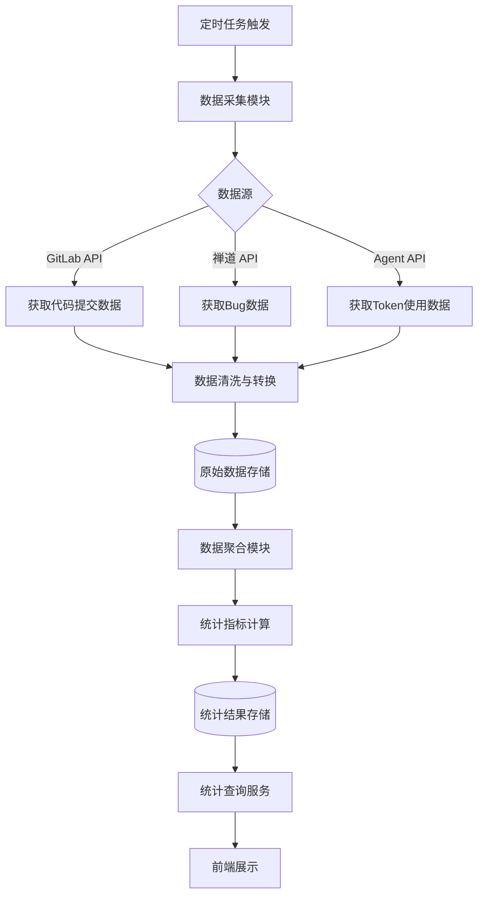
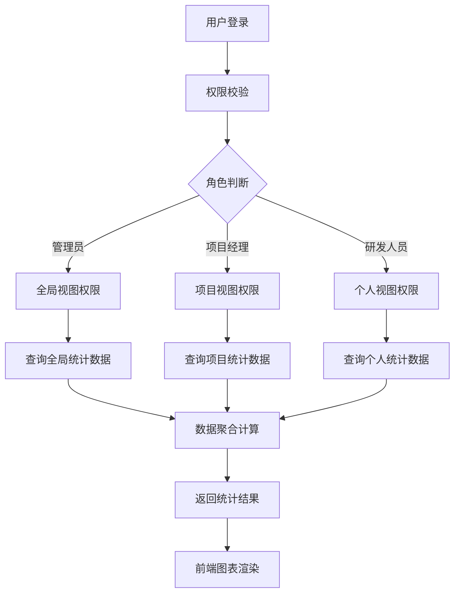
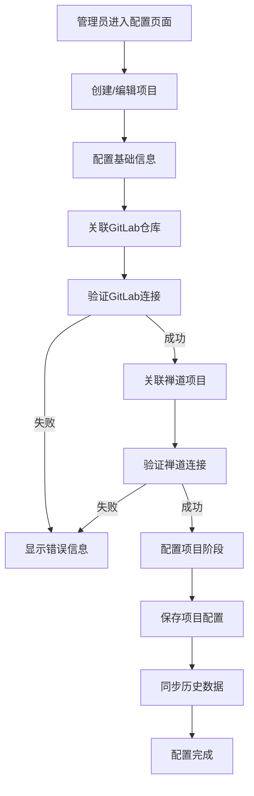
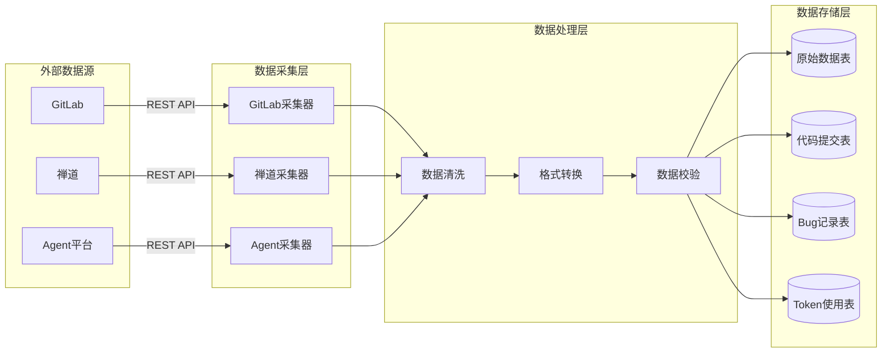
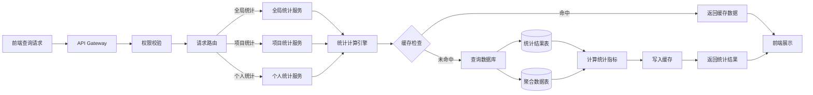
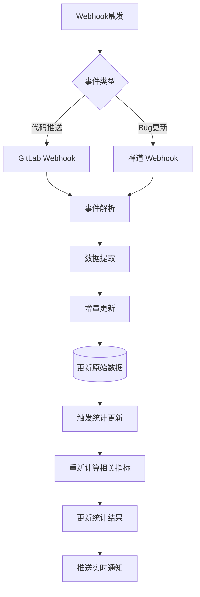

# S5-S16 系统架构设计

---

## 元信息

| 属性 | 内容 |
|------|------|
| **Skill 编号** | S5-S16 |
| **Skill 名称** | 系统架构设计 |
| **所属阶段** | S5 - 架构设计阶段 |
| **前置 Skill** | S4-S08 核心需求提炼 |
| **后置 Skill** | S5-S17 数据架构设计 |
| **执行模式** | 标准模式 |
| **人工评审点** | 架构方案评审（步骤 8） |

---

## 触发条件

当满足以下任一条件时，触发本 Skill：

1. 需求分析阶段已完成，获得核心需求清单
2. 技术选型已确定，需要设计系统整体架构
3. 需要明确模块划分和组件交互关系
4. 需要输出可指导开发的架构文档

---

## 输入

| 输入项 | 说明 | 来源 |
|--------|------|------|
| 核心需求清单 | P0/P1 级功能需求和非功能需求 | S4-S08 产物 |
| 技术选型建议 | 推荐技术栈和组件 | S3-S12 产物 |
| 用户故事 | 15 个核心用户故事 | 需求报告 |
| 原型设计 | 10 个页面原型 | S4-S15 产物 |
| 约束条件 | 性能、安全、部署约束 | 需求报告 |

---

## 输出

| 产物 | 说明 | 存储路径 |
|------|------|----------|
| 系统架构设计文档 | 分层架构、模块划分、组件关系 | `database/stages/s5/{PlanID}/{PlanID}-S5-S16-001.md` |
| 业务流图 | 核心业务场景流程 | 嵌入架构文档 |
| 数据流图 | 数据流转和交互关系 | 嵌入架构文档 |
| 架构决策记录 | ADR 列表 | 嵌入架构文档 |

---

## 执行流程

### 步骤 1：读取前置产物

读取以下文件获取设计输入：
- 需求报告：`database/plans/{PlanID}-requirements-report.md`
- 技术选型：`database/stages/s3/{PlanID}/{PlanID}-S3-S12-001.md`
- 核心需求：`database/stages/s4/{PlanID}/{PlanID}-S4-S08-001.md`

### 步骤 2：分析架构需求

基于输入分析以下维度：

| 分析维度 | 分析内容 |
|----------|----------|
| 功能架构 | 根据需求清单识别功能模块 |
| 非功能需求 | 性能、安全、可扩展性要求 |
| 技术约束 | 已确定技术栈的架构影响 |
| 集成需求 | 与外部系统（GitLab/禅道/Agent平台）的集成方式 |

### 步骤 3：设计分层架构

采用分层架构模式，定义以下层次：

```
┌─────────────────────────────────────────────────────────────┐
│                      表现层 (Presentation)                   │
│         Vue3 前端应用 - 全局/项目/个人统计视图                │
├─────────────────────────────────────────────────────────────┤
│                      应用层 (Application)                    │
│    FastAPI 应用服务 - API 接口、业务编排、权限控制            │
├─────────────────────────────────────────────────────────────┤
│                      领域层 (Domain)                         │
│    核心业务逻辑 - 统计计算、数据聚合、规则引擎                │
├─────────────────────────────────────────────────────────────┤
│                    基础设施层 (Infrastructure)               │
│  PostgreSQL | Redis | GitLab API | 禅道 API | Agent API     │
└─────────────────────────────────────────────────────────────┘
```

### 步骤 4：设计模块划分

基于需求识别核心模块：

| 模块名称 | 职责 | 包含功能 |
|----------|------|----------|
| 全局统计模块 | 管理层视角统计 | Token趋势、活跃度、TOP20 |
| 项目统计模块 | 项目维度统计 | 代码排名、Bug趋势、采纳率 |
| 个人统计模块 | 个人视角统计 | 代码量、Token使用、Bug率 |
| 配置管理模块 | 系统和项目配置 | 项目信息、人员账号、数据源 |
| 权限管理模块 | 访问控制 | 角色管理、权限分配、数据隔离 |
| 数据采集模块 | 外部数据同步 | GitLab/禅道/Agent 数据抓取 |
| 数据聚合模块 | 统计计算 | 指标计算、趋势分析、报表生成 |

### 步骤 5：绘制业务流图

使用 Mermaid 绘制核心业务流：

**业务流 1：数据采集与统计流程**


**业务流 2：用户查看统计报表流程**


**业务流 3：项目配置流程**


### 步骤 6：绘制数据流图

**数据流 1：数据采集数据流**


**数据流 2：统计查询数据流**


**数据流 3：实时同步数据流**


### 步骤 7：记录架构决策

对每个关键决策记录 ADR：

| 决策项 | 可选方案 | 选定方案 | 决策理由 |
|--------|----------|----------|----------|
| 架构模式 | 单体/微服务/分层 | 分层架构 | 团队规模适中，分层清晰，易于维护 |
| 前端框架 | Vue3/React | Vue3 | 团队熟悉，生态完善 |
| 后端框架 | FastAPI/Flask/Django | FastAPI | 异步支持好，性能优秀，类型安全 |
| 数据库 | PostgreSQL/MySQL | PostgreSQL | JSON支持好，分析函数丰富 |
| 缓存 | Redis/Memcached | Redis | 支持数据结构丰富，持久化 |
| 部署 | Docker/裸机/K8s | Docker Compose | 内部部署，运维简单 |

### 步骤 8：用户评审

生成架构设计初稿后，进入用户评审：

**评审内容**：
1. 分层架构是否合理
2. 模块划分是否完整
3. 业务流图是否准确
4. 数据流图是否清晰
5. 技术选型是否符合预期

**评审选项**：
- **确认** → 进入步骤 9
- **修改：{具体意见}** → 返回步骤 3-7 调整
- **补充：{新增需求}** → 补充分析后重新评审

### 步骤 9：生成产物

评审通过后，生成以下产物：

1. **系统架构设计文档**（Markdown 格式）
2. **更新 Todo-List**：标记 S5-S16 为已完成

---

## 产物模板

### 系统架构设计文档结构

```markdown
# {PlanID}-S5-S16-001 系统架构设计文档

## 1. 架构概述
- 设计目标
- 架构原则
- 技术栈总览

## 2. 分层架构
- 表现层设计
- 应用层设计
- 领域层设计
- 基础设施层设计

## 3. 模块划分
- 模块清单
- 模块职责
- 模块依赖关系

## 4. 业务流图
- 数据采集流程
- 统计查询流程
- 配置管理流程

## 5. 数据流图
- 数据采集数据流
- 统计查询数据流
- 实时同步数据流

## 6. 架构决策记录
- ADR-001: 架构模式选择
- ADR-002: 技术栈选择
- ...

## 7. 非功能需求应对
- 性能设计
- 安全设计
- 可扩展性设计
```

---

## 错误处理策略

| 错误场景 | 处理策略 |
|----------|----------|
| 前置产物缺失 | 提示用户先完成需求分析阶段 |
| 技术选型不明确 | 基于需求推荐技术栈，请求用户确认 |
| 模块划分争议 | 提供多种方案对比，引导用户决策 |
| 用户评审不通过 | 记录反馈，针对性调整架构设计 |

---

## 注意事项

1. 架构设计应平衡前瞻性和可实现性
2. 充分考虑与现有系统（GitLab/禅道）的集成
3. 预留扩展空间，支持未来新增数据源
4. 业务流图和数据流图使用 Mermaid 语法，确保可渲染
