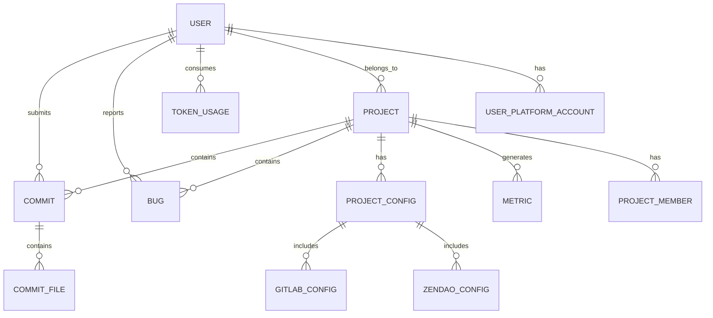
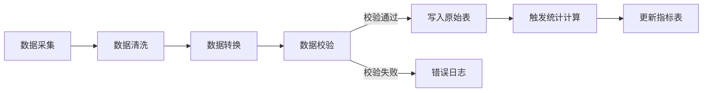

# S5-S17 数据架构设计

---

## 元信息

| 属性 | 内容 |
|------|------|
| **Skill 编号** | S5-S17 |
| **Skill 名称** | 数据架构设计 |
| **所属阶段** | S5 - 架构设计阶段 |
| **前置 Skill** | S5-S16 系统架构设计 |
| **后置 Skill** | S5-S18 接口架构设计 |
| **执行模式** | 标准模式 |
| **人工评审点** | 数据模型评审（步骤 7） |

---

## 触发条件

当满足以下任一条件时，触发本 Skill：

1. 系统架构设计已完成，需要细化数据存储方案
2. 需要设计数据库表结构和关系
3. 需要定义数据同步和流转策略
4. 需要输出可指导开发的数据库设计文档

---

## 输入

| 输入项 | 说明 | 来源 |
|--------|------|------|
| 系统架构设计 | 分层架构、模块划分 | S5-S16 产物 |
| 数据需求清单 | 12 个数据需求 | 需求报告 |
| 业务规则 | 7 个业务规则 | 需求报告 |
| 技术选型 | 数据库选型（PostgreSQL） | S3-S12 产物 |
| 集成需求 | GitLab/禅道/Agent 数据结构 | 需求报告 |

---

## 输出

| 产物 | 说明 | 存储路径 |
|------|------|----------|
| 数据架构设计文档 | ER 图、表结构、数据流 | `database/stages/s5/{PlanID}/{PlanID}-S5-S17-001.md` |
| 数据库表结构定义 | 完整 DDL | 嵌入架构文档 |
| 数据字典 | 字段说明、枚举值 | 嵌入架构文档 |
| 数据同步策略 | 采集、清洗、同步方案 | 嵌入架构文档 |

---

## 执行流程

### 步骤 1：读取前置产物

读取以下文件获取设计输入：
- 系统架构设计：`database/stages/s5/{PlanID}/{PlanID}-S5-S16-001.md`
- 需求报告：`database/plans/{PlanID}-requirements-report.md`
- 技术选型：`database/stages/s3/{PlanID}/{PlanID}-S3-S12-001.md`

### 步骤 2：识别领域实体

基于需求分析识别核心领域实体：

| 实体名称 | 说明 | 来源需求 |
|----------|------|----------|
| 项目（Project） | 研发项目基本信息 | FR008 |
| 人员（User） | 系统用户和研发人员 | FR011 |
| 代码提交（Commit） | GitLab 代码提交记录 | FR005 |
| Bug 记录（Bug） | 禅道 Bug 数据 | FR007 |
| Token 使用（TokenUsage） | Agent 平台 Token 消耗 | FR006 |
| 项目配置（ProjectConfig） | 项目数据源配置 | FR009/FR010 |
| 统计指标（Metric） | 计算后的统计数据 | IR001 |
| 操作日志（OperationLog） | 系统操作记录 | NFR003 |

### 步骤 3：设计概念模型

绘制 ER 图（实体关系图）：



### 步骤 4：设计逻辑模型

定义各实体属性：

**项目表（projects）**
| 字段 | 类型 | 说明 | 约束 |
|------|------|------|------|
| id | UUID | 主键 | PK |
| name | VARCHAR(100) | 项目名称 | NOT NULL |
| code | VARCHAR(50) | 项目编码 | UNIQUE |
| description | TEXT | 项目描述 | |
| status | SMALLINT | 状态：0-未开始,1-进行中,2-已结束 | DEFAULT 1 |
| start_date | DATE | 开始日期 | |
| end_date | DATE | 结束日期 | |
| created_at | TIMESTAMP | 创建时间 | DEFAULT NOW() |
| updated_at | TIMESTAMP | 更新时间 | |

**人员表（users）**
| 字段 | 类型 | 说明 | 约束 |
|------|------|------|------|
| id | UUID | 主键 | PK |
| username | VARCHAR(50) | 登录名 | UNIQUE, NOT NULL |
| real_name | VARCHAR(50) | 真实姓名 | NOT NULL |
| email | VARCHAR(100) | 邮箱 | UNIQUE |
| role | SMALLINT | 角色：0-管理员,1-项目经理,2-研发人员 | DEFAULT 2 |
| status | SMALLINT | 状态：0-禁用,1-启用 | DEFAULT 1 |
| created_at | TIMESTAMP | 创建时间 | |
| updated_at | TIMESTAMP | 更新时间 | |

**人员平台账号表（user_platform_accounts）**
| 字段 | 类型 | 说明 | 约束 |
|------|------|------|------|
| id | UUID | 主键 | PK |
| user_id | UUID | 用户ID | FK -> users |
| platform_type | SMALLINT | 平台：1-GitLab,2-禅道,3-Agent | |
| platform_user_id | VARCHAR(100) | 平台用户ID | |
| platform_username | VARCHAR(100) | 平台用户名 | |
| created_at | TIMESTAMP | 创建时间 | |

**代码提交表（commits）**
| 字段 | 类型 | 说明 | 约束 |
|------|------|------|------|
| id | UUID | 主键 | PK |
| project_id | UUID | 项目ID | FK -> projects |
| user_id | UUID | 提交人ID | FK -> users |
| commit_hash | VARCHAR(40) | Git commit hash | UNIQUE |
| message | TEXT | 提交信息 | |
| additions | INTEGER | 新增行数 | DEFAULT 0 |
| deletions | INTEGER | 删除行数 | DEFAULT 0 |
| committed_at | TIMESTAMP | 提交时间 | |
| is_ai_generated | BOOLEAN | 是否AI生成 | DEFAULT FALSE |
| created_at | TIMESTAMP | 记录创建时间 | |

**Bug 记录表（bugs）**
| 字段 | 类型 | 说明 | 约束 |
|------|------|------|------|
| id | UUID | 主键 | PK |
| project_id | UUID | 项目ID | FK -> projects |
| reporter_id | UUID | 报告人ID | FK -> users |
| assignee_id | UUID | 处理人ID | FK -> users |
| zentao_bug_id | INTEGER | 禅道Bug ID | UNIQUE |
| title | VARCHAR(500) | Bug标题 | |
| severity | SMALLINT | 严重程度：1-致命,2-严重,3-一般,4-提示 | |
| status | SMALLINT | 状态：1-激活,2-已解决,3-已关闭 | |
| created_at | TIMESTAMP | 创建时间 | |
| resolved_at | TIMESTAMP | 解决时间 | |
| closed_at | TIMESTAMP | 关闭时间 | |

**Token 使用表（token_usages）**
| 字段 | 类型 | 说明 | 约束 |
|------|------|------|------|
| id | UUID | 主键 | PK |
| user_id | UUID | 用户ID | FK -> users |
| project_id | UUID | 项目ID | FK -> projects |
| platform_type | SMALLINT | Agent平台类型 | |
| tokens_input | INTEGER | 输入Token数 | DEFAULT 0 |
| tokens_output | INTEGER | 输出Token数 | DEFAULT 0 |
| tokens_total | INTEGER | 总Token数 | DEFAULT 0 |
| usage_date | DATE | 使用日期 | |
| created_at | TIMESTAMP | 记录创建时间 | |

**项目配置表（project_configs）**
| 字段 | 类型 | 说明 | 约束 |
|------|------|------|------|
| id | UUID | 主键 | PK |
| project_id | UUID | 项目ID | FK -> projects, UNIQUE |
| gitlab_project_id | INTEGER | GitLab项目ID | |
| gitlab_webhook_secret | VARCHAR(100) | Webhook密钥 | |
| zentao_project_id | INTEGER | 禅道项目ID | |
| zentao_product_id | INTEGER | 禅道产品ID | |
| sync_frequency | SMALLINT | 同步频率：1-每小时,2-每天,3-每周 | DEFAULT 2 |
| last_sync_at | TIMESTAMP | 上次同步时间 | |
| created_at | TIMESTAMP | 创建时间 | |
| updated_at | TIMESTAMP | 更新时间 | |

**统计指标表（metrics）**
| 字段 | 类型 | 说明 | 约束 |
|------|------|------|------|
| id | UUID | 主键 | PK |
| project_id | UUID | 项目ID（全局统计为NULL） | FK -> projects |
| user_id | UUID | 用户ID（项目统计为NULL） | FK -> users |
| metric_type | VARCHAR(50) | 指标类型 | |
| metric_value | DECIMAL(18,4) | 指标值 | |
| metric_date | DATE | 统计日期 | |
| period_type | SMALLINT | 周期：1-日,2-周,3-月 | |
| created_at | TIMESTAMP | 创建时间 | |

### 步骤 5：设计数据同步策略

**数据采集策略**

| 数据源 | 采集方式 | 频率 | 数据范围 |
|--------|----------|------|----------|
| GitLab | REST API + Webhook | 每日全量 + 实时增量 | 代码提交、合并请求 |
| 禅道 | REST API + Webhook | 每日全量 + 实时增量 | Bug、任务 |
| Agent平台 | REST API | 每日全量 | Token使用、采纳率 |

**数据清洗规则**

| 规则类型 | 规则说明 |
|----------|----------|
| 重复数据 | 基于 commit_hash/bug_id 去重 |
| 无效数据 | 过滤空提交、测试账号数据 |
| 数据补全 | 通过平台账号映射补全 user_id |
| 格式统一 | 统一时间格式、编码格式 |

**数据同步流程**


### 步骤 6：设计索引策略

为提高查询性能，设计以下索引：

| 表名 | 索引字段 | 索引类型 | 用途 |
|------|----------|----------|------|
| commits | (project_id, committed_at) | B-Tree | 项目代码统计查询 |
| commits | (user_id, committed_at) | B-Tree | 个人代码统计查询 |
| bugs | (project_id, created_at) | B-Tree | 项目Bug统计查询 |
| bugs | (assignee_id, status) | B-Tree | 个人Bug率查询 |
| token_usages | (user_id, usage_date) | B-Tree | Token使用查询 |
| token_usages | (project_id, usage_date) | B-Tree | 项目Token统计 |
| metrics | (project_id, metric_type, metric_date) | B-Tree | 指标查询 |
| metrics | (user_id, metric_type, metric_date) | B-Tree | 个人指标查询 |

### 步骤 7：用户评审

生成数据架构设计初稿后，进入用户评审：

**评审内容**：
1. 实体设计是否完整
2. 表结构是否满足查询需求
3. 索引设计是否合理
4. 数据同步策略是否可行
5. 是否支持未来扩展

**评审选项**：
- **确认** → 进入步骤 8
- **修改：{具体意见}** → 返回步骤 3-6 调整
- **补充：{新增需求}** → 补充分析后重新评审

### 步骤 8：生成产物

评审通过后，生成以下产物：

1. **数据架构设计文档**（Markdown 格式）
2. **更新 Todo-List**：标记 S5-S17 为已完成

---

## 产物模板

### 数据架构设计文档结构

```markdown
# {PlanID}-S5-S17-001 数据架构设计文档

## 1. 数据架构概述
- 设计原则
- 数据分层
- 技术选型

## 2. 领域模型
- 实体关系图（ER图）
- 实体说明

## 3. 数据库设计
- 表结构定义
- 字段说明
- 索引设计
- 约束定义

## 4. 数据字典
- 枚举值定义
- 状态码说明
- 字段取值范围

## 5. 数据同步策略
- 采集方案
- 清洗规则
- 同步流程
- 异常处理

## 6. 性能优化
- 索引策略
- 分区方案
- 缓存策略

## 7. 数据安全
- 敏感数据加密
- 访问控制
- 备份策略
```

---

## 错误处理策略

| 错误场景 | 处理策略 |
|----------|----------|
| 需求理解偏差 | 与用户确认业务场景，修正模型 |
| 性能瓶颈预判 | 提前设计索引和分区方案 |
| 数据一致性 | 设计补偿机制和事务策略 |
| 扩展性不足 | 预留扩展字段，采用JSON字段存储变长数据 |

---

## 注意事项

1. 表结构设计遵循第三范式，适度反范式设计以提高查询性能
2. 所有时间字段使用 TIMESTAMP WITH TIME ZONE
3. 软删除使用 status 字段，不物理删除数据
4. 预留 20% 的扩展字段空间
5. 关键表添加 created_at/updated_at 审计字段
