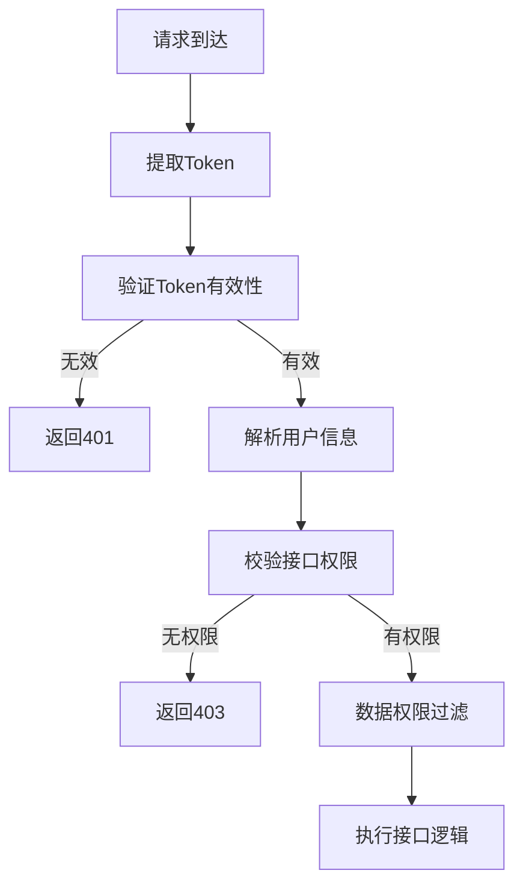

# S5-S18 接口架构设计

---

## 元信息

| 属性 | 内容 |
|------|------|
| **Skill 编号** | S5-S18 |
| **Skill 名称** | 接口架构设计 |
| **所属阶段** | S5 - 架构设计阶段 |
| **前置 Skill** | S5-S17 数据架构设计 |
| **后置 Skill** | S5-S19 部署架构设计 |
| **执行模式** | 标准模式 |
| **人工评审点** | 接口规范评审（步骤 7） |

---

## 触发条件

当满足以下任一条件时，触发本 Skill：

1. 数据架构设计已完成，需要设计 API 接口
2. 需要定义前后端交互规范
3. 需要设计外部系统集成接口
4. 需要输出可指导开发的接口文档

---

## 输入

| 输入项 | 说明 | 来源 |
|--------|------|------|
| 系统架构设计 | 模块划分、分层架构 | S5-S16 产物 |
| 数据架构设计 | 表结构、实体关系 | S5-S17 产物 |
| 用户故事 | 15 个核心用户故事 | 需求报告 |
| 原型设计 | 10 个页面交互 | S4-S15 产物 |
| 接口需求 | 5 个接口需求 | 需求报告 |

---

## 输出

| 产物 | 说明 | 存储路径 |
|------|------|----------|
| 接口架构设计文档 | RESTful API 规范 | `database/stages/s5/{PlanID}/{PlanID}-S5-S18-001.md` |
| 接口清单 | 完整 API 列表 | 嵌入架构文档 |
| 认证授权方案 | JWT/OAuth2 设计 | 嵌入架构文档 |
| 外部集成接口 | GitLab/禅道/Agent API | 嵌入架构文档 |

---

## 执行流程

### 步骤 1：读取前置产物

读取以下文件获取设计输入：
- 系统架构设计：`database/stages/s5/{PlanID}/{PlanID}-S5-S16-001.md`
- 数据架构设计：`database/stages/s5/{PlanID}/{PlanID}-S5-S17-001.md`
- 原型设计：`database/prototypes/{PlanID}/{PlanID}-S4-S15-001.md`

### 步骤 2：设计 API 分层

基于模块划分设计 API 分层：

| API 分组 | 基础路径 | 说明 | 对应模块 |
|----------|----------|------|----------|
| 认证接口 | `/api/v1/auth` | 登录、登出、Token刷新 | 权限管理 |
| 全局统计 | `/api/v1/dashboard` | 全局看板数据 | 全局统计 |
| 项目统计 | `/api/v1/projects/{id}/stats` | 项目维度统计 | 项目统计 |
| 个人统计 | `/api/v1/users/{id}/stats` | 个人统计视图 | 个人统计 |
| 项目管理 | `/api/v1/projects` | 项目 CRUD | 配置管理 |
| 人员管理 | `/api/v1/users` | 人员 CRUD | 配置管理 |
| 系统配置 | `/api/v1/config` | 系统配置管理 | 配置管理 |
| 数据采集 | `/api/v1/sync` | 数据同步触发 | 数据采集 |

### 步骤 3：设计核心接口

**3.1 认证接口**

| 方法 | 路径 | 说明 | 请求体 | 响应 |
|------|------|------|--------|------|
| POST | `/api/v1/auth/login` | 用户登录 | username, password | token, user_info |
| POST | `/api/v1/auth/logout` | 用户登出 | - | success |
| POST | `/api/v1/auth/refresh` | 刷新Token | refresh_token | new_token |
| GET | `/api/v1/auth/me` | 获取当前用户 | - | user_info |

**3.2 全局统计接口**

| 方法 | 路径 | 说明 | 查询参数 | 响应 |
|------|------|------|----------|------|
| GET | `/api/v1/dashboard/token-trend` | Token使用趋势 | start_date, end_date, period | trend_data |
| GET | `/api/v1/dashboard/activity-trend` | 活跃度趋势 | start_date, end_date | activity_data |
| GET | `/api/v1/dashboard/top-users` | 高频使用人员 | limit, period | user_list |
| GET | `/api/v1/dashboard/overview` | 全局概览 | - | overview_stats |

**3.3 项目统计接口**

| 方法 | 路径 | 说明 | 查询参数 | 响应 |
|------|------|------|----------|------|
| GET | `/api/v1/projects/{id}/stats/code` | 项目代码统计 | start_date, end_date | code_stats |
| GET | `/api/v1/projects/{id}/stats/bugs` | 项目Bug统计 | start_date, end_date, severity | bug_stats |
| GET | `/api/v1/projects/{id}/stats/adoption` | AI采纳率统计 | start_date, end_date | adoption_stats |
| GET | `/api/v1/projects/{id}/stats/members` | 项目成员统计 | - | member_stats |

**3.4 个人统计接口**

| 方法 | 路径 | 说明 | 查询参数 | 响应 |
|------|------|------|----------|------|
| GET | `/api/v1/users/{id}/stats/code` | 个人代码统计 | start_date, end_date | code_stats |
| GET | `/api/v1/users/{id}/stats/tokens` | Token使用统计 | start_date, end_date | token_stats |
| GET | `/api/v1/users/{id}/stats/bugs` | Bug率统计 | start_date, end_date | bug_stats |
| GET | `/api/v1/users/me/stats` | 当前用户统计 | - | all_stats |

**3.5 项目管理接口**

| 方法 | 路径 | 说明 | 请求体 | 响应 |
|------|------|------|--------|------|
| GET | `/api/v1/projects` | 项目列表 | page, size, status | project_list |
| POST | `/api/v1/projects` | 创建项目 | project_data | project_info |
| GET | `/api/v1/projects/{id}` | 项目详情 | - | project_detail |
| PUT | `/api/v1/projects/{id}` | 更新项目 | project_data | project_info |
| DELETE | `/api/v1/projects/{id}` | 删除项目 | - | success |
| GET | `/api/v1/projects/{id}/config` | 项目配置 | - | config_info |
| PUT | `/api/v1/projects/{id}/config` | 更新配置 | config_data | config_info |
| POST | `/api/v1/projects/{id}/sync` | 触发同步 | - | sync_task |

**3.6 人员管理接口**

| 方法 | 路径 | 说明 | 请求体 | 响应 |
|------|------|------|--------|------|
| GET | `/api/v1/users` | 人员列表 | page, size, role | user_list |
| POST | `/api/v1/users` | 创建人员 | user_data | user_info |
| GET | `/api/v1/users/{id}` | 人员详情 | - | user_detail |
| PUT | `/api/v1/users/{id}` | 更新人员 | user_data | user_info |
| DELETE | `/api/v1/users/{id}` | 删除人员 | - | success |
| POST | `/api/v1/users/{id}/accounts` | 绑定平台账号 | account_data | account_info |

### 步骤 4：设计请求/响应规范

**4.1 通用响应格式**

```json
{
  "code": 200,
  "message": "success",
  "data": {},
  "timestamp": "2026-03-27T10:00:00Z",
  "request_id": "req_xxx"
}
```

**4.2 分页响应格式**

```json
{
  "code": 200,
  "message": "success",
  "data": {
    "items": [],
    "pagination": {
      "page": 1,
      "size": 20,
      "total": 100,
      "total_pages": 5
    }
  }
}
```

**4.3 错误响应格式**

```json
{
  "code": 400,
  "message": "请求参数错误",
  "errors": [
    {
      "field": "username",
      "message": "用户名不能为空"
    }
  ],
  "timestamp": "2026-03-27T10:00:00Z",
  "request_id": "req_xxx"
}
```

### 步骤 5：设计认证授权方案

**5.1 JWT 认证方案**

| 组件 | 说明 |
|------|------|
| Token 类型 | JWT (JSON Web Token) |
| 签名算法 | HS256 |
| Access Token 有效期 | 2 小时 |
| Refresh Token 有效期 | 7 天 |
| Token 传输 | HTTP Header: `Authorization: Bearer {token}` |

**5.2 权限控制模型**

| 角色 | 权限范围 |
|------|----------|
| 管理员 | 所有接口 |
| 项目经理 | 项目统计、个人统计、项目配置（自己负责的项目） |
| 研发人员 | 个人统计（仅自己） |

**5.3 权限校验流程**


### 步骤 6：设计外部集成接口

**6.1 GitLab API 集成**

| 接口 | 用途 | 调用频率 |
|------|------|----------|
| GET /projects | 获取项目列表 | 初始化时 |
| GET /projects/{id}/repository/commits | 获取提交记录 | 每日同步 |
| GET /projects/{id}/merge_requests | 获取合并请求 | 每日同步 |
| POST /projects/{id}/hooks | 配置Webhook | 项目配置时 |

**6.2 禅道 API 集成**

| 接口 | 用途 | 调用频率 |
|------|------|----------|
| GET /products | 获取产品列表 | 初始化时 |
| GET /projects | 获取项目列表 | 初始化时 |
| GET /bugs | 获取Bug列表 | 每日同步 |
| GET /tasks | 获取任务列表 | 每日同步 |

**6.3 Agent 平台 API 集成**

| 接口 | 用途 | 调用频率 |
|------|------|----------|
| GET /usage/tokens | 获取Token使用统计 | 每日同步 |
| GET /usage/adoption | 获取采纳率统计 | 每日同步 |
| GET /users/activity | 获取用户活跃度 | 每日同步 |

### 步骤 7：用户评审

生成接口架构设计初稿后，进入用户评审：

**评审内容**：
1. 接口划分是否合理
2. 接口命名是否规范
3. 请求/响应格式是否满足需求
4. 认证授权方案是否安全
5. 外部集成接口是否完整

**评审选项**：
- **确认** → 进入步骤 8
- **修改：{具体意见}** → 返回步骤 3-6 调整
- **补充：{新增需求}** → 补充分析后重新评审

### 步骤 8：生成产物

评审通过后，生成以下产物：

1. **接口架构设计文档**（Markdown 格式）
2. **更新 Todo-List**：标记 S5-S18 为已完成

---

## 产物模板

### 接口架构设计文档结构

```markdown
# {PlanID}-S5-S18-001 接口架构设计文档

## 1. 接口架构概述
- 设计原则
- 接口风格
- 版本管理

## 2. API 分层设计
- 接口分组
- 路由规划
- 模块映射

## 3. 接口清单
- 认证接口
- 全局统计接口
- 项目统计接口
- 个人统计接口
- 项目管理接口
- 人员管理接口
- 系统配置接口

## 4. 请求/响应规范
- 通用格式
- 分页规范
- 错误规范
- 字段命名规范

## 5. 认证授权设计
- JWT 方案
- 权限模型
- 安全策略

## 6. 外部集成接口
- GitLab API
- 禅道 API
- Agent 平台 API

## 7. 接口版本管理
- 版本策略
- 兼容性保证
- 弃用流程
```

---

## 错误处理策略

| 错误场景 | 处理策略 |
|----------|----------|
| 接口命名冲突 | 采用 RESTful 规范，使用资源名词复数 |
| 权限粒度不足 | 设计数据权限过滤器，实现行级权限控制 |
| 外部 API 不稳定 | 设计熔断降级机制，本地缓存兜底 |
| 接口性能瓶颈 | 设计缓存策略，支持批量查询 |

---

## 注意事项

1. 所有接口遵循 RESTful 设计规范
2. 接口版本通过 URL 路径控制（/api/v1/）
3. 敏感操作记录操作日志
4. 外部 API 调用设置超时和重试机制
5. 接口文档使用 OpenAPI 3.0 规范
