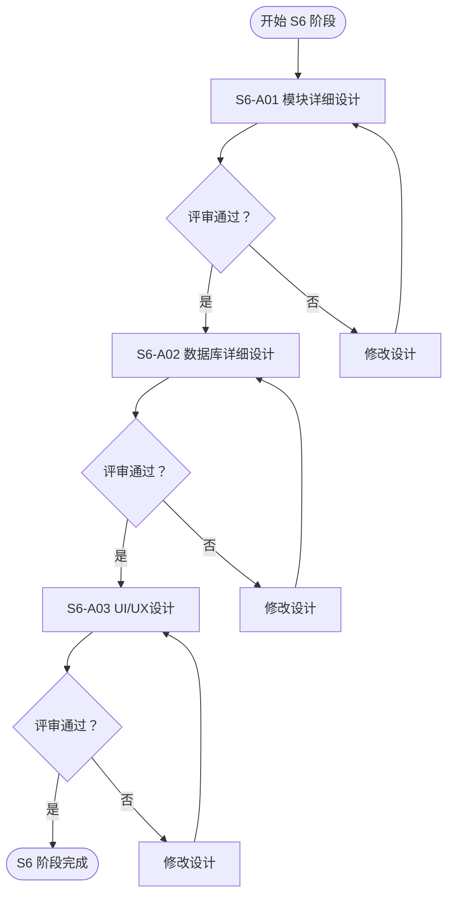
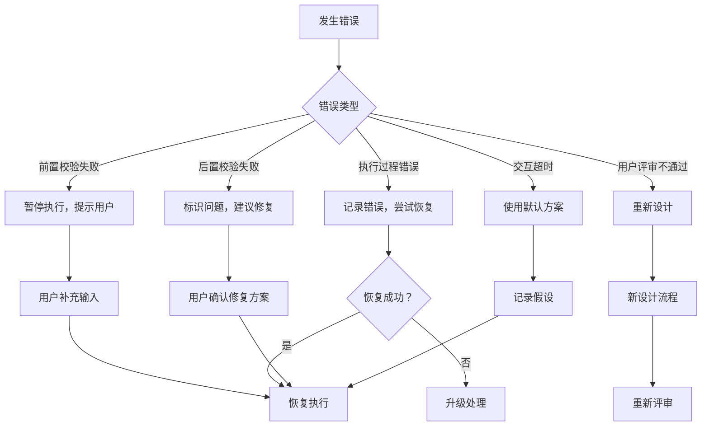

# S6 通用详细设计阶段

---

## 元信息

| 属性 | 内容 |
|------|------|
| **阶段编号** | S6 |
| **阶段名称** | 通用详细设计阶段 |
| **参考标准** | IEEE 1016, UML 2.5, ISO/IEC 12207 |
| **前置阶段** | 架构设计阶段（S5） |
| **后置阶段** | 实现阶段（S7） / 测试阶段（S8） |
| **执行模式** | 自动推导 + 用户交互 |

---

## 阶段概述

本阶段基于架构设计产物，**自动推导**详细设计方案。包括模块详细设计、数据库详细设计、UI/UX设计，为开发团队提供可指导编码的完整设计文档。

### 设计哲学

- **自动推导为主**：基于架构设计自动分析，减少用户负担
- **用户确认为辅**：仅在必要时请求用户确认
- **提供理由**：每个设计决策都附带理由，帮助用户理解
- **记录决策**：所有决策（自动或人工）都记录理由
- **详细可执行**：输出可指导编码的详细设计文档

### 设计过程活动

```
详细设计过程
├── S6-A01 模块详细设计
│   ├── 自动识别类结构
│   ├── 自动设计方法签名
│   ├── 自动设计核心算法
│   ├── 自动设计业务流程
│   └── 交互确认设计决策
├── S6-A02 数据库详细设计
│   ├── 自动设计表结构
│   ├── 自动设计索引
│   ├── 自动设计视图/存储过程
│   ├── 自动设计分区策略
│   └── 交互确认数据库选型
└── S6-A03 UI/UX设计
    ├── 自动设计信息架构
    ├── 自动设计页面布局
    ├── 自动设计界面组件
    ├── 自动设计交互流程
    └── 交互确认设计风格
```

---

## Skill 清单

| Skill 编号 | Skill 名称 | 核心能力 | 交互点 | 预计工作量 |
|:----------:|-----------|----------|--------|------------|
| S6-A01 | 模块详细设计 | 自动识别类结构，设计方法签名、算法、流程 | 设计模式选择、算法复杂度确认 | 3-4 小时 |
| S6-A02 | 数据库详细设计 | 自动设计表结构、索引、视图、存储过程 | 数据库选型、索引策略确认 | 2-3 小时 |
| S6-A03 | UI/UX设计 | 自动设计信息架构、页面布局、交互流程 | 设计风格、组件库选择确认 | 2-3 小时 |

---

## 自动推导规则

### 类结构识别

| 架构概念 | 识别规则 | 输出 |
|----------|----------|------|
| 领域模型实体 | 每个实体 → 一个实体类 | User, Order, Product |
| API 资源 | 每个资源 → 一个控制器类 | UserController, OrderController |
| 业务用例 | 每个用例 → 一个服务类 | UserService, OrderService |
| 聚合根 | 每个聚合根 → 一个仓储类 | UserRepository, OrderRepository |
| 数据传输 | 每个接口 → DTO 类 | UserDTO, OrderDTO |

### 数据库设计推导

| 数据特征 | 推导规则 | 输出 |
|----------|----------|------|
| 结构化数据 + 事务要求 | 关系型数据库 | PostgreSQL / MySQL |
| 文档型数据 + 灵活 Schema | 文档数据库 | MongoDB |
| 海量数据（>5000 万） | 分库分表 | 按时间/哈希分区 |
| 高频查询字段 | 创建索引 | 单索引/复合索引 |
| 复杂关联查询 | 创建视图 | 简化查询逻辑 |

### UI/UX设计推导

| 系统类型 | 推导规则 | 输出 |
|----------|----------|------|
| 企业应用 | 简洁商务风 + 桌面优先 | Ant Design + 蓝色系 |
| C 端产品 | 温暖亲和风 + 移动优先 | 圆角设计 + 暖色调 |
| 数据展示 | 仪表板布局 + 卡片组件 | 数据可视化组件 |
| 协作应用 | 时间线 + 实时通知 | 动态更新组件 |

---

## 用户交互场景

### 场景 1：提供选项

当存在多个可行方案时，提供选项供用户选择：

```
基于模块特征分析，"订单处理模块"推荐以下设计方案：

A. 领域驱动设计（推荐）
   - 实体 + 值对象 + 聚合根 + 领域服务
   - 适合复杂业务逻辑
   - 学习曲线较陡

B. 事务脚本模式
   - 简单服务类 + 数据库操作
   - 适合简单 CRUD 场景
   - 易于理解和实现

请选择设计方案（A/B）：
```

### 场景 2：询问澄清

当需求描述不明确时，询问用户澄清：

```
需求中提到"系统需要支持高并发"，但未明确并发量级。

请确认并发量级：
A. 低并发（<100 并发）
B. 中并发（100-1000 并发）
C. 高并发（1000-10000 并发）
D. 极高并发（>10000 并发）

请选择（A/B/C/D）：_____
```

### 场景 3：确认假设

基于分析做出假设，请求用户确认：

```
基于需求分析，做出以下详细设计假设：

假设 1：采用前后端分离架构，后端提供 RESTful API
假设 2：使用 Spring Boot 框架（Java）或 Express 框架（Node.js）
假设 3：数据库访问采用 ORM 框架（MyBatis/Sequelize）
假设 4：前端使用 React + Ant Design 组件库

请确认以上假设是否成立（是/否）：
如有不成立的假设，请说明：_____
```

---

## 产物清单

| 产物编号 | 产物名称 | 存储路径 | 生成方式 | 预计页数 |
|----------|----------|----------|----------|----------|
| S6-A01-001 | 模块详细设计文档 | `database/stages/s6/{PlanID}/{PlanID}-S6-A01-001.md` | 自动推导 + 用户确认 | 30-50 页 |
| S6-A02-001 | 数据库详细设计文档 | `database/stages/s6/{PlanID}/{PlanID}-S6-A02-001.md` | 自动推导 + 用户确认 | 20-40 页 |
| S6-A02-002 | DDL 脚本 | `database/stages/s6/{PlanID}/{PlanID}-S6-A02-002.sql` | 自动生成 | - |
| S6-A03-001 | UI/UX设计文档 | `database/stages/s6/{PlanID}/{PlanID}-S6-A03-001.md` | 自动推导 + 用户确认 | 40-60 页 |
| S6-A03-002 | 界面组件清单 | `database/stages/s6/{PlanID}/{PlanID}-S6-A03-002.md` | 自动生成 | 10-20 页 |

---

## 执行流程

### 阶段入口条件

- [ ] S5 架构设计阶段已完成并评审通过
- [ ] 架构视图设计文档可用
- [ ] 数据架构设计文档可用
- [ ] 接口架构设计文档可用

### 阶段内流程



### 阶段出口条件

- [ ] 模块详细设计文档已完成并评审通过
- [ ] 数据库详细设计文档已完成并评审通过
- [ ] DDL 脚本已生成并验证
- [ ] UI/UX设计文档已完成并评审通过
- [ ] 所有设计决策已记录

---

## 与其他阶段的关系

### 输入依赖

| 依赖阶段 | 依赖产物 | 用途 |
|----------|----------|------|
| S5-A01 架构愿景 | 架构愿景文档 | 理解系统特征和技术约束 |
| S5-A02 架构视图 | 架构视图设计文档 | 接收模块划分和领域模型 |
| S5-A03 数据架构 | 数据架构设计文档 | 接收存储方案和数据模型 |
| S5-A04 接口架构 | 接口架构设计文档 | 接收 API 定义和接口规范 |

### 输出传递

| 接收阶段 | 接收产物 | 用途 |
|----------|----------|------|
| S7 实现阶段 | 模块详细设计文档 | 指导编码实现 |
| S7 实现阶段 | 数据库详细设计文档 + DDL | 指导数据库实施 |
| S7 实现阶段 | UI/UX设计文档 | 指导前端开发 |
| S8 测试阶段 | 所有详细设计文档 | 设计测试用例 |

---

## 设计质量标准

### 模块详细设计质量

| 质量维度 | 检查项 | 标准 |
|----------|--------|------|
| 完整性 | 类设计覆盖所有功能 | 功能覆盖率 100% |
| 一致性 | 命名规范统一 | 符合命名规范 |
| 可维护性 | 符合 SOLID 原则 | 单一职责、开闭原则等 |
| 可测试性 | 依赖注入、接口隔离 | 易于 Mock 和单元测试 |
| 性能 | 算法复杂度合理 | 满足性能要求 |

### 数据库详细设计质量

| 质量维度 | 检查项 | 标准 |
|----------|--------|------|
| 完整性 | 表结构覆盖所有实体 | 实体覆盖率 100% |
| 规范性 | 符合数据库设计规范 | 命名、类型、约束规范 |
| 性能 | 索引设计合理 | 高频查询有索引覆盖 |
| 可扩展性 | 支持未来扩展 | 预留扩展字段 |
| 安全性 | 敏感数据保护 | 加密、脱敏处理 |

### UI/UX设计质量

| 质量维度 | 检查项 | 标准 |
|----------|--------|------|
| 可用性 | 交互流程顺畅 | 操作步骤 <= 3 步 |
| 一致性 | 设计元素统一 | 色彩、字体、间距一致 |
| 可访问性 | 符合 WCAG 标准 | AA 级合规 |
| 响应式 | 多端适配完整 | 断点覆盖全面 |
| 美观性 | 符合设计原则 | 对比、对齐、重复、亲密性 |

---

## Todo-List 管理

### 阶段任务清单

```markdown
## S6 详细设计阶段

- [ ] S6-A01 模块详细设计
  - [ ] 自动分析模块特征
  - [ ] 自动设计类结构
  - [ ] 自动设计方法签名
  - [ ] 自动设计核心算法
  - [ ] 用户交互确认
  - [ ] 生成模块详细设计文档
  - [ ] 用户评审

- [ ] S6-A02 数据库详细设计
  - [ ] 自动分析数据实体
  - [ ] 自动设计表结构
  - [ ] 自动设计索引
  - [ ] 自动设计视图/存储过程
  - [ ] 用户交互确认
  - [ ] 生成数据库详细设计文档
  - [ ] 生成 DDL 脚本
  - [ ] 用户评审

- [ ] S6-A03 UI/UX设计
  - [ ] 自动分析界面需求
  - [ ] 自动设计信息架构
  - [ ] 自动设计页面布局
  - [ ] 自动设计界面组件
  - [ ] 自动设计交互流程
  - [ ] 用户交互确认
  - [ ] 生成 UI/UX设计文档
  - [ ] 生成组件清单
  - [ ] 用户评审

- [ ] S6 阶段评审
  - [ ] 检查所有产物完整性
  - [ ] 确认所有评审通过
  - [ ] 生成阶段总结报告
  - [ ] 准备进入 S7 实现阶段
```

### 状态更新规则

| 时机 | 更新动作 |
|------|----------|
| Skill 开始执行 | 状态更新为"执行中" |
| 生成设计文档 | 状态更新为"已完成"，评审状态"pending" |
| 发起用户评审 | 记录评审时间，等待用户反馈 |
| 用户确认 | 状态更新为"已评审"，评审状态"approved" |
| 用户要求修改 | 状态更新为"修改中"，记录修改意见 |
| 修改完成 | 状态更新为"已完成"，重新发起评审 |

---

## 断点续跑

### 断点记录

在每个 Skill 完成后记录断点信息：

```markdown
## 断点记录 - S6-A01 完成

**完成时间：** 2026-03-27 14:30  
**产物：** `database/stages/s6/{PlanID}/{PlanID}-S6-A01-001.md`  
**评审状态：** approved  
**下一步：** 执行 S6-A02 数据库详细设计  
**备注：** 无
```

### 恢复流程

从中断点恢复时：

1. 读取 Todo-List，识别最后一个"已评审"状态的 Skill
2. 从下一个 Skill 开始继续执行
3. 如需重新评审已完成的 Skill，手动修改状态为"pending"

---

## 错误处理

### 错误分类

| 错误类型 | 示例 | 处理方式 |
|----------|------|----------|
| 前置校验失败 | 架构设计文档缺失 | 提示补充输入，暂停执行 |
| 执行过程错误 | 自动推导逻辑异常 | 记录错误上下文，提供恢复建议 |
| 后置校验失败 | 设计文档格式错误 | 标识具体校验项，提供修复建议 |
| 用户评审不通过 | 设计不符合预期 | 记录修改意见，重新执行设计 |
| 用户交互超时 | 用户未及时确认 | 使用默认方案，记录假设 |

### 恢复策略



---

## 阶段评审

### 评审检查清单

**S6 阶段完成前，必须完成以下检查：**

- [ ] S6-A01 模块详细设计文档已完成
  - [ ] 类设计完整（类图、类清单、方法签名）
  - [ ] 算法设计合理（伪代码、复杂度分析）
  - [ ] 流程设计清晰（流程图、时序图）
  - [ ] 设计模式应用合理
  - [ ] 用户评审通过

- [ ] S6-A02 数据库详细设计文档已完成
  - [ ] 表结构设计完整（表清单、字段说明）
  - [ ] 索引设计合理（索引清单、选择理由）
  - [ ] DDL 脚本可执行
  - [ ] 用户评审通过

- [ ] S6-A03 UI/UX设计文档已完成
  - [ ] 信息架构清晰（导航结构、页面清单）
  - [ ] 页面设计完整（布局图、组件清单）
  - [ ] 交互流程顺畅（状态转换、交互细节）
  - [ ] 响应式设计覆盖全面
  - [ ] 用户评审通过

### 评审报告模板

```markdown
# S6 详细设计阶段评审报告

## 评审概况

- 评审日期：2026-03-27
- 评审人员：{评审人员清单}
- 评审方式：文档评审 + 会议评审

## 评审结论

- [ ] 模块详细设计：通过 / 有条件通过 / 不通过
- [ ] 数据库详细设计：通过 / 有条件通过 / 不通过
- [ ] UI/UX设计：通过 / 有条件通过 / 不通过

## 问题清单

| 编号 | 问题描述 | 严重程度 | 修改建议 | 状态 |
|------|----------|----------|----------|------|
| Q001 | {问题描述} | 高/中/低 | {建议} | 待修改/已修改 |

## 评审结论

综合评审结论：通过 / 有条件通过 / 不通过

**进入 S7 实现阶段：** 是 / 否

**备注：**
{其他说明}
```

---

## 阶段总结

### 工作量统计

| Skill | 预计工作量 | 实际工作量 | 偏差 |
|-------|------------|------------|------|
| S6-A01 模块详细设计 | 3-4 小时 | {实际} | {偏差} |
| S6-A02 数据库详细设计 | 2-3 小时 | {实际} | {偏差} |
| S6-A03 UI/UX设计 | 2-3 小时 | {实际} | {偏差} |
| **总计** | **7-10 小时** | **{实际}** | **{偏差}** |

### 产物统计

| 产物类型 | 数量 | 总页数 |
|----------|------|--------|
| 模块详细设计文档 | 1 | {页数} |
| 数据库详细设计文档 | 1 | {页数} |
| DDL 脚本 | 1 | - |
| UI/UX设计文档 | 1 | {页数} |
| 界面组件清单 | 1 | {页数} |
| **总计** | **5** | **{总页数}** |

### 经验总结

**成功经验：**
- {成功实践 1}
- {成功实践 2}

**改进建议：**
- {改进建议 1}
- {改进建议 2}

**风险项：**
- {风险项 1} + 应对措施
- {风险项 2} + 应对措施

---

## 版本历史

| 版本 | 日期 | 变更内容 |
|------|------|----------|
| v1.0 | 2026-03-27 | 初始版本 |
