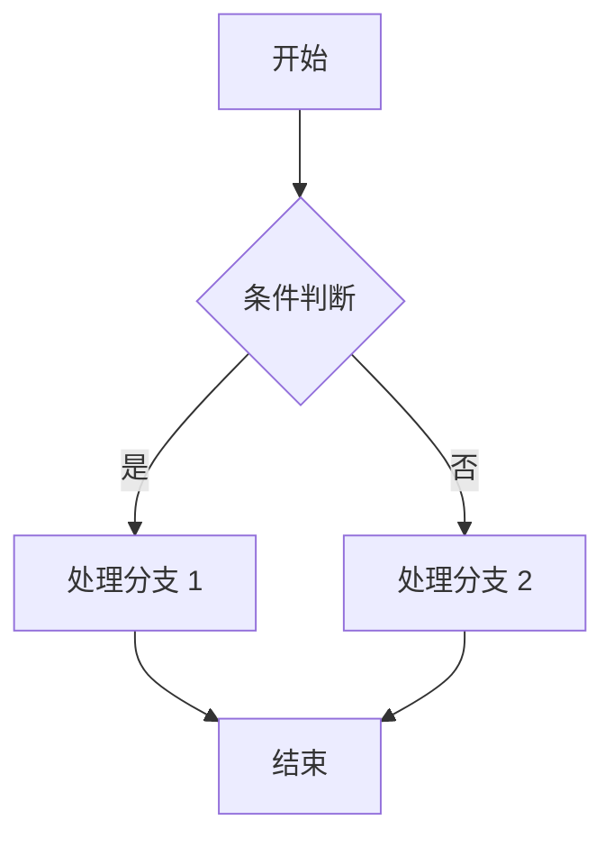
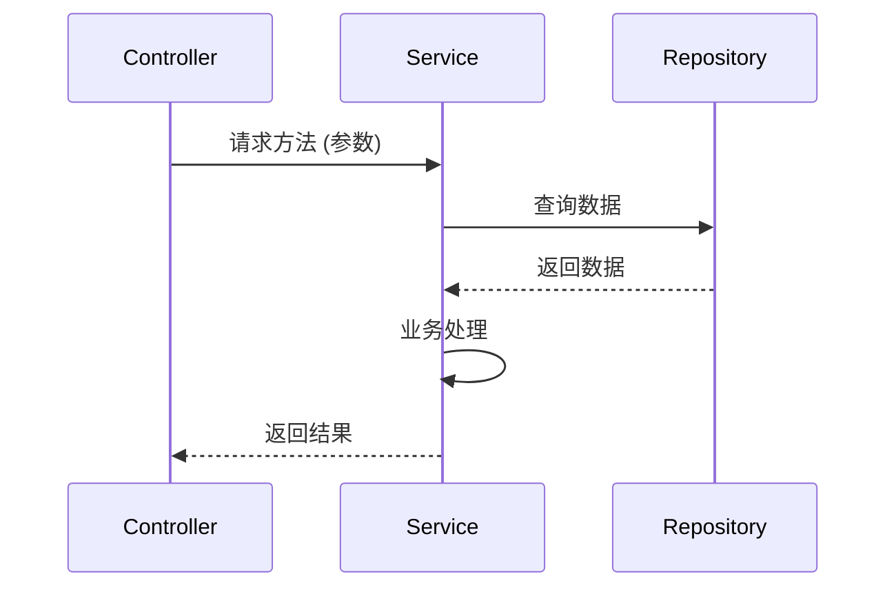
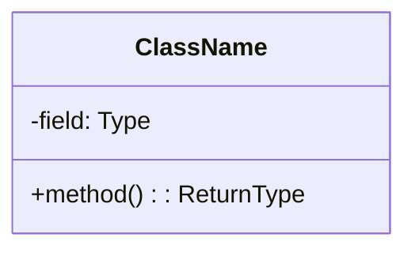
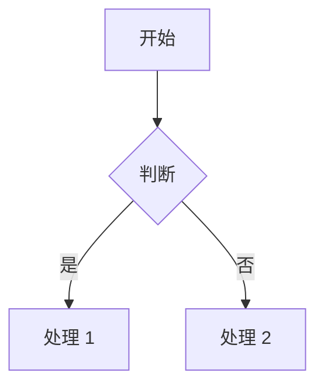
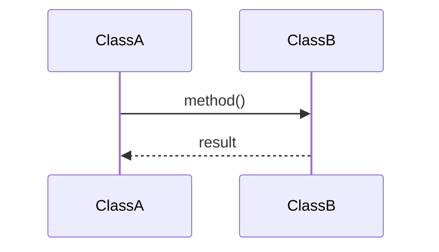

# S6-A01 模块详细设计

---

## 元信息

| 属性 | 内容 |
|------|------|
| **Skill 编号** | S6-A01 |
| **Skill 名称** | 模块详细设计 |
| **所属阶段** | S6 - 详细设计阶段 |
| **前置 Skill** | S5-A06 架构验证与评审 |
| **后置 Skill** | S6-A02 数据库详细设计 |
| **执行模式** | 自动推导 + 用户交互 |
| **参考标准** | UML 2.5, IEEE 1016, 面向对象设计原则 |

---

## 触发条件

当满足以下任一条件时，触发本 Skill：

1. 架构设计已完成，需要细化模块内部设计
2. 需要为开发团队提供详细的类设计和方法签名
3. 需要设计核心算法和业务流程
4. 需要输出可指导编码的详细设计文档

---

## 输入

| 输入项 | 说明 | 来源 |
|--------|------|------|
| 架构视图设计文档 | 逻辑视图中的模块划分 | S5-A02 产物 |
| 数据架构设计文档 | 数据实体、数据关系 | S5-A03 产物 |
| 接口架构设计文档 | API 清单、接口规范 | S5-A04 产物 |
| 需求规格说明书 | 详细功能需求、用户故事 | 需求工程阶段 |
| 非功能需求 | 性能、安全、可维护性要求 | 需求工程阶段 |

---

## 输出

| 产物 | 说明 | 存储路径 |
|------|------|----------|
| 模块详细设计文档 | 类设计、方法签名、算法设计、流程设计 | `database/stages/s6/{PlanID}/{PlanID}-S6-A01-001.md` |

---

## 执行流程

### 步骤 1：读取前置产物

自动读取以下文件获取设计输入：
- 架构视图设计文档：`database/stages/s5/{PlanID}/{PlanID}-S5-A02-001.md`
- 数据架构设计文档：`database/stages/s5/{PlanID}/{PlanID}-S5-A03-001.md`
- 接口架构设计文档：`database/stages/s5/{PlanID}/{PlanID}-S5-A04-001.md`
- 需求规格说明书（SRS）

### 步骤 2：自动分析模块特征

基于架构视图中的模块划分，自动分析每个模块的特征：

| 分析维度 | 分析内容 | 输出 |
|----------|----------|------|
| **模块类型** | 业务逻辑/数据访问/工具类/控制类 | 模块分类 |
| **复杂度等级** | 简单/中等/复杂/极复杂 | 基于类数量、方法数量、关系复杂度 |
| **依赖关系** | 依赖模块、被依赖模块 | 依赖图谱 |
| **设计模式适用性** | 识别可应用的设计模式 | 模式推荐清单 |
| **关键算法识别** | 识别需要特殊设计的核心算法 | 算法设计清单 |

### 步骤 3：自动设计类结构

#### 3.1 类识别规则

基于架构视图和数据模型自动识别类：

| 来源 | 识别规则 | 输出 |
|------|----------|------|
| 领域模型实体 | 每个实体 → 一个实体类 | User, Order, Product |
| 接口定义 | 每个 API 资源 → 一个控制器类 | UserController, OrderController |
| 业务用例 | 每个用例 → 一个服务类 | UserService, OrderService |
| 数据访问 | 每个聚合根 → 一个仓储类 | UserRepository, OrderRepository |
| 数据传输 | 每个接口 → DTO 类 | UserDTO, OrderDTO |

#### 3.2 类设计模板

**标准类结构：**

| 组成部分 | 说明 | 示例 |
|----------|------|------|
| 类名 | 名词，大驼峰命名 | `OrderService` |
| 职责描述 | 单句描述类的职责 | 处理订单业务逻辑 |
| 属性 | 私有属性，小驼峰命名 | `private orderRepository` |
| 方法 | 公共方法，动词开头 | `createOrder()`, `cancelOrder()` |
| 依赖 | 构造函数注入或属性注入 | `constructor(orderRepository)` |

#### 3.3 类关系设计

| 关系类型 | UML 表示 | 代码实现 | 示例 |
|----------|----------|----------|------|
| 关联 | 实线箭头 | 属性引用 | `Order` → `OrderItem` |
| 聚合 | 空心菱形 | 集合属性 | `Department` ◇→ `Employee` |
| 组合 | 实心菱形 | 强依赖创建 | `House` ◆→ `Room` |
| 继承 | 空心三角箭头 | extends | `AdminUser` → `User` |
| 实现 | 虚线三角箭头 | implements | `UserService` → `IUserService` |
| 依赖 | 虚线箭头 | 方法参数/局部变量 | `OrderService` ⇢ `PaymentService` |

### 步骤 4：自动设计方法签名

#### 4.1 方法命名规范

| 方法类型 | 命名规则 | 示例 |
|----------|----------|------|
| 创建 | create + 对象名 | `createUser()`, `createOrder()` |
| 查询 | get/find/query + 对象名 | `getUserById()`, `findOrders()` |
| 更新 | update/modify + 对象名 | `updateUser()`, `modifyOrder()` |
| 删除 | delete/remove + 对象名 | `deleteUser()`, `removeOrder()` |
| 业务操作 | 动词 + 对象 | `cancelOrder()`, `approvePayment()` |

#### 4.2 方法签名模板

**标准方法签名：**

```
方法名：createUser
可见性：public
参数：
  - username: string (必填，用户名)
  - email: string (必填，邮箱)
  - password: string (必填，密码)
  - role: string (可选，默认"user")
返回值：UserDTO (创建成功的用户信息)
异常：
  - UserAlreadyExistsException: 用户已存在
  - InvalidEmailException: 邮箱格式不正确
  - PasswordTooWeakException: 密码强度不足
```

#### 4.3 参数验证规则

| 验证类型 | 验证规则 | 错误提示 |
|----------|----------|----------|
| 必填验证 | 不能为 null 或空 | "{字段} 不能为空" |
| 类型验证 | 符合声明类型 | "{字段} 类型不正确" |
| 长度验证 | 在最小/最大长度内 | "{字段} 长度应在{min}-{max}之间" |
| 格式验证 | 符合正则表达式 | "{字段} 格式不正确" |
| 范围验证 | 在最小/最大值范围内 | "{字段} 应在{min}-{max}范围内" |
| 业务验证 | 符合业务规则 | "{字段} {具体业务错误}" |

### 步骤 5：自动设计核心算法

#### 5.1 算法识别规则

识别需要详细设计的算法场景：

| 场景特征 | 算法类型 | 设计要点 |
|----------|----------|----------|
| 数据排序/筛选 | 排序算法 | 稳定性、时间复杂度 |
| 路径查找 | 图算法 | BFS/DFS/Dijkstra |
| 数据匹配 | 匹配算法 | 精确匹配/模糊匹配 |
| 权限校验 | 规则引擎 | RBAC/ABAC |
| 价格计算 | 计算策略 | 折扣、税费、运费 |
| 状态流转 | 状态机 | 状态定义、转移条件 |

#### 5.2 算法设计模板

**算法设计文档结构：**

| 章节 | 内容 | 说明 |
|------|------|------|
| 算法名称 | 简明描述算法功能 | 订单价格计算算法 |
| 输入 | 参数列表及约束 | 订单、用户、优惠券 |
| 输出 | 返回值及含义 | 最终价格明细 |
| 处理步骤 | 伪代码或流程图 | 分步骤描述 |
| 边界条件 | 特殊处理场景 | 零价格、负数、溢出 |
| 时间复杂度 | O 表示法 | O(n), O(log n) |
| 空间复杂度 | 额外空间需求 | O(1), O(n) |

#### 5.3 状态机设计

**状态机设计模板：**

| 状态 | 描述 | 可转移状态 | 转移条件 |
|------|------|------------|----------|
| DRAFT | 草稿 | SUBMITTED | 提交审核 |
| SUBMITTED | 已提交 | APPROVED/REJECTED | 审核通过/拒绝 |
| APPROVED | 已批准 | PROCESSING | 开始处理 |
| PROCESSING | 处理中 | COMPLETED/CANCELLED | 处理完成/取消 |
| COMPLETED | 已完成 | - | 终态 |
| REJECTED | 已拒绝 | DRAFT | 重新提交 |

### 步骤 6：自动设计业务流程

#### 6.1 流程图设计

使用 Mermaid 语法绘制业务流程图：



#### 6.2 时序图设计

使用 Mermaid 语法绘制对象交互时序图：



### 步骤 7：应用设计模式

基于模块特征自动推荐并应用设计模式：

| 设计模式 | 适用场景 | 应用示例 |
|----------|----------|----------|
| 单例模式 | 全局唯一实例 | 配置管理器、日志记录器 |
| 工厂模式 | 对象创建复杂 | 根据类型创建不同处理器 |
| 策略模式 | 算法可替换 | 多种支付方式、多种折扣策略 |
| 观察者模式 | 事件通知 | 状态变更通知、消息推送 |
| 装饰器模式 | 动态增强功能 | 缓存增强、日志增强 |
| 代理模式 | 访问控制 | 权限代理、远程代理 |
| 模板方法模式 | 流程固定步骤可变 | 标准处理流程 |
| 建造者模式 | 复杂对象构建 | 复杂查询条件构建 |

### 步骤 8：识别需要用户确认的决策点

**常见决策点：**

1. **设计模式选择**
   - 当存在多个适用模式时
   - 需要用户基于团队熟悉度选择

2. **算法复杂度权衡**
   - 时间复杂度 vs 空间复杂度
   - 需要用户基于性能要求选择

3. **依赖注入方式**
   - 构造函数注入 vs 属性注入
   - 需要用户基于框架选择

4. **异常处理策略**
   - 检查异常 vs 非检查异常
   - 需要用户基于语言规范选择

### 步骤 9：用户交互确认

**交互方式 1：设计模式选择**

```
模块"订单处理"识别到以下适用设计模式：

A. 策略模式（推荐）
   - 适用场景：多种订单类型，处理逻辑不同
   - 优点：易于扩展新订单类型
   - 缺点：类数量增加

B. 状态模式
   - 适用场景：订单状态流转复杂
   - 优点：状态逻辑清晰
   - 缺点：实现复杂度较高

C. 模板方法模式
   - 适用场景：处理流程固定，步骤可变
   - 优点：流程控制集中
   - 缺点：灵活性较低

请选择设计模式（A/B/C）：
```

**交互方式 2：算法复杂度确认**

```
算法"商品搜索匹配"提供两种实现方案：

方案 A：简单匹配算法
- 时间复杂度：O(n)
- 空间复杂度：O(1)
- 适用场景：商品数量 < 1000
- 实现简单，性能可接受

方案 B：索引 + 二分查找
- 时间复杂度：O(log n)
- 空间复杂度：O(n)
- 适用场景：商品数量 >= 1000
- 实现复杂，性能优秀

基于当前商品规模预估（500 件），推荐方案 A。
请确认选择（A/B）：
```

**交互方式 3：关键设计决策确认**

```
模块详细设计做出以下关键决策：

决策 1：服务层采用接口 + 实现分离（推荐）
  - 便于单元测试和 Mock
  - 符合依赖倒置原则

决策 2：仓储层采用泛型仓储模式
  - 减少重复代码
  - 统一数据访问接口

决策 3：DTO 与实体分离
  - 避免数据库模型暴露给前端
  - 支持灵活的接口数据结构

请确认以上设计决策（全部确认/部分修改）：
如有修改意见，请说明：_____
```

### 步骤 10：生成模块详细设计文档

基于自动设计和用户确认，生成完整模块详细设计文档：

**文档内容包括：**

1. **模块概述**
   - 模块职责、模块划分

2. **类设计**
   - 类图（Mermaid）
   - 类清单（类名、职责、属性、方法）
   - 类关系说明

3. **方法设计**
   - 方法签名清单
   - 参数验证规则
   - 异常定义

4. **算法设计**
   - 核心算法伪代码
   - 时间/空间复杂度分析

5. **流程设计**
   - 业务流程图
   - 时序图

6. **设计模式应用**
   - 应用模式说明
   - 模式实现方式

7. **依赖关系**
   - 模块依赖图
   - 外部依赖清单

### 步骤 11：设计质量检查

自动检查设计质量：

| 检查项 | 检查规则 | 标准 |
|--------|----------|------|
| 单一职责 | 每个类职责单一 | 类职责描述不超过 1 句 |
| 开闭原则 | 对扩展开放，对修改关闭 | 优先使用多态而非条件判断 |
| 依赖倒置 | 依赖抽象而非具体 | 依赖接口/抽象类 |
| 接口隔离 | 接口粒度适中 | 接口方法数 <= 5 |
| 迪米特法则 | 减少对象间耦合 | 方法链调用深度 <= 3 |
| 代码复用 | 避免重复 | 公共逻辑抽取为工具方法 |

### 步骤 12：生成 Todo-List 更新

更新任务状态：

| 任务 | 状态 | 说明 |
|------|------|------|
| S6-A01 模块详细设计 | 已完成 | 等待评审 |
| S6-A02 数据库详细设计 | 待执行 | 依赖 S6-A01 完成 |

---

## 用户交互

### 交互时机

在步骤 9 触发用户交互，以下场景需要用户确认：

1. **信息完整度不足**：架构设计信息不足以推导详细设计
2. **需求理解模糊**：业务逻辑存在多种理解方式
3. **用户偏好不明确**：存在多个同等可行的设计方案
4. **发现重大设计风险**：识别到可能影响项目的设计决策

### 交互方式

**方式 1：提供选项**

当存在多个可行方案时，提供选项供用户选择：

```
基于模块特征分析，"订单处理模块"推荐以下设计方案：

A. 领域驱动设计（推荐）
   - 实体 + 值对象 + 聚合根 + 领域服务
   - 适合复杂业务逻辑
   - 学习曲线较陡

B. 事务脚本模式
   - 简单服务类 + 数据库操作
   - 适合简单 CRUD 场景
   - 易于理解和实现

请选择设计方案（A/B）：
```

**方式 2：询问澄清**

当需求描述不明确时，询问用户澄清：

```
需求中提到"订单需要支持多种支付方式"，但未明确支付方式扩展性要求。

请确认：
A. 固定支付方式（支付宝、微信、银联）
B. 可动态扩展的支付方式（支持未来新增）

请选择（A/B）：_____
```

**方式 3：确认假设**

基于分析做出假设，请求用户确认：

```
基于需求分析，做出以下设计假设：

假设 1：系统采用前后端分离架构，后端提供 RESTful API
假设 2：使用 Spring Boot 框架（Java）或 Express 框架（Node.js）
假设 3：数据库访问采用 ORM 框架（MyBatis/Sequelize）

请确认以上假设是否成立（是/否）：
如有不成立的假设，请说明：_____
```

---

## 用户评审

### 评审时机

在步骤 10 完成后，发起用户评审：

```
【模块详细设计完成】

已完成模块"订单管理"的详细设计：
- 类设计：8 个类（Controller 2, Service 3, Repository 2, DTO 1）
- 方法设计：24 个方法签名
- 算法设计：2 个核心算法（价格计算、库存扣减）
- 流程设计：3 个业务流程图

核心设计决策：
1. 采用领域驱动设计，划分订单聚合
2. 使用策略模式处理多种订单类型
3. 价格计算算法时间复杂度 O(n)

请评审设计结果：
- 确认 → 进入 S6-A02 数据库详细设计
- 修改 → 说明具体修改需求
- 新增 → 提出新的设计想法
- 跳过 → 直接进入下一阶段
```

### 评审决策选项

| 选项 | 说明 | 后续动作 |
|------|------|----------|
| 确认 | 设计结果满足要求 | 保存产物，更新 Todo-List，进入下一 Skill |
| 修改 | 需要调整设计 | 提供修改细节，重新执行设计流程 |
| 新增 | 有新的设计想法 | 补充设计需求，重新执行设计流程 |
| 跳过 | 暂不评审 | 保存当前产物，进入下一 Skill |

---

## 产物模板

### 模块详细设计文档模板

```markdown
# 模块详细设计 - {模块名称}

## 1. 模块概述

### 1.1 模块职责
{单句描述模块的核心职责}

### 1.2 模块划分
| 子模块 | 职责 | 关键类 |
|--------|------|--------|
| {子模块 1} | {职责描述} | {类清单} |

## 2. 类设计

### 2.1 类图



### 2.2 类清单

| 类名 | 职责 | 属性 | 方法 |
|------|------|------|------|
| {类名} | {职责描述} | {关键属性} | {关键方法} |

## 3. 方法设计

### 3.1 方法签名清单

| 方法名 | 所属类 | 参数 | 返回值 | 异常 |
|--------|--------|------|--------|------|
| {方法名} | {类名} | {参数列表} | {返回值} | {异常} |

## 4. 算法设计

### 4.1 算法名称

**输入：** {参数列表}  
**输出：** {返回值}  
**处理步骤：**
1. {步骤 1}
2. {步骤 2}

**时间复杂度：** O(x)  
**空间复杂度：** O(x)

## 5. 流程设计

### 5.1 业务流程图



### 5.2 时序图



## 6. 设计模式应用

| 模式名称 | 应用场景 | 实现方式 |
|----------|----------|----------|
| {模式名} | {场景描述} | {实现说明} |

## 7. 依赖关系

### 7.1 模块依赖
| 依赖模块 | 依赖类型 | 说明 |
|----------|----------|------|
| {模块名} | 编译时/运行时 | {依赖说明} |

### 7.2 外部依赖
| 依赖名称 | 版本 | 用途 |
|----------|------|------|
| {库名} | {版本} | {用途说明} |
```

---

## 错误处理

### 错误分类

| 错误类型 | 处理方式 |
|----------|----------|
| 前置校验失败 | 返回错误信息，提示补充输入 |
| 执行过程错误 | 记录错误上下文，提供恢复建议 |
| 后置校验失败 | 标识具体校验项，提供修复建议 |
| 用户评审不通过 | 记录修改意见，重新执行设计 |
| 用户交互超时 | 使用默认方案，记录假设 |

---

## 质量检查清单

- [ ] 类设计符合单一职责原则
- [ ] 方法签名清晰表达意图
- [ ] 参数验证规则完整
- [ ] 异常处理覆盖所有错误场景
- [ ] 算法复杂度满足性能要求
- [ ] 流程图清晰表达业务逻辑
- [ ] 设计模式应用合理
- [ ] 依赖关系清晰无循环依赖
- [ ] 文档模板填写完整

---

## 与其他 Skill 的协作

| 协作 Skill | 协作内容 |
|------------|----------|
| S5-A02 架构视图设计 | 接收模块划分，细化类设计 |
| S5-A03 数据架构设计 | 接收数据模型，映射为实体类 |
| S5-A04 接口架构设计 | 接收 API 定义，设计 Controller 类 |
| S6-A02 数据库详细设计 | 传递实体类设计，细化表结构 |
| S6-A03 UI/UX设计 | 传递前端组件设计需求 |

---

## 版本历史

| 版本 | 日期 | 变更内容 |
|------|------|----------|
| v1.0 | 2026-03-27 | 初始版本 |
