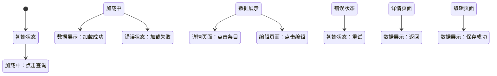

# S6-A03 UI/UX设计

---

## 元信息

| 属性 | 内容 |
|------|------|
| **Skill 编号** | S6-A03 |
| **Skill 名称** | UI/UX设计 |
| **所属阶段** | S6 - 详细设计阶段 |
| **前置 Skill** | S6-A02 数据库详细设计 |
| **后置 Skill** | S7 实现阶段 |
| **执行模式** | 自动推导 + 用户交互 |
| **参考标准** | Material Design, Human Interface Guidelines, WCAG 2.1 |

---

## 触发条件

当满足以下任一条件时，触发本 Skill：

1. 数据库详细设计已完成，需要设计用户界面
2. 需要为前端开发提供界面原型和交互流程
3. 需要设计响应式布局和多端适配方案
4. 需要输出可指导前端开发的 UI/UX设计文档

---

## 输入

| 输入项 | 说明 | 来源 |
|--------|------|------|
| 模块详细设计文档 | 功能需求、业务流程 | S6-A01 产物 |
| 数据库详细设计文档 | 数据结构、字段信息 | S6-A02 产物 |
| 接口架构设计文档 | API 定义、交互规范 | S5-A04 产物 |
| 需求规格说明书 | 用户故事、用例描述 | 需求工程阶段 |
| 非功能需求 | 性能、可用性、可访问性要求 | 需求工程阶段 |

---

## 输出

| 产物 | 说明 | 存储路径 |
|------|------|----------|
| UI/UX设计文档 | 界面原型、交互流程、设计规范 | `database/stages/s6/{PlanID}/{PlanID}-S6-A03-001.md` |
| 界面组件清单 | 组件列表、组件属性、复用关系 | `database/stages/s6/{PlanID}/{PlanID}-S6-A03-002.md` |

---

## 执行流程

### 步骤 1：读取前置产物

自动读取以下文件获取设计输入：
- 模块详细设计文档：`database/stages/s6/{PlanID}/{PlanID}-S6-A01-001.md`
- 数据库详细设计文档：`database/stages/s6/{PlanID}/{PlanID}-S6-A02-001.md`
- 接口架构设计文档：`database/stages/s5/{PlanID}/{PlanID}-S5-A04-001.md`
- 需求规格说明书（SRS）

### 步骤 2：自动分析界面需求

基于功能需求和用户故事，自动分析界面需求：

| 分析维度 | 分析内容 | 输出 |
|----------|----------|------|
| **用户角色** | 管理员/普通用户/访客 | 角色清单 |
| **使用场景** | 办公场景/移动场景/公共场景 | 场景清单 |
| **设备类型** | 桌面/平板/手机 | 设备适配策略 |
| **操作频率** | 高频操作/低频操作 | 交互优化优先级 |
| **信息密度** | 高密度/中密度/低密度 | 布局策略 |

### 步骤 3：自动设计信息架构

#### 3.1 导航结构设计

基于功能模块自动推导导航结构：

**典型导航模式：**

| 模式 | 适用场景 | 示例 |
|------|----------|------|
| 顶部导航 + 侧边栏 | 企业应用、后台管理 | 顶部一级菜单 + 侧边二级菜单 |
| 底部标签栏 | 移动应用 | 3-5 个核心功能入口 |
| 汉堡菜单 | 内容型应用 | 隐藏式侧边菜单 |
| 仪表板式 | 数据展示应用 | 卡片式布局 |

**导航结构模板：**

```
导航结构：
├── 首页（Dashboard）
│   ├── 关键指标卡片
│   ├── 快捷操作入口
│   └── 最近动态
├── 核心功能模块 1
│   ├── 列表页
│   ├── 详情页
│   └── 创建/编辑页
├── 核心功能模块 2
│   └── ...
├── 个人中心
│   ├── 个人资料
│   ├── 账号设置
│   └── 消息通知
└── 系统管理（仅管理员）
    ├── 用户管理
    ├── 角色权限
    └── 系统配置
```

#### 3.2 页面清单

自动生成完整页面清单：

| 页面编号 | 页面名称 | 页面类型 | 用户角色 | 访问路径 |
|----------|----------|----------|----------|----------|
| P001 | 首页 | 仪表板 | 所有用户 | `/dashboard` |
| P002 | 用户列表 | 列表页 | 管理员 | `/users` |
| P003 | 用户详情 | 详情页 | 管理员 | `/users/:id` |
| P004 | 创建用户 | 表单页 | 管理员 | `/users/new` |
| P005 | 编辑用户 | 表单页 | 管理员 | `/users/:id/edit` |

### 步骤 4：自动设计页面布局

#### 4.1 布局模板

**典型页面布局：**

| 布局类型 | 适用场景 | 结构 |
|----------|----------|------|
| 单栏布局 | 登录页、错误页 | 居中内容区 |
| 两栏布局 | 列表页、详情页 | 侧边栏 + 主内容区 |
| 三栏布局 | 复杂后台 | 导航栏 + 侧边栏 + 主内容区 |
| 卡片布局 | 仪表板、展示页 | 网格卡片系统 |
| 分屏布局 | 对比、双操作 | 左右等分/不等分 |

#### 4.2 页面布局模板（Mermaid）

使用 Mermaid 绘制页面布局示意图：

```mermaid
graph TB
    subgraph 页面：用户列表
        Header[顶部导航栏]
        Sidebar[侧边菜单]
        Content[主内容区]
        
        subgraph Content
            Filter[筛选区]
            Table[数据表格]
            Pagination[分页器]
        end
        
        Header --> Content
        Sidebar --> Content
        Filter --> Table
        Table --> Pagination
    end
```

### 步骤 5：自动设计界面组件

#### 5.1 组件识别规则

基于页面功能自动识别所需组件：

| 功能场景 | 推荐组件 | 说明 |
|----------|----------|------|
| 数据展示 | 表格、列表、卡片 | 根据数据密度选择 |
| 数据输入 | 表单、输入框、选择器 | 根据数据类型选择 |
| 数据筛选 | 搜索框、筛选器、标签 | 根据筛选维度选择 |
| 操作反馈 | 按钮、弹窗、提示 | 根据操作类型选择 |
| 导航 | 菜单、面包屑、分页 | 根据导航层级选择 |

#### 5.2 组件库映射

基于技术栈推荐组件库：

| 技术栈 | 推荐组件库 | 说明 |
|--------|------------|------|
| React | Ant Design / Material-UI | 企业级组件库 |
| Vue | Element Plus / Vuetify | 完善的 Vue 生态 |
| Angular | Angular Material / NG-ZORRO | 官方组件库 |
| 原生 | Bootstrap / Tailwind CSS | CSS 框架 |

#### 5.3 组件清单模板

```
组件清单 - 用户列表页：

├── 布局组件
│   ├── PageContainer - 页面容器
│   ├── Card - 卡片容器
│   └── Grid - 网格布局
├── 导航组件
│   ├── Breadcrumb - 面包屑
│   └── Pagination - 分页器
├── 数据展示组件
│   └── Table - 数据表格
│       ├── Column - 列定义
│       └── ActionColumn - 操作列
├── 筛选组件
│   ├── Search - 搜索框
│   ├── Select - 下拉选择
│   └── DatePicker - 日期选择
└── 操作组件
    ├── Button - 按钮（主按钮、次按钮、危险按钮）
    ├── Modal - 弹窗
    └── Message - 消息提示
```

### 步骤 6：自动设计交互流程

#### 6.1 交互事件识别

基于用户操作自动识别交互事件：

| 用户操作 | 交互事件 | 系统响应 |
|----------|----------|----------|
| 点击按钮 | onClick | 提交表单/打开弹窗/跳转页面 |
| 输入文本 | onChange | 实时验证/自动保存 |
| 选择选项 | onSelect | 筛选数据/更新状态 |
| 滚动页面 | onScroll | 懒加载/无限滚动 |
| 鼠标悬停 | onHover | 显示提示/高亮 |

#### 6.2 交互流程图

使用 Mermaid 绘制状态转换图：



#### 6.3 交互细节设计

**交互细节模板：**

```
交互：用户登录

前置条件：
- 用户访问登录页面

主流程：
1. 用户输入用户名和密码
2. 用户点击"登录"按钮
3. 系统验证凭据
4. 验证成功，跳转到首页

异常流程：
A1. 用户名或密码错误
  - 显示错误提示："用户名或密码错误"
  - 清空密码框
  - 保留用户名
  
A2. 网络错误
  - 显示错误提示："网络连接失败，请重试"
  - 保留已输入内容
  
A3. 账号被锁定
  - 显示错误提示："账号已被锁定，请联系管理员"
  - 提供"忘记密码"入口

交互规则：
- 密码输入框隐藏字符
- 支持 Enter 键提交
- 登录按钮点击后禁用，防止重复提交
- 显示加载状态（Loading 动画）
```

### 步骤 7：自动设计表单

#### 7.1 表单类型识别

| 表单类型 | 适用场景 | 设计要点 |
|----------|----------|----------|
| 登录表单 | 用户认证 | 简洁、安全、记住我 |
| 注册表单 | 用户注册 | 分步、验证、引导 |
| 搜索表单 | 数据筛选 | 快捷、智能、历史 |
| 编辑表单 | 数据修改 | 预填充、验证、撤销 |
| 上传表单 | 文件上传 | 拖拽、进度、预览 |

#### 7.2 表单验证规则

**验证规则模板：**

```
表单：用户注册

字段验证：
├── 用户名
│   ├── 必填：不能为空
│   ├── 长度：3-20 个字符
│   ├── 格式：字母开头，允许字母数字下划线
│   └── 唯一性：实时检查是否已存在
├── 邮箱
│   ├── 必填：不能为空
│   ├── 格式：符合邮箱格式
│   └── 唯一性：实时检查是否已注册
├── 密码
│   ├── 必填：不能为空
│   ├── 长度：8-20 个字符
│   ├── 复杂度：包含大小写字母和数字
│   └── 确认：两次输入一致
└── 手机号
    ├── 选填
    ├── 格式：符合手机号格式
    └── 唯一性：可选验证

验证时机：
- 失焦验证：用户离开输入框时
- 实时验证：用户名、邮箱、手机号
- 提交验证：点击提交按钮时

错误提示：
- 位置：输入框下方
- 颜色：红色（#ff4d4f）
- 图标：感叹号图标
```

### 步骤 8：自动设计响应式布局

#### 8.1 断点设计

基于设备类型自动设计响应式断点：

**响应式断点标准：**

| 断点名称 | 断点值 | 适用设备 |
|----------|--------|----------|
| xs | < 576px | 小屏手机 |
| sm | ≥ 576px | 大屏手机 |
| md | ≥ 768px | 平板 |
| lg | ≥ 992px | 小屏桌面 |
| xl | ≥ 1200px | 标准桌面 |
| xxl | ≥ 1600px | 大屏桌面 |

#### 8.2 响应式策略

| 页面元素 | 响应式行为 |
|----------|------------|
| 导航栏 | 桌面横向菜单，移动汉堡菜单 |
| 表格 | 桌面完整表格，移动卡片列表 |
| 表单 | 桌面多列，移动单列 |
| 图片 | 根据容器自适应，懒加载 |
| 字体 | 根据屏幕尺寸缩放 |

### 步骤 9：自动设计可访问性

#### 9.1 可访问性检查清单

| 检查项 | 设计要求 | 标准 |
|--------|----------|------|
| 色彩对比度 | 文字与背景对比度 | WCAG AA 级（4.5:1） |
| 键盘导航 | 支持 Tab 键导航 | 所有交互元素可访问 |
| 屏幕阅读器 | 提供 ARIA 标签 | 关键元素 aria-label |
| 焦点指示 | 清晰的焦点样式 | :focus 可见 |
| 错误提示 | 文字 + 图标提示 | 不依赖单一感官 |

### 步骤 10：识别需要用户确认的决策点

**常见决策点：**

1. **设计风格选择**
   - 当存在多种设计风格时
   - 需要用户基于品牌形象选择

2. **组件库选择**
   - 当存在多个组件库选项时
   - 需要用户基于技术栈和团队熟悉度选择

3. **响应式优先级**
   - 当需要权衡不同设备体验时
   - 需要用户基于目标用户选择

4. **交互复杂度**
   - 当存在简单/丰富交互选项时
   - 需要用户基于开发成本选择

### 步骤 11：用户交互确认

**交互方式 1：设计风格选择**

```
基于系统类型分析，推荐以下设计风格：

A. 简洁商务风（推荐）
   - 适合企业应用、后台管理
   - 色彩：蓝色系为主
   - 特点：专业、高效、清晰
   
B. 现代科技风
   - 适合 SaaS 产品、创新应用
   - 色彩：渐变色、深色模式
   - 特点：时尚、前卫、视觉冲击
   
C. 温暖亲和风
   - 适合 C 端产品、社区应用
   - 色彩：暖色调、圆角设计
   - 特点：友好、亲切、易用

请选择设计风格（A/B/C）：
```

**交互方式 2：组件库选择**

```
基于技术栈（React），推荐以下组件库：

A. Ant Design（推荐）
   - 企业级 UI 组件库
   - 组件丰富，文档完善
   - 社区活跃，生态成熟
   
B. Material-UI
   - Material Design 实现
   - 设计精美，动画流畅
   - 适合国际化产品
   
C. Chakra UI
   - 现代化组件库
   - 易用性强，可定制
   - 适合快速原型

请选择组件库（A/B/C）：
```

**交互方式 3：响应式优先级确认**

```
基于用户分析，系统主要使用场景：

A. 桌面优先（推荐）
   - 主要用户：办公场景
   - 桌面端：完整功能，精细布局
   - 移动端：核心功能，简化布局
   
B. 移动优先
   - 主要用户：移动场景
   - 移动端：完整功能，优化体验
   - 桌面端：适配布局，功能一致
   
C. 均衡策略
   - 多端用户均衡
   - 所有端：功能一致，体验优化
   - 开发成本较高

请确认响应式优先级（A/B/C）：
```

### 步骤 12：生成 UI/UX设计文档

基于自动设计和用户确认，生成完整 UI/UX设计文档：

**文档内容包括：**

1. **设计概述**
   - 设计风格、设计原则、目标用户

2. **信息架构**
   - 导航结构、页面清单、路由设计

3. **页面设计**
   - 页面布局、组件清单、线框图

4. **交互设计**
   - 交互流程、状态转换、交互细节

5. **组件设计**
   - 组件清单、组件属性、复用关系

6. **响应式设计**
   - 断点设计、适配策略、布局变化

7. **可访问性设计**
   - 可访问性检查清单、ARIA 标签

### 步骤 13：生成界面组件清单

自动生成完整的组件清单：

```
组件清单 - 项目完整组件

├── 布局组件（12 个）
│   ├── PageContainer
│   ├── Card
│   ├── Grid
│   └── ...
├── 导航组件（8 个）
│   ├── Menu
│   ├── Breadcrumb
│   └── Pagination
├── 数据展示组件（15 个）
│   ├── Table
│   ├── List
│   ├── Tree
│   └── ...
├── 表单组件（20 个）
│   ├── Input
│   ├── Select
│   ├── DatePicker
│   └── ...
├── 反馈组件（10 个）
│   ├── Modal
│   ├── Message
│   └── Notification
└── 业务组件（N 个）
    ├── UserCard
    ├── OrderTable
    └── ...
```

### 步骤 14：设计质量检查

自动检查设计质量：

| 检查项 | 检查规则 | 标准 |
|--------|----------|------|
| 一致性 | 设计元素统一 | 色彩、字体、间距一致 |
| 可用性 | 交互流程顺畅 | 操作步骤 <= 3 步 |
| 可访问性 | 符合 WCAG 标准 | AA 级合规 |
| 响应式 | 多端适配完整 | 断点覆盖全面 |
| 性能 | 加载优化 | 首屏加载 < 3 秒 |
| 复用性 | 组件化程度 | 组件复用率 > 60% |

### 步骤 15：生成 Todo-List 更新

更新任务状态：

| 任务 | 状态 | 说明 |
|------|------|------|
| S6-A01 模块详细设计 | 已评审 | 设计确认 |
| S6-A02 数据库详细设计 | 已评审 | 设计确认 |
| S6-A03 UI/UX设计 | 已完成 | 等待评审 |
| S7 实现阶段 | 待执行 | 依赖 S6 阶段完成 |

---

## 用户交互

### 交互时机

在步骤 10 触发用户交互，以下场景需要用户确认：

1. **信息完整度不足**：功能需求不足以推导界面设计
2. **需求理解模糊**：用户角色、使用场景不明确
3. **用户偏好不明确**：设计风格、组件库存在多个可行方案
4. **发现重大设计风险**：识别到可能影响项目的 UI/UX设计决策

### 交互方式

**方式 1：提供选项**

当存在多个可行方案时，提供选项供用户选择：

```
基于系统特征分析，"首页仪表板"推荐以下设计方案：

A. 指标卡片区 + 图表区 + 快捷操作（推荐）
   - 适合数据展示型应用
   - 关键指标一目了然
   - 快捷操作提升效率
   
B. 时间线 + 动态通知
   - 适合协作型应用
   - 强调实时性和动态
   
C. 导航中心 + 功能入口
   - 适合工具型应用
   - 强调功能分类和导航

请选择设计方案（A/B/C）：
```

**方式 2：询问澄清**

当需求描述不明确时，询问用户澄清：

```
需求中提到"系统需要支持多端访问"，但未明确主要使用场景。

请确认主要使用场景：
A. 办公场景（桌面端为主）
B. 移动场景（手机端为主）
C. 混合场景（多端均衡）

请选择（A/B/C）：_____
```

**方式 3：确认假设**

基于分析做出假设，请求用户确认：

```
基于需求分析，做出以下 UI/UX设计假设：

假设 1：采用 Ant Design 组件库（React 技术栈）
假设 2：主色调为品牌蓝色（#1890ff）
假设 3：响应式断点遵循 Bootstrap 标准
假设 4：表单验证采用实时验证 + 提交验证组合

请确认以上假设是否成立（是/否）：
如有不成立的假设，请说明：_____
```

---

## 用户评审

### 评审时机

在步骤 12 完成后，发起用户评审：

```
【UI/UX设计完成】

已完成系统 UI/UX设计：
- 信息架构：1 个导航结构，18 个页面
- 页面设计：18 个页面布局，86 个界面组件
- 交互设计：24 个交互流程，15 个状态转换
- 响应式：5 个断点，3 套适配方案

核心设计决策：
1. 采用简洁商务风格，蓝色系主色调
2. 使用 Ant Design 组件库
3. 桌面优先响应式策略
4. 表单实时验证 + 提交验证组合

请评审设计结果：
- 确认 → 进入 S7 实现阶段
- 修改 → 说明具体修改需求
- 新增 → 提出新的设计想法
- 跳过 → 直接进入下一阶段
```

### 评审决策选项

| 选项 | 说明 | 后续动作 |
|------|------|----------|
| 确认 | 设计结果满足要求 | 保存产物，更新 Todo-List，进入下一 Skill |
| 修改 | 需要调整设计 | 提供修改细节，重新执行设计流程 |
| 新增 | 有新的设计想法 | 补充设计需求，重新执行设计流程 |
| 跳过 | 暂不评审 | 保存当前产物，进入下一 Skill |

---

## 产物模板

### UI/UX设计文档模板

```markdown
# UI/UX设计 - {项目名称}

## 1. 设计概述

### 1.1 设计风格
- 风格定位：{简洁商务/现代科技/温暖亲和}
- 色彩体系：{主色、辅助色、功能色}
- 设计原则：{一致性、可用性、可访问性}

### 1.2 目标用户
- 主要用户：{用户画像}
- 使用场景：{办公/移动/混合}

## 2. 信息架构

### 2.1 导航结构
（导航树状图）

### 2.2 页面清单

| 页面编号 | 页面名称 | 页面类型 | 访问路径 |
|----------|----------|----------|----------|
| P001 | 首页 | 仪表板 | `/dashboard` |

## 3. 页面设计

### 3.1 页面布局
（Mermaid 布局图）

### 3.2 组件清单
（组件树状结构）

## 4. 交互设计

### 4.1 交互流程
（Mermaid 状态转换图）

### 4.2 交互细节
（关键交互详细说明）

## 5. 响应式设计

### 5.1 断点设计
| 断点 | 值 | 设备 |
|------|---|------|
| xs | <576px | 小屏手机 |

### 5.2 适配策略
（不同断点下的布局变化）

## 6. 可访问性

### 6.1 可访问性检查清单
（WCAG 合规检查）
```

---

## 错误处理

### 错误分类

| 错误类型 | 处理方式 |
|----------|----------|
| 前置校验失败 | 返回错误信息，提示补充输入 |
| 执行过程错误 | 记录错误上下文，提供恢复建议 |
| 后置校验失败 | 标识具体校验项，提供修复建议 |
| 用户评审不通过 | 记录修改意见，重新执行设计 |
| 用户交互超时 | 使用默认方案，记录假设 |

---

## 质量检查清单

- [ ] 信息架构清晰合理
- [ ] 页面布局符合用户习惯
- [ ] 组件选择恰当
- [ ] 交互流程顺畅
- [ ] 表单验证完整
- [ ] 响应式覆盖全面
- [ ] 可访问性符合标准
- [ ] 设计规范统一

---

## 与其他 Skill 的协作

| 协作 Skill | 协作内容 |
|------------|----------|
| S6-A01 模块详细设计 | 接收功能需求，设计对应界面 |
| S6-A02 数据库详细设计 | 接收数据结构，设计表单字段 |
| S5-A04 接口架构设计 | 接收 API 定义，设计数据交互 |

---

## 版本历史

| 版本 | 日期 | 变更内容 |
|------|------|----------|
| v1.0 | 2026-03-27 | 初始版本 |
